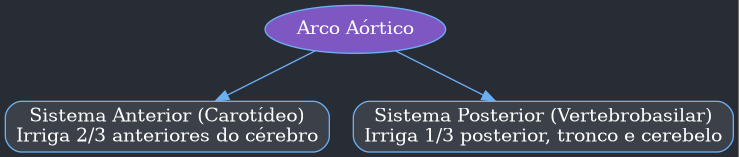
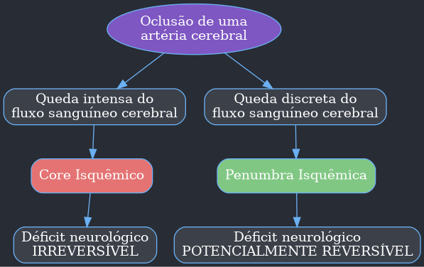
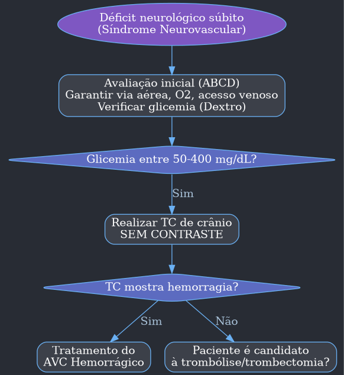
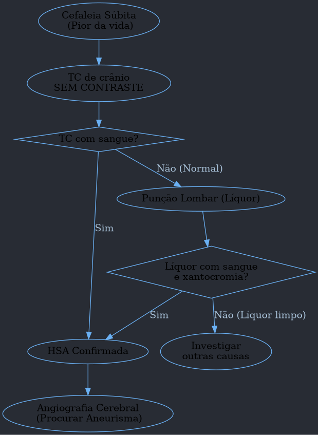

---
{"dg-publish":true,"permalink":"/9-periodo/aulas-segunda-rotacao/ave/","dgPassFrontmatter":true}
---

---

# **Neurologia: Acidentes Vasculares Cerebrais (AVC)**

## **Introdução ao Módulo de AVC**
- **Relevância:** O AVC é o assunto de neurologia mais frequente em provas de residência, correspondendo a cerca de 15% das questões da especialidade.
- **Divisão dos AVCs:**
    - **AVC Isquêmico (AVCi):** 70% das questões.
    - **AVC Hemorrágico Intraparenquimatoso (AVCh):** 10% das questões.
    - **Hemorragia Subaracnóidea (HSA):** 20% das questões.
- **Foco Principal:** O tratamento da fase aguda do AVC isquêmico é o tópico mais abordado.

### **Distribuição de Tópicos em Provas**

| Tópico | Prevalência nas Provas |
| :--- | :--- |
| **Tratamento fase aguda (AVCi)** | **32%** |
| Fatores de risco do AVCi | 20% |
| Neuroanatomia | 12% |
| Imagem | 9% |
| Síndrome neurovascular | 9% |
| AIT (Ataque Isquêmico Transitório) | 6% |
| AVCh (Hemorrágico) | 5% |
| NIHSS (Escala de AVC do NIH) | 4% |
| Profilaxia secundária AVCi | 2% |
| HSA (Hemorragia Subaracnóidea) | 1% |

---

## **1.0 Anatomia Neurovascular**
O entendimento da neuroanatomia vascular é crucial para interpretar o quadro clínico de um AVC.

### **1.1 Sistemas Anterior e Posterior**
- O encéfalo é irrigado por quatro grandes artérias que se originam dos troncos supra-aórticos.
- **Sistema Anterior (Carotídeo):**
    - Formado pelas artérias carótidas internas (direita e esquerda) e seus ramos.
    - Irriga os **dois terços anteriores** dos hemisférios cerebrais.
- **Sistema Posterior (Vertebrobasilar):**
    - Formado pelas artérias vertebrais (direita e esquerda) que se unem para formar a artéria basilar.
    - Irriga o **terço posterior** dos hemisférios, o tronco encefálico e o cerebelo.

### **1.2 Polígono de Willis**
- É uma estrutura de anastomose na base do crânio que conecta os sistemas anterior e posterior.
- **Função:** Permite um mecanismo compensatório parcial em caso de hipofluxo em uma das artérias, podendo inverter o fluxo para nutrir a área deficitária.
- **Componentes:**
    - **Sistema Anterior:** Artérias carótidas internas, cerebrais médias, cerebrais anteriores e comunicante anterior.
    - **Sistema Posterior:** Artérias vertebrais, basilar, cerebrais posteriores, comunicantes posteriores e cerebelares.
- **Conexões Chave:**
    - A **artéria comunicante anterior** une os lados direito e esquerdo do sistema anterior.
    - As **artérias comunicantes posteriores** unem o sistema anterior ao posterior de cada lado.

### **1.3 Circulação Carotídea**
- **Bifurcação da Carótida Comum:** Divide-se em carótida interna e externa na região cervical.
    - **Carótida Externa:** Não irriga o encéfalo.
    - **Carótida Interna:** Possui ramos apenas intracranianos.
- **Bulbo Carotídeo:** Porção inicial da carótida interna, local mais suscetível à formação de placas de ateroma.
- **Sifão Carotídeo:** Curvatura em "S" da porção intracraniana da carótida interna, também é um local comum de aterosclerose.
- **Ramos Terminais:** A carótida interna se bifurca nas artérias cerebral média e cerebral anterior.

### **1.4 Circulação Vertebrobasilar**
- **Artérias Vertebrais:** Passam pelos forames transversos das vértebras C 6 a C 2 e se unem para formar a **artéria basilar**.
- **Artéria Basilar:** Irriga a ponte e, em sua porção terminal, bifurca-se nas artérias cerebrais posteriores.
- **Irrigação do Tronco e Cerebelo:**
    - **Tálamo e Mesencéfalo:** Ramos da artéria cerebral posterior.
    - **Ponte:** Ramos da artéria basilar.
    - **Bulbo:** Ramos das artérias vertebrais.
    - **Cerebelo:** Artérias cerebelares superiores (SUCA), anteroinferiores (AICA) e posteroinferiores (PICA).

### **1.5 Irrigação dos Hemisférios Cerebrais**
- **Artéria Cerebral Anterior (ACA):** Irriga a maior parte da face medial dos hemisférios (área motora e sensitiva dos membros inferiores).
- **Artéria Cerebral Média (ACM):** Irriga a maior parte da face lateral dos hemisférios (área motora e sensitiva da face e membros superiores). É a artéria mais frequentemente acometida em AVCi.
- **Artéria Cerebral Posterior (ACP):** Irriga a face inferior do lobo temporal e o lobo occipital (visão).

---

## **2.0 Acidentes Vasculares Cerebrais Isquêmicos (AVCi)**

### **2.1 Introdução**
- **Definição de AVC:** Redução ou perda **súbita** de funções neurológicas devido à oclusão (isquêmico) ou rompimento (hemorrágico) de uma artéria encefálica. A palavra-chave é **SÚBITO**.
- **AVC vs. AVE:** O termo correto segundo a Academia Brasileira de Neurologia é **AVC (Acidente Vascular Cerebral)**, embora AVE (Encefálico) seja anatomicamente mais preciso.
- **AVC vs. AIT (Ataque Isquêmico Transitório):**
    - No **AVC**, ocorre morte neuronal, resultando em um déficit neurológico permanente e alteração em exames de imagem (necrose).
    - No **AIT**, o fluxo sanguíneo é restabelecido antes da morte celular. O déficit é temporário (tradicionalmente < 24 h) e não há alterações nos exames de imagem.
- **Classificação:**
    - **Isquêmicos:** 85% dos casos, causados por oclusão.
    - **Hemorrágicos:** 15% dos casos, causados por ruptura.
    - A diferenciação só é possível com **exame de imagem**.

### **2.2 Fatores de Risco**
- Divididos em modificáveis e não modificáveis.

#### **Tabela de Fatores de Risco para AVC Isquêmico**

| Categoria | Fator de Risco | Risco Relativo de AVC |
| :--- | :--- | :--- |
| **Não Modificáveis** | Idade | Dobra a cada década após 55 anos |
| | Sexo | Masculino: 30% maior |
| | Etnia | Afrodescendentes (2,4 x), Hispânicos e Asiáticos (2 x) |
| | História Familiar | Risco 1,9 x maior com parentes de 1º grau |
| **Modificáveis** | **Hipertensão Arterial** | **4 x maior (fator mais importante)** |
| | Fibrilação Atrial | Valvar: 17 x maior; Não valvar: ↑ 5% ao ano |
| | Diabetes Mellitus | 1,8 - 6 x maior |
| | Tabagismo | 1,9 x maior |
| | Dislipidemia | 1,5 x maior |
| | Etilismo (>40 g/semana) | 1,6 x maior |
| | Obesidade | Aumento de 5% a cada 1 ponto de IMC |
| | Sedentarismo | Aumento de 20-30% |

### **2.3 Fisiopatologia**

#### **2.3.1 Core e Penumbra Isquêmicos**
- A oclusão de um vaso leva a uma queda não homogênea da perfusão.
- **Core Isquêmico:**
    - Área com queda de fluxo sanguíneo **intensa**.
    - Neurônios morrem em **poucos minutos**.
    - Dano **irreversível**.
- **Penumbra Isquêmica:**
    - Área ao redor do core com queda de fluxo **discreta**.
    - Neurônios estão vivos, mas **não funcionantes** (metabolismo incompatível com a função).
    - Dano **potencialmente reversível**.
- **Objetivo do Tratamento:** Salvar a penumbra! **Tempo é cérebro**. Se o fluxo for restabelecido a tempo, os neurônios da penumbra voltam a funcionar e o paciente melhora o déficit.

#### **2.3.2 Edema Citotóxico**
- A isquemia leva à falha da bomba de Na/K por falta de ATP.
- O sódio entra na célula, levando água consigo.
- Ocorre **edema citotóxico** (inchaço neuronal), que aumenta o volume do parênquima, eleva a pressão intracraniana e pode levar a **herniações cerebrais**.

### **2.4 Etiopatogenia (Classificação de TOAST)**
- **Aterosclerose de Grandes Vasos (15-20%):**
    - Ruptura de placa aterosclerótica com trombose local ou embolia artério-arterial.
    - **Infarto hemodinâmico:** Isquemia em áreas de fronteira vascular por baixo fluxo sistêmico (ex: hipotensão).
- **Aterosclerose de Pequenos Vasos (Microangiopatia - 15-25%):**
    - Oclusão de pequenas artérias perfurantes por lipo-hialinose.
    - Causa **infartos lacunares** (< 1,5 cm) em regiões profundas (cápsula interna, tálamo, ponte).
- **Cardioembolia (30%):**
    - Embolização de trombos de origem cardíaca.
    - Principal causa: **Fibrilação Atrial**.
    - Outras causas: Infarto do miocárdio, endocardite, próteses valvares, forame oval patente.
- **Outras Causas (Raras - 4%):**
    - **Dissecções arteriais:** Causa mais comum em jovens (< 45 anos), frequentemente associada a trauma e dor cervical. Pode causar Síndrome de Horner.
    - **Síndrome do roubo da subclávia:** Inversão do fluxo na artéria vertebral por estenose proximal da subclávia, causando síncope ao esforço do membro superior.
    - Vasculites, trombofilias, doenças genéticas.
- **Mecanismo Indeterminado:**
    - Causa não encontrada, investigação incompleta ou mais de uma causa possível.

### **2.5 Síndromes Neurovasculares**

#### **2.5.2.1 Síndromes da Artéria Cerebral Média (ACM)**
- A clínica varia conforme o local da oclusão (M 1 proximal/distal, M 2 superior/inferior).

| Sinais e Sintomas | M 1 Proximal | M 1 Distal | Divisão Superior (M 2) | Divisão Inferior (M 2) |
| :--- | :--- | :--- | :--- | :--- |
| **Hemiparesia Contralateral** | Proporcionada (face=braço=perna) | Predomínio braquiofacial | Predomínio braquiofacial | Ausente |
| **Hemi-hipoestesia Contralateral** | Presente (completa) | Presente | Presente | Presente |
| **Paresia do Olhar Conjugado** | Presente (olhar desviado para o lado da lesão) | Presente | Presente | Ausente |
| **Afasia (Hemisf. Dominante)** | Global | Global ou Broca | **Afasia de Broca (motora)** | **Afasia de Wernicke (sensitiva)** |
| **Heminegligência (Hemisf. Não Dominante)** | Presente | Presente | Presente | Presente |
| **Perda de Campo Visual** | Hemianopsia homônima contralateral | Quadrantanopsia inferior | **Quadrantanopsia inferior** | **Quadrantanopsia superior** |

- **Afasia de Broca:** Dificuldade na **expressão** da linguagem, com compreensão preservada.
- **Afasia de Wernicke:** Dificuldade na **compreensão** da linguagem, com fala fluente mas ininteligível.
- **Síndrome de Gerstmann:** Lesão parietal no hemisfério dominante (território de M 2 superior). Causa **agrafia**, **acalculia**, **agnosia digital** e **desorientação direita-esquerda**.

#### **2.5.2.2 Síndrome da Artéria Cerebral Anterior (ACA)**
- **Déficit motor e/ou sensitivo contralateral de predomínio crural** (perna > braço/face).
- **Abulia:** Perda da iniciativa, apatia.
- **Incontinência urinária.**
- Agitação, reflexos primitivos (preensão).
- Afasia e heminegligência são raras.

#### **2.5.2.3 Síndrome das Artérias Lenticuloestriadas (Infarto Lacunar)**
- **Hemiparesia motora pura:** Déficit motor proporcionado (face, braço, perna) sem outros achados.
- **Síndrome sensitiva pura:** Apenas déficit sensitivo.
- **Síndrome sensitivo-motora:** Combinação dos dois.
- **Não há** déficits corticais como afasia, negligência ou alterações visuais.

#### **2.5.3 Síndromes da Circulação Posterior**
- **Síndrome da Artéria Cerebral Posterior (ACP):**
    - **Hemianopsia homônima contralateral com preservação macular**.
    - **Síndrome de Dejerine-Roussy (Talâmica):** Dor neuropática intensa e hemi-hipoestesia contralateral.
- **Síndromes de Tronco Encefálico ("Síndromes Alternas"):**
    - Caracterizadas por **paralisia de nervo craniano ipsilateral** à lesão e **déficit motor/sensitivo contralateral**.
    - **Síndrome de Weber (Mesencéfalo):** Paralisia do III nervo ipsilateral + hemiparesia contralateral.
    - **Síndrome de Wallenberg (Bulbo Lateral):** A mais famosa. Vertigem, nistagmo, disfagia, rouquidão, soluços, síndrome de Horner ipsilateral, hipoestesia facial ipsilateral e hipoestesia corporal contralateral.
- **Síndrome do Topo da Basilar:**
    - Pode levar ao coma ou à **síndrome do cativeiro (locked-in)**, onde o paciente está consciente, mas tetraplégico, comunicando-se apenas com movimentos oculares verticais.

### **2.6 Escalas de Avaliação Clínica**

#### **Escala de AVC do NIH (NIHSS - National Institutes of Health Stroke Scale)**
- Quantifica o déficit neurológico. Usada antes da trombólise para avaliar a gravidade.
- **Pontuação:** 0 (normal) a 42 (máximo). Quanto **maior** a pontuação, **pior** o déficit.
- **Classificação:**
    - **0-5:** AVC menor (stroke minor).
    - **> 25:** AVC grave (alto risco de sangramento).

| Item | Critério | Pontos |
| :--- | :--- | :--- |
| **1 a. Nível de Consciência** | Alerta | 0 |
| | Sonolento, mas responde | 1 |
| | Torporoso, requer estímulo doloroso | 2 |
| | Coma, irresponsivo | 3 |
| **1 b. Perguntas (mês, idade)** | Responde ambas corretamente | 0 |
| | Responde uma corretamente | 1 |
| | Não responde nenhuma | 2 |
| **1 c. Comandos (abrir/fechar olhos, mão)** | Executa ambos | 0 |
| | Executa um | 1 |
| | Não executa nenhum | 2 |
| **2. Melhor Olhar Conjugado** | Normal | 0 |
| | Paresia parcial do olhar | 1 |
| | Desvio forçado do olhar | 2 |
| **3. Campos Visuais** | Sem perda | 0 |
| | Hemianopsia parcial | 1 |
| | Hemianopsia completa | 2 |
| | Hemianopsia bilateral (cego) | 3 |
| **4. Paralisia Facial** | Normal | 0 |
| | Leve (apagamento sulco nasolabial) | 1 |
| | Parcial (inferior da face) | 2 |
| | Completa (superior e inferior) | 3 |
| **5 a/5 b. Motor - Braços** | Sem queda por 10 s | 0 |
| | Queda antes de 10 s | 1 |
| | Algum esforço contra gravidade | 2 |
| | Sem esforço contra gravidade | 3 |
| | Nenhum movimento | 4 |
| **6 a/6 b. Motor - Pernas** | Sem queda por 5 s | 0 |
| | Queda antes de 5 s | 1 |
| | Algum esforço contra gravidade | 2 |
| | Sem esforço contra gravidade | 3 |
| | Nenhum movimento | 4 |
| **7. Ataxia de Membros** | Ausente | 0 |
| | Presente em um membro | 1 |
| | Presente em dois membros | 2 |
| **8. Sensibilidade** | Normal | 0 |
| | Perda leve a moderada | 1 |
| | Perda grave | 2 |
| **9. Melhor Linguagem** | Normal | 0 |
| | Afasia leve a moderada | 1 |
| | Afasia grave | 2 |
| | Mudo, afasia global | 3 |
| **10. Disartria** | Normal | 0 |
| | Leve a moderada | 1 |
| | Grave | 2 |
| **11. Extinção/Negligência** | Normal | 0 |
| | Desatenção a um estímulo | 1 |
| | Profunda desatenção/extinção | 2 |

#### **Escala de Rankin Modificada (mRS)**
- Avalia o grau de **incapacidade ou sequela** após o AVC. O objetivo do tratamento é deixar o paciente com o menor mRS possível.
- **0:** Assintomático.
- **1:** Sintomas, mas sem incapacidade.
- **2:** Incapacidade leve (capaz de cuidar de si).
- **3:** Incapacidade moderada (precisa de ajuda, mas anda sozinho).
- **4:** Incapacidade moderada a grave (precisa de ajuda para andar).
- **5:** Incapacidade grave (restrito ao leito).
- **6:** Óbito.

### **2.7 Exames de Imagem na Fase Aguda**
- **Obrigatórios** em todo paciente com síndrome neurovascular aguda.
- **Tomografia de Crânio (TC) sem contraste:**
    - **Exame de escolha inicial.** Rápido e acessível.
    - **Função principal:** **Descartar hemorragia**.
    - Pode ser normal nas primeiras horas de um AVCi.
    - **Sinais precoces de isquemia:**
        - **Sinal da artéria cerebral média hiperdensa:** Trombo visível na artéria.
        - Apagamento dos sulcos corticais.
        - Perda da diferenciação entre substância branca e cinzenta.
- **Ressonância Magnética (RM):**
    - Mais sensível que a TC, detecta isquemia em minutos.
    - **Sequência de difusão (DWI):** Mostra a área de infarto (core) com hipersinal. É o **padrão-ouro** para diagnóstico de AVCi.
    - **Sequência FLAIR:** As alterações aparecem após 4,5 horas. O **mismatch Difusão-FLAIR** (DWI positivo, FLAIR negativo) indica um AVC com menos de 4,5 horas, útil em casos de tempo de início desconhecido ("wake-up stroke").
- **Angiotomografia (AngioTC) / Angioressonância (AngioRM):**
    - Avaliam os vasos para detectar oclusões proximais, indicando a necessidade de **trombectomia mecânica**.

### **2.8 Tratamento da Fase Aguda do AVCi**

#### **Avaliação Inicial e Suporte (ABCD)**
- **A:** Vias aéreas pérvias.
- **B:** Oxigenação (SatO 2 > 94%).
- **C:** Acesso venoso, monitorização cardíaca.
- **D:** Dextro (glicemia capilar). Hipoglicemia é um importante *stroke mimic*.

#### **2.8.4 Trombólise Endovenosa**
- **Objetivo:** Destruir o trombo e reperfundir a área de penumbra.
- **Droga:** **Alteplase (rt-PA)**, um ativador de plasminogênio tecidual.
    - **Dose:** 0,9 mg/kg (máximo 90 mg). 10% em bólus em 1 minuto, 90% em bomba de infusão em 1 hora.
- **Janela Terapêutica:**
    - **Até 4,5 horas** do início dos sintomas.
- **Critérios de Inclusão Principais:**
    - Idade > 18 anos.
    - Diagnóstico clínico de AVCi com déficit significativo (NIHSS > 5 ou incapacitante).
    - Janela de até 4,5 horas.
- **Critérios de Exclusão Principais (Contraindicações):**
    - **TC com hemorragia.**
    - **PA sustentada > 185 x 110 mmHg** (apesar de tratamento).
    - Sangramento ativo ou diátese hemorrágica (Plaquetas < 100.000, INR > 1,7).
    - Uso de anticoagulantes recentes (heparina nas últimas 24 h, anticoagulantes diretos nas últimas 48 h).
    - AVC ou trauma craniano grave nos últimos 3 meses.
    - Cirurgia de grande porte nos últimos 14 dias.
    - TC com hipodensidade extensa (> 1/3 do território da ACM).

#### **2.8.5 Trombectomia Mecânica**
- **Objetivo:** Remoção mecânica do trombo por cateterismo arterial.
- **Indicação:** Pacientes com **oclusão de grande vaso proximal** na circulação anterior (carótida interna ou segmento M 1 da ACM).
- **Janela Terapêutica:**
    - **Até 6 horas** do início dos sintomas para a maioria dos pacientes.
    - **De 6 a 24 horas** em pacientes selecionados com exames de perfusão (TC ou RM) que mostram grande área de penumbra (mismatch favorável).
- **Critérios Principais:**
    - NIHSS ≥ 6.
    - ASPECTS ≥ 6 (escore tomográfico que avalia a extensão da isquemia; < 6 indica infarto extenso).
    - Independência funcional prévia (mRS < 2).

#### **Controle da Pressão Arterial (PA) no AVCi**
- **Se candidato à trombólise:** PA deve ser **< 185 x 110 mmHg** antes e mantida **< 180 x 105 mmHg** por 24 h após.
- **Se NÃO candidato à trombólise:** **Hipertensão permissiva**. Tratar apenas se PA **> 220 x 120 mmHg**.
- **Droga de escolha:** Nitroprussiato de sódio EV.

---
## **2.10 Investigação Etiológica e Profilaxia Secundária**

### **2.9 Ataque Isquêmico Transitório (AIT)**
- Episódio transitório de disfunção neurológica sem infarto agudo.
- **Alto risco de AVC** nos dias seguintes.
- **Escore ABCD 2** para estratificar o risco de AVC em 90 dias após um AIT.

| Critério | Definição | Pontos |
| :--- | :--- | :--- |
| **A (Age)** | Idade ≥ 60 anos | 1 |
| **B (Blood Pressure)** | PA ≥ 140 x 90 mmHg | 1 |
| **C (Clinical)** | Fraqueza unilateral (hemiparesia) | 2 |
| | Distúrbio de fala sem fraqueza | 1 |
| **D (Duration)** | > 60 minutos | 2 |
| | 10-59 minutos | 1 |
| **D (Diabetes)** | Presença de Diabetes | 1 |

- **Risco:**
    - **Baixo (0-3 pontos):** Risco de 1%.
    - **Moderado (4-5 pontos):** Risco de 4%.
    - **Alto (6-7 pontos):** Risco de 8%.
- Pacientes com AIT de alto risco devem ser internados para investigação.

### **Profilaxia Secundária**
- **Antiagregação Plaquetária:**
    - Para AVCs de etiologia aterosclerótica (grandes ou pequenos vasos) ou indeterminada.
    - **Monoterapia (AAS ou Clopidogrel):** Uso crônico.
    - **Dupla Antiagregação (AAS + Clopidogrel):** Indicada por 21 dias em AIT de alto risco ou AVC menor (NIHSS ≤ 5), ou por 90 dias após oclusão de grande vaso.
- **Anticoagulação:**
    - Para AVCs cardioembólicos, principalmente por **Fibrilação Atrial**.
    - Usa-se o **escore CHA 2 DS 2-VASc** para decidir. Anticoagulação indicada para homens ≥ 2 e mulheres ≥ 3.
- **Revascularização Carotídea (Endarterectomia ou Stent):**
    - Indicada para pacientes com **estenose sintomática de 70-99%**.
    - Considerada em homens com estenose de 50-69%.

---

## **3.0 Acidentes Vasculares Cerebrais Hemorrágicos**

### **3.1 AVC Hemorrágico Intraparenquimatoso (AVCh)**
- Sangramento dentro do parênquima cerebral (10% de todos os AVCs).
- **Mortalidade elevada (50%).**

#### **3.1.1 Introdução e Causas**
- **Hipertensão Arterial (70% dos casos):** Causa principal. Ruptura de microaneurismas de Charcot-Bouchard em vasos perfurantes.
    - **Localização típica:** Núcleos da base (putâmen), tálamo, ponte, cerebelo.
- **Angiopatia Amiloide:** Causa comum em idosos (>75 anos) não hipertensos.
    - Depósito de proteína amiloide em vasos corticais.
    - **Localização típica:** Lobar (sangramento superficial).
- **Outras causas:** Malformações arteriovenosas (MAV), tumores, coagulopatias, uso de drogas (cocaína).

#### **3.1.2 Quadro Clínico e Diagnóstico**
- **Clínica:** Déficit neurológico focal de instalação aguda, frequentemente associado a **sinais de hipertensão intracraniana (HIC)**:
    - **Cefaleia, náuseas, vômitos.**
    - Rebaixamento do nível de consciência.
- **Diagnóstico:** **TC de crânio sem contraste**, que mostra uma coleção **hiperdensa** (branca) no parênquima.

#### **3.1.4 Tratamento Clínico**
- Suporte intensivo (ABCD).
- **Controle Agressivo da Pressão Arterial:**
    - **Meta:** Manter PA sistólica em torno de **140 mmHg**.
- **Tratamento Cirúrgico:** Indicado em casos selecionados.
    - Hematomas cerebelares > 3 cm com compressão do tronco encefálico.
    - Hematomas supratentoriais (lobares) volumosos com deterioração neurológica.

#### **3.1.6 Prognóstico (Escore ICH)**
- Estima a mortalidade em 30 dias.

| Fator | Pontos |
| :--- | :--- |
| **Glasgow na admissão:** 3-4 | 2 |
| **Glasgow na admissão:** 5-12 | 1 |
| **Volume do hematoma:** ≥ 30 mL | 1 |
| **Presença de Hemoventrículo** | 1 |
| **Origem Infratentorial** | 1 |
| **Idade:** ≥ 80 anos | 1 |

- **Mortalidade:** Varia de 0% (0 pontos) a quase 100% (5-6 pontos).

### **3.2 Hemorragia Subaracnóidea (HSA)**
- Sangramento no espaço entre a aracnoide e a pia-máter, onde circula o líquor (5% de todos os AVCs).

#### **3.2.1 Introdução e Causas**
- **Causa mais comum de HSA espontânea:** **Ruptura de aneurisma cerebral sacular** (85% dos casos), localizados tipicamente em bifurcações do Polígono de Willis.
- **Causa mais comum de HSA geral:** Trauma.
- **Fatores de risco para ruptura:** Tabagismo, hipertensão, idade, história familiar.

#### **3.2.2 Quadro Clínico**
- **"A pior dor de cabeça da vida" (cefaleia em trovoada ou *thunderclap headache*):** Súbita, de intensidade máxima em segundos.
- Sinais de irritação meníngea (rigidez de nuca).
- Náuseas, vômitos, fotofobia.
- Síncope ou rebaixamento do nível de consciência.
- Paralisia do III nervo (oculomotor) pode indicar aneurisma de comunicante posterior.

#### **3.2.3 Investigação**
- **1. TC de crânio sem contraste:**
    - Alta sensibilidade (>95%) nas primeiras 6 horas.
    - Mostra sangue **hiperdenso** nas cisternas da base.
- **2. Punção Lombar (Líquor):**
    - Indicada se a **TC for normal** mas a suspeita clínica for alta.
    - **Achados:** Líquor hemorrágico que não clareia nos 3 tubos e **xantocromia** (coloração amarelada do sobrenadante após centrifugação).
- **3. Arteriografia Cerebral:**
    - **Padrão-ouro** para identificar o aneurisma e planejar o tratamento (clipagem ou embolização).

#### **Escalas de Prognóstico na HSA**
- **Escala de Fisher:** Avalia a quantidade de sangue na TC para predizer o risco de **vasoespasmo**.
- **Escala de Hunt-Hess:** Avalia o estado clínico do paciente na admissão para predizer a **mortalidade**.

| Grau (Hunt-Hess) | Quadro Clínico | Mortalidade (%) |
| :--- | :--- | :--- |
| I | Assintomático, cefaleia leve | 5 |
| II | Cefaleia moderada a grave, paralisia de nervo craniano | 5 |
| III | Sonolência, confusão, déficit focal leve | 10 |
| IV | Torpor, localiza a dor | 34 |
| V | Coma, posturas patológicas | 52 |

#### **3.2.4 Tratamento e Complicações**
- **Medidas Gerais:** Repouso, analgesia, controle da PA (< 130 mmHg).
- **Prevenção do Ressangramento:** Oclusão do aneurisma (clipagem cirúrgica ou embolização endovascular) nas primeiras 24 horas.
- **Prevenção do Vasoespasmo:**
    - **Nimodipino** (bloqueador de canal de cálcio) para todos os pacientes por 21 dias.
    - O vasoespasmo é uma complicação tardia (pico entre 5º e 14º dia) que causa isquemia cerebral.
- **Outras Complicações:** Hidrocefalia, hiponatremia, crises epilépticas.

---
### **Resumo Comparativo dos Tipos de AVC**

| Característica | AVC Isquêmico (AVCi) | AVC Hemorrágico (AVCh) | Hemorragia Subaracnóidea (HSA) |
| :--- | :--- | :--- | :--- |
| **Sintoma Principal** | Déficit focal súbito | Déficit focal + HIC | Cefaleia súbita e intensa |
| **Duração** | > 24 h | > 24 h | > 24 h |
| **TC de Crânio** | Normal ou hipodenso | Hiperdensidade no parênquima | Hiperdensidade nas cisternas |
| **RM de Crânio** | Hipersinal na difusão | Hipersinal em T 2 | Normal ou hipersinal em FLAIR |
| **Líquor** | Normal | Normal (geralmente) | Hemácias + Xantocromia |
| **Tratamento Agudo** | Trombólise/Trombectomia | Controle de PA, cirurgia | Clipagem/Embolização |