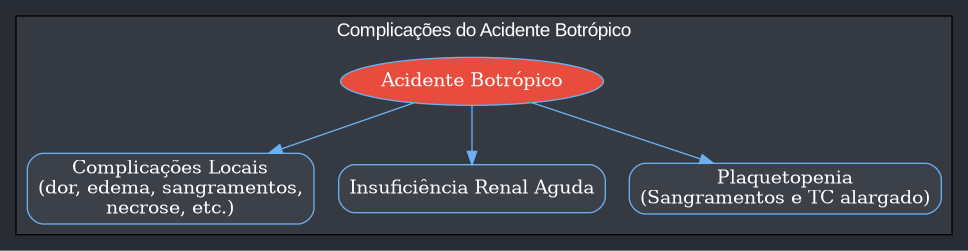
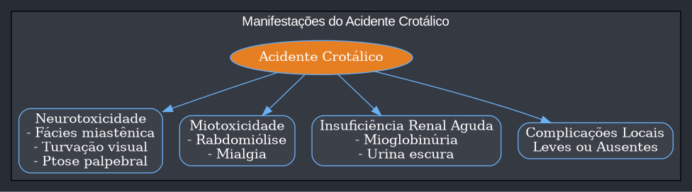
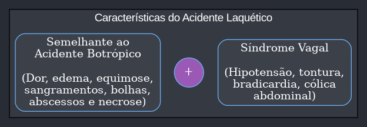
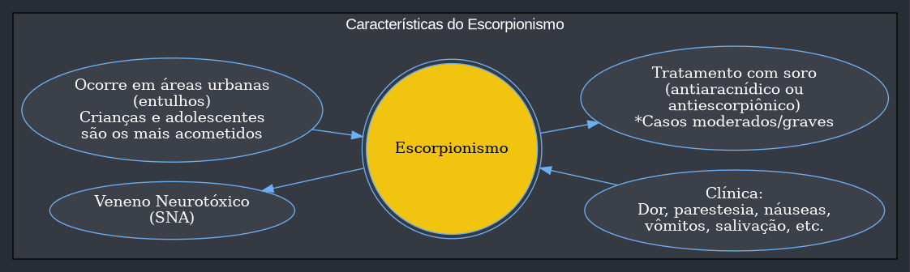
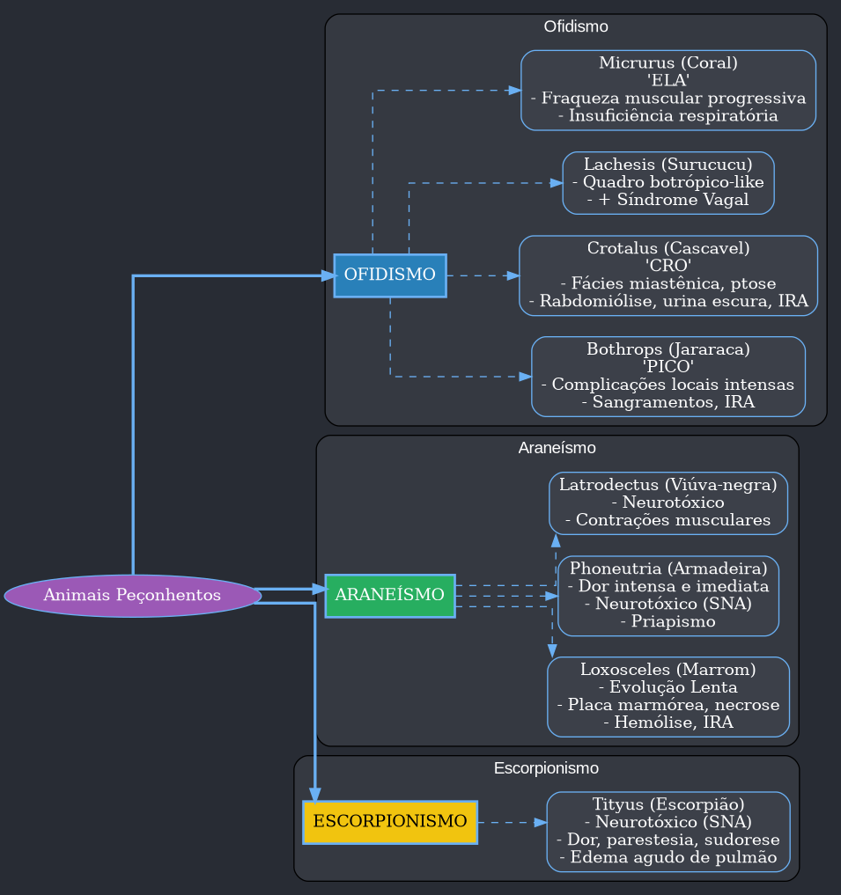

---
{"dg-publish":true,"permalink":"/9-periodo/aulas-segunda-rotacao/animais-peconhentos/","dgPassFrontmatter":true}
---

***

# Infectologia: Acidentes por Animais Peçonhentos

Este material é um resumo detalhado sobre os principais acidentes com animais peçonhentos, focado nos temas mais recorrentes em provas de residência médica no Brasil. O conteúdo aborda o diagnóstico, as manifestações clínicas e o tratamento para acidentes ofídicos, escorpionismo, araneísmo, erucismo e picadas de himenópteros.

### Prevalência dos Assuntos nas Provas de Residência

Compreender a frequência de cada tópico ajuda a direcionar os estudos. A distribuição dos acidentes por animais peçonhentos em provas é a seguinte:

| Tema | Prevalência |
| :--- | :--- |
| **Ofidismo Botrópico** | 34% |
| **Escorpionismo** | 22% |
| **Araneísmo** | 17% |
| **Ofidismo Crotálico** | 11% |
| **Prevenção de Acidentes** | 6% |
| **Ofidismo Laquético** | 5% |
| **Erucismo** | 3% |
| **Acidente por Himenópteros** | 1% |
| **Ofidismo Elapídico** | 1% |

O **Ofidismo** é o tema mais cobrado, com destaque para os acidentes botrópico e crotálico. É fundamental saber diferenciar as manifestações clínicas de cada tipo de serpente, bem como diferenciar os acidentes ofídicos dos causados por aranhas e escorpiões.

---

## 1.0 Ofidismo (Acidentes por Serpentes)

Ofidismo é o quadro clínico decorrente da inoculação de veneno por serpentes peçonhentas. No Brasil, todas as serpentes peçonhentas de importância médica (com exceção da coral-verdadeira) possuem uma **fosseta loreal**, um órgão termorreceptor localizado entre o olho e a narina.

- **Prevalência no Brasil:**
    - **Acidente Botrópico (Jararaca):** Corresponde a cerca de **90%** dos casos.
    - **Acidente Crotálico (Cascavel):** O segundo mais comum, com **7,7%** dos casos.
    - **Acidente Laquético (Surucucu):** Raro, com **1,4%** dos casos.
    - **Acidente Elapídico (Coral-verdadeira):** Muito raro, com **0,4%** dos casos.
- **Locais mais acometidos:** Pés e pernas são os locais de picada em cerca de 70% dos acidentes, seguidos por mãos e antebraços. O uso de equipamentos de proteção individual (botas, luvas de couro) é crucial em áreas de risco.

### 1.1 Medidas Gerais Após Acidente Ofídico

As condutas de primeiros socorros são essenciais e frequentemente cobradas em provas.

- **O que FAZER:**
    - Lavar a ferida com água e sabão.
    - Manter o paciente deitado, calmo e hidratado.
    - Procurar atendimento médico imediatamente.
    - Se possível e seguro, levar o animal (morto) para identificação, mas sem se arriscar a um novo acidente.

- **O que NÃO FAZER:**
    - **Não fazer torniquete ou garrote:** Isso concentra o veneno no local, piorando a necrose e as lesões locais.
    - **Não cortar ou perfurar o local da picada:** Aumenta o risco de infecção e não remove o veneno de forma eficaz.
    - **Não aplicar substâncias no local:** Folhas, pó de café, ou outras soluções podem contaminar a ferida.
    - **Não oferecer bebidas alcoólicas ou outros tóxicos:** Podem agravar a depressão do sistema nervoso central ou mascarar sintomas.

### 1.2 Acidente Botrópico

Causado por serpentes do gênero *Bothrops* (jararaca, jararacuçu). É o acidente mais comum e mais importante para as provas.

- **Ações do Veneno:** O veneno botrópico possui três ações principais:
    - **Ação Proteolítica:** Causa intensa reação inflamatória no local da picada, resultando em dor, edema progressivo, equimoses, bolhas e necrose. É a principal responsável pelas complicações locais, como a síndrome compartimental.
    - **Ação Coagulante:** Consome fatores de coagulação (principalmente fibrinogênio), levando a um estado de incoagulabilidade sanguínea. O tempo de coagulação (TC) se torna alargado.
    - **Ação Hemorrágica:** Causa sangramentos locais e sistêmicos (gengivorragia, epistaxe, hematúria) devido à ação em capilares e ao consumo dos fatores de coagulação.

- **Manifestações Clínicas:**
    - **Locais:** Dor e edema imediatos e progressivos, equimose, bolhas (conteúdo seroso ou hemorrágico) e necrose. Pode evoluir para síndrome compartimental, abscessos e amputação.
    - **Sistêmicas:** Sangramentos (gengivorragia, hematúria, epistaxe), plaquetopenia. A principal complicação sistêmica é a **insuficiência renal aguda (IRA)**.
    - **Mnemônico `botróPICO`:**
        - **P:** Plaquetopenia (sangramentos)
        - **I:** Insuficiência renal
        - **CO:** Complicações locais (necrose, edema, bolhas)

- **Classificação de Gravidade e Tratamento:** A dose do soro depende da gravidade e não do peso do paciente.

| | Leve | Moderado | Grave |
| :--- | :--- | :--- | :--- |
| **Manifestações Locais** | Dor e edema discretos ou ausentes | Dor e edema evidentes que ultrapassam o segmento picado | Dor e edema muito intensos, acometendo todo o membro |
| **Manifestações Sistêmicas** | Ausentes | Podem estar presentes (sangramentos discretos) | Presentes e intensas (hipotensão, choque, IRA, sangramento importante) |
| **Tempo de Coagulação (TC)** | Normal ou alterado | Alterado | Alterado |
| **Soro (Antitrópico - SAB)** | **2 a 4 ampolas** | **4 a 8 ampolas** | **12 ampolas** |

- **Tratamento Adicional:**
    - Manter membro picado elevado.
    - Analgesia.
    - Hidratação venosa.
    - Antibióticos apenas se houver infecção secundária.
    - Repetir o TC após 24 h. Se permanecer alterado, administrar mais 2 ampolas de soro.

### 1.3 Acidente Crotálico

Causado pela serpente do gênero *Crotalus* (cascavel). É o segundo mais comum e possui alta letalidade devido à frequência de IRA.

- **Ações do Veneno:**
    - **Ação Neurotóxica:** Causa paralisia craniocaudal. Os primeiros sinais são a **fácies miastênica** (ptose palpebral, flacidez facial), oftalmoplegia e turvação visual.
    - **Ação Miotóxica:** Causa **rabdomiólise** (destruição de fibras musculares), levando a mialgia intensa e liberação de mioglobina. A mioglobina é nefrotóxica e causa a principal complicação.
    - **Ação Coagulante:** Consome fibrinogênio, mas as manifestações hemorrágicas são geralmente discretas.

- **Manifestações Clínicas:**
    - **Locais:** Manifestações discretas ou ausentes. Geralmente pouca dor e edema.
    - **Sistêmicas:**
        - **Neurológicas:** Fácies miastênica ("cara de bêbado"), ptose palpebral, diplopia, visão turva.
        - **Musculares:** Mialgia intensa.
        - **Renais:** Urina escura, cor de **"Coca-Cola" ou "chá preto"**, devido à mioglobinúria. Evolução para Insuficiência Renal Aguda é a principal causa de óbito.
    - **Mnemônico `CRO`:**
        - **C**ascavel -> **C**érebro (neurotoxicidade), C**R**Oca-cola (urina escura), **O**lho caído (ptose).

- **Tratamento:**
    - Soro anticrotálico (SAC) ou soro antibotrópico-crotálico (SABC). A dose varia com a gravidade.
    - **Hidratação venosa vigorosa** para prevenir a necrose tubular aguda pela mioglobina.
    - Pode-se usar manitol ou furosemida para induzir diurese.
    - Alcalinização da urina com bicarbonato de sódio (manter pH > 6,5) para evitar a precipitação da mioglobina nos túbulos renais.

### 1.4 Acidente Laquético

Causado pela serpente do gênero *Lachesis* (surucucu, pico-de-jaca), a maior serpente peçonhenta das Américas.

- **Ações do Veneno:** O veneno é muito semelhante ao botrópico, com as mesmas ações proteolítica, coagulante e hemorrágica. A grande diferença é a adição de uma quarta ação:
    - **Ação Neurotóxica (Estimulação Vagal):** Causa a **síndrome vagal**, com hipotensão, tontura, bradicardia, cólica abdominal e diarreia.

- **Manifestações Clínicas:**
    - Quadro clínico **idêntico ao acidente botrópico grave** (dor, edema, bolhas, necrose, sangramentos).
    - **Associado a manifestações da síndrome vagal.**

- **Tratamento:**
    - Soro antilaquético (SAL) ou soro antibotrópico-laquético (SABL).
    - O restante do tratamento é de suporte, similar ao acidente botrópico.

### 1.5 Acidente Elapídico

Causado por serpentes do gênero *Micrurus* (corais-verdadeiras). Acidente raro, mas potencialmente grave.

- **Ação do Veneno:**
    - **Ação Neurotóxica Pós-sináptica:** O veneno compete com a acetilcolina nos receptores da junção neuromuscular, causando bloqueio que leva a uma paralisia flácida progressiva.

- **Manifestações Clínicas:**
    - **Locais:** Dor discreta e parestesia no local da picada.
    - **Sistêmicas:**
        - Fraqueza muscular progressiva.
        - Assim como no acidente crotálico, pode haver **fácies miastênica e ptose palpebral**.
        - A progressão da paralisia atinge os músculos respiratórios, levando à **insuficiência respiratória aguda e apneia**, que é a principal causa de morte.
    - **Mnemônico `ELA`:**
        - **ELA**pídico -> **ELA** (Esclerose Lateral Amiotrófica), para lembrar da fraqueza muscular progressiva.

- **Tratamento:**
    - Soro antielapídico (SAE). A dose é de **10 ampolas**, independentemente da gravidade.
    - Suporte ventilatório é fundamental caso haja insuficiência respiratória.
    - **Agentes anticolinesterásicos (Neostigmina):** Podem ser usados para reverter o bloqueio neuromuscular, sempre precedidos de **Atropina** para evitar efeitos colaterais como a bradicardia.

### Tabela Resumo dos Acidentes Ofídicos

| Característica | Botrópico (Jararaca) | Crotálico (Cascavel) | Laquético (Surucucu) | Elapídico (Coral) |
| :--- | :--- | :--- | :--- | :--- |
| **Ações do Veneno** | Proteolítica, Hemorrágica, Coagulante | Neurotóxica, Miotóxica, Coagulante | Proteolítica, Hemorrágica, Coagulante, Neurotóxica (vagal) | Neurotóxica |
| **Manifestações Locais** | **Intensas:** Dor, edema, equimose, bolhas, necrose | **Discretas ou ausentes** | **Intensas:** Semelhante ao botrópico | Dor discreta, parestesia |
| **Manifestações Sistêmicas**| Sangramentos, IRA | Fácies miastênica, mialgia, urina escura (rabdomiólise), IRA | Semelhante ao botrópico + **Síndrome Vagal** (hipotensão, bradicardia) | Fraqueza muscular progressiva, ptose, insuficiência respiratória, apneia |
| **Tratamento (Soro)** | Soro Antibotrópico (SAB) | Soro Anticrotálico (SAC) | Soro Antilaquético (SAL) | Soro Antielapídico (SAE) |

---

## 2.0 Escorpionismo

Acidentes causados por escorpiões, principalmente do gênero *Tityus* (*T. serrulatus*, o escorpião-amarelo, é o mais perigoso).

- **Epidemiologia:**
    - Ocorrem frequentemente em áreas urbanas, onde há acúmulo de entulhos, tijolos e lixo.
    - Crianças e adolescentes são os grupos mais atingidos e com maior risco de desenvolver formas graves.
    - As picadas ocorrem mais nos membros superiores.

- **Ação do Veneno:**
    - O veneno é **neurotóxico** e atua nos canais de sódio, causando despolarização de terminações nervosas pós-ganglionares do sistema nervoso autônomo.
    - Isso leva a uma liberação maciça de **catecolaminas (simpático) e acetilcolina (parassimpático)**, explicando a variedade de sintomas.

- **Classificação e Manifestações Clínicas:**
    - **Leve:** Apenas dor e parestesia no local da picada.
    - **Moderado:** Além da dor local, surgem sintomas sistêmicos como sudorese, náuseas, vômitos, taquicardia e taquipneia.
    - **Grave:** Sintomas mais intensos: sudorese profusa, vômitos incoercíveis, salivação excessiva, bradicardia ou taquicardia, insuficiência cardíaca e **edema agudo de pulmão**.

- **Tratamento:**
    - **Casos Leves:** Apenas tratamento sintomático para a dor (analgésicos, anestésicos locais) e observação por 6 a 12 horas. **Não necessitam de soro.**
    - **Casos Moderados e Graves:** **Administração de soro antiescorpiônico (SAEsc) ou antiaracnídico (SAAr)** o mais rápido possível.

---

## 3.0 Araneísmo (Acidentes por Aranhas)

No Brasil, três gêneros de aranhas têm importância médica: *Loxosceles*, *Phoneutria* e *Latrodectus*.

### 3.1 Loxoscelismo (*Loxosceles* - Aranha-marrom)

É o acidente por aranha mais cobrado em provas.

- **Características:** Aranhas pequenas, não agressivas, que se escondem em roupas, sapatos e atrás de móveis. A picada ocorre quando são comprimidas contra o corpo.
- **Manifestações Clínicas:**
    - **A picada é geralmente indolor no momento.** Os sintomas começam horas depois (24-72 h).
    - **Forma Cutânea (80-90% dos casos):**
        - Lesão que evolui com dor, edema e eritema.
        - A lesão característica é a **placa marmórea:** uma área central de isquemia e necrose, rodeada por uma área de palidez e um halo de eritema.
        - Evolui para uma úlcera necrótica de difícil cicatrização.
    - **Forma Cutâneo-Visceral (mais grave):**
        - Além da lesão cutânea, o veneno causa **hemólise intravascular**.
        - Clínica: anemia, icterícia, hemoglobinúria (urina escura) e insuficiência renal aguda.

- **Tratamento:**
    - Soro antiaracnídico (SAAr) ou antiloxoscélico (SALox).
    - Uso de **prednisona** é indicado para controlar o processo inflamatório local e a hemólise.

### 3.2 Foneutrismo (*Phoneutria* - Aranha armadeira)

- **Características:** Aranha agressiva, conhecida por se apoiar nas patas traseiras em posição de ataque. Acidentes comuns em áreas urbanas.
- **Manifestações Clínicas:**
    - **Dor local imediata e intensa.**
    - O veneno é **neurotóxico**, com quadro clínico semelhante ao do escorpionismo (agitação, sudorese, taquicardia, etc.).
    - Em homens, pode causar **priapismo**.
- **Tratamento:**
    - A maioria dos casos é leve, tratando-se apenas a dor.
    - Casos graves (raros, mais em crianças) recebem soro antiaracnídico.

### 3.3 Latrodectismo (*Latrodectus* - Viúva-negra)

- **Características:** Raro no Brasil. Fêmeas maiores com uma mancha vermelha em forma de ampulheta no abdômen.
- **Manifestações Clínicas:**
    - Dor no local da picada, com irradiação.
    - **Ação neurotóxica** com tremores, contrações musculares espasmódicas e dor abdominal intensa.
- **Tratamento:**
    - Sintomático. Soro antilatrodéctico (SALatr) para casos moderados a graves.

### Tabela Resumo do Araneísmo

| Característica | Loxosceles (Aranha-marrom) | Phoneutria (Armadeira) | Latrodectus (Viúva-negra) |
| :--- | :--- | :--- | :--- |
| **Ações do Veneno** | Proteolítica, Coagulante, Hemolítica | Neurotóxica (SNA) | Neurotóxica (SNA) |
| **Manifestações Locais** | **Evolução lenta.** Placa marmórea com necrose | **Dor imediata e intensa**, edema, eritema | Dor, sudorese e parestesia |
| **Manifestações Sistêmicas**| **Hemólise intravascular**, IRA (forma cutâneo-visceral) | Sudorese, agitação, priapismo, choque | Tremores, contraturas, mialgia, dor abdominal |
| **Tratamento** | Soro + **Prednisona** | Soro (casos graves), sintomáticos | Soro, sintomáticos |

---

## 4.0 Erucismo

Acidente causado por contato com cerdas de lagartas, principalmente do gênero *Lonomia*.

- **Características:** As lagartas se camuflam em troncos de árvores. O acidente ocorre quando a pessoa encosta ou se apoia no local.
- **Manifestações Clínicas:**
    - **Local:** Dor imediata em queimação, eritema e edema.
    - **Sistêmica:** O veneno tem ação fibrinolítica, causando uma **síndrome hemorrágica** com sangramentos (gengivorragia, equimoses, hematúria) e pode evoluir para IRA.
- **Tratamento:**
    - Casos graves recebem **soro antilonômico (SALon)**.

---

## 5.0 Acidentes por Himenópteros

Acidentes causados por abelhas, vespas e formigas.

- **Abelhas:**
    - A principal característica é que **a abelha deixa o ferrão** na pele após a picada, que deve ser removido.
    - A clínica pode ser de reação local (dor, edema, prurido) ou **anafilaxia**.
- **Vespas (Marimbondos):**
    - A clínica é semelhante à da abelha, mas **a vespa não deixa o ferrão** e pode picar múltiplas vezes.
- **Formigas (Lava-pés - *Solenopsis*):**
    - A picada forma uma pápula que evolui em 24 horas para uma **pústula estéril**, que é reabsorvida em 7 a 10 dias.

---

## 6.0 Mapa Mental dos Principais Acidentes

