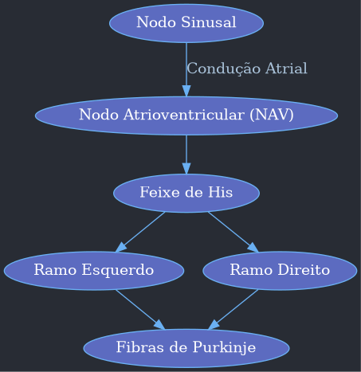
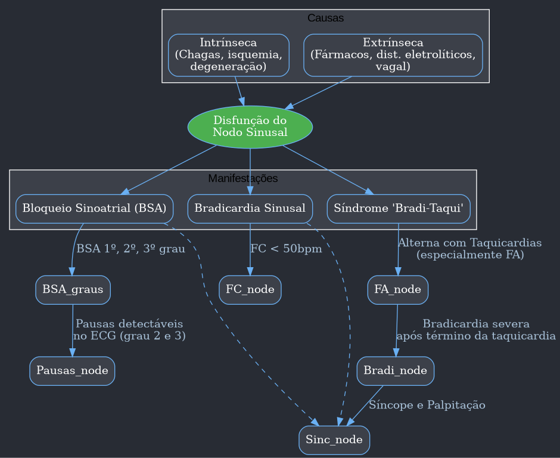
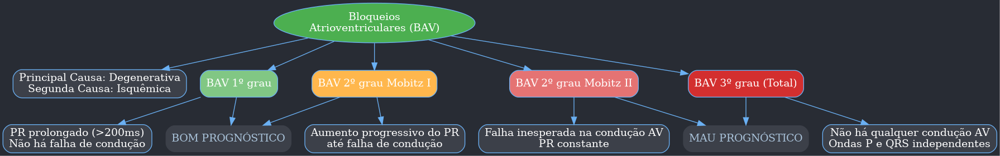
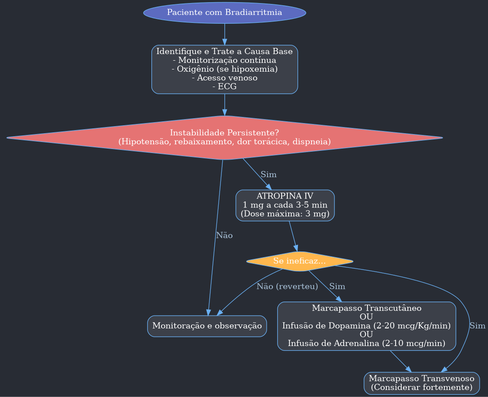
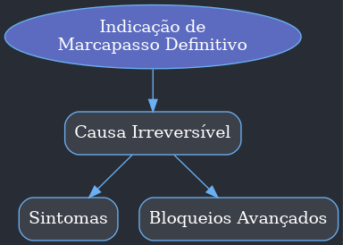
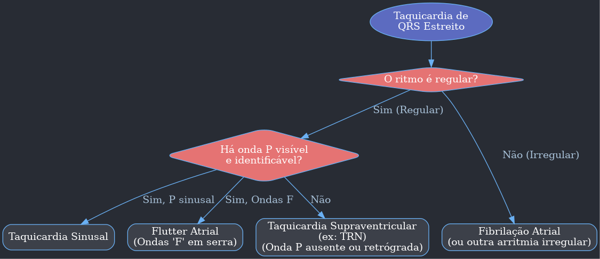
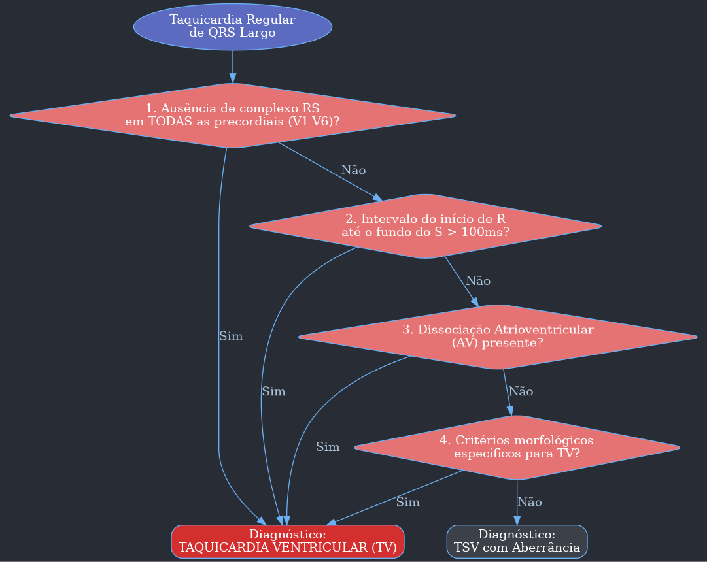
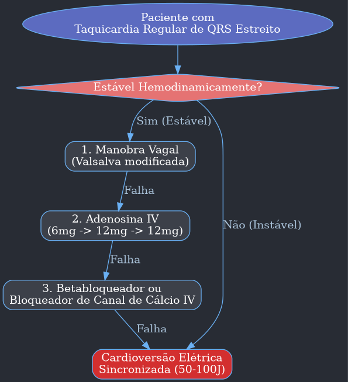
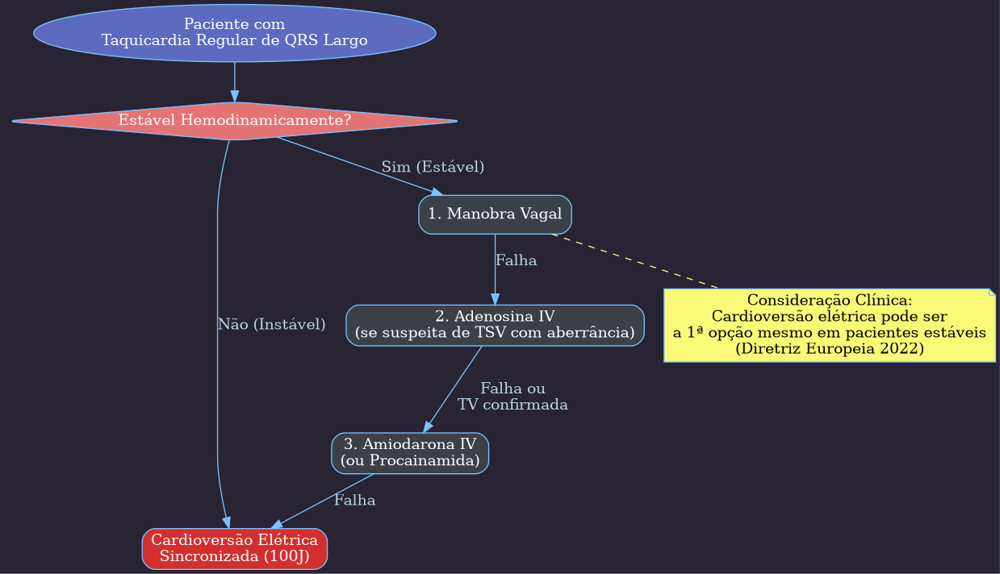

---
{"dg-publish":true,"permalink":"/9-periodo/aulas-segunda-rotacao/arritmias/","dgPassFrontmatter":true}
---

***

# Bradiarritmias

## Introdução
- **Bradiarritmia** é o assunto menos cobrado em provas de residência (1,68% das questões de cardiologia), mas as questões geralmente possuem menor dificuldade.
- A maioria das questões foca no **diagnóstico** através do eletrocardiograma (ECG), com as demais abordando conduta e fisiopatologia.
- A bradiarritmia é uma causa importante de síncope.

### Distribuição das Questões
- **Diagnóstico pelo ECG:** 51%
- **Tratamento:** 35%
- **Causa da Bradiarritmia:** 11%
- **Doença do nodo sinusal:** 3%

## 1.0 Definição
- **Arritmia:** Condição onde o ritmo e/ou a frequência cardíaca (FC) estão alterados sem uma justificativa fisiológica.
- **Bradiarritmias:** Arritmias que ocorrem com uma frequência cardíaca (FC) **abaixo de 50 batimentos por minuto (bpm)**, de forma permanente ou intermitente.

## 2.0 Etiologia das Bradiarritmias
- O coração possui dois tipos principais de células:
    1.  **Células automáticas:** Capazes de se despolarizar espontaneamente e iniciar o impulso elétrico. As células do **nodo sinusal** têm o maior automatismo e, por isso, comandam o ritmo cardíaco.
    2.  **Células de condução:** Propagam o impulso elétrico.
- As bradiarritmias ocorrem por problemas no **nodo sinusal**, no **nodo atrioventricular (NAV)** ou no **sistema de condução (His-Purkinje)**.

### Sistema de Condução Cardíaco

### Causas Intrínsecas vs. Extrínsecas
- As causas são divididas em:
    - **Intrínsecas:** Problemas diretos no tecido de condução.
    - **Extrínsecas:** Estímulos externos que causam a bradicardia.

| Causas Intrínsecas                                                                                                 | Causas Extrínsecas                                                                                                                             |
| ------------------------------------------------------------------------------------------------------------------- | ---------------------------------------------------------------------------------------------------------------------------------------------- |
| Degeneração do sistema de condução (principal causa em idosos)                                                      | Hipotireoidismo                                                                                                                                |
| Doença isquêmica do coração                                                                                         | Hipotermia                                                                                                                                     |
| Doenças infiltrativas (sarcoidose, amiloidose, hemocromatose)                                                         | **Drogas** (betabloqueadores, bloqueadores de canal de cálcio - BCC, clonidina, digoxina, antiarrítmicos)                                      |
| Doenças difusas do tecido conjuntivo (lúpus, artrite reumatoide, esclerodermia)                                      | Mediadas pelo sistema autonômico (síncope neurocardiogênica, hipersensibilidade do seio carotídeo)                                              |
| Cirurgia cardíaca prévia                                                                                            | Distúrbios eletrolíticos (hipo/hipercalemia)                                                                                                   |
| Doenças familiares                                                                                                  | Distúrbios neurológicos (hipertensão intracraniana - HIC, meningite)                                                                             |
| Doenças infecciosas (**Chagas**, endocardite, brucelose, leptospirose)                                                  | -                                                                                                                                              |

- A bradicardia deve ser investigada na presença de sintomas (síncope, dor torácica, lipotimia) ou cardiopatia prévia.

## 3.0 Classificação das Bradiarritmias
As bradiarritmias são classificadas em dois grandes grupos:
1.  **Disfunção do Nodo Sinusal (DNS)**
2.  **Distúrbios da Condução Atrioventricular (BAV)**

### 3.1 Disfunção do Nodo Sinusal (DNS)
- Caracterizada por alterações anatômicas ou funcionais no nodo sinusal.
- Quando sintomática, é chamada de **Doença do Nodo Sinusal**. Se o sintoma for síncope, é chamada de **Síndrome de Stoke-Adams**.
- **Causas:**
    - **Intrínseca:** Fibrose ou substituição gordurosa do tecido sinusal.
    - **Extrínseca:** Fármacos, distúrbios autonômicos ou eletrolíticos.
- **Epidemiologia:** Mais comum em mulheres e idosos (60-69 anos). No Brasil, a principal causa é a **cardiopatia chagásica crônica**.

#### 3.1.1 Bradicardia Sinusal
- Redução da frequência de disparo do nodo sinusal para uma **FC < 50 bpm**.
- **ECG:** Onda P sinusal (positiva em DII, DIII e aVF) sempre seguida por um complexo QRS. É uma "lentificação" do ritmo normal.

#### 3.1.2 Bloqueio Sinoatrial (BSA)
- Ocorre quando a atividade sinusal não consegue despolarizar o átrio.
- Existem 3 graus, de forma parecida com os BAVs:
    - **BSA 1º grau:** Retardo na condução. **Não é detectável no ECG**.
    - **BSA 2º grau:** Falhas intermitentes na condução.
        - **Tipo I:** Encurtamento progressivo do intervalo PP até uma falha.
        - **Tipo II:** Pausas sinusais súbitas com intervalo PP fixo (o intervalo da pausa é múltiplo do PP basal). **É o mais fácil de identificar no ECG**.
    - **BSA 3º grau:** Bloqueio completo da condução sinoatrial.
        - **ECG:** Ausência de onda P. O ritmo é mantido por um **escape juncional** (QRS estreito, regular, com FC em torno de 40-60 bpm).

#### 3.1.3 Síndrome "Bradi-Taqui"
- Também conhecida como síndrome "taqui-bradi".
- Ocorrência de **taquiarritmias supraventriculares** (principalmente Fibrilação Atrial) que, ao cessarem, são seguidas por uma **bradicardia severa** ou pausa sinusal.
- **Sintomas principais:** Síncope (causada pela pausa pós-taquicardia) e palpitações.
- A bradicardia facilita o reinício da taquiarritmia, criando um ciclo vicioso.
- Muitos casos necessitam de implante de marcapasso definitivo.

### 3.2 Distúrbios da Condução Atrioventricular
- O NAV funciona como um "filtro", lentificando a condução do átrio para o ventrículo.
- Os **Bloqueios Atrioventriculares (BAV)** são distúrbios nessa condução.
- **Causas principais:**
    1.  **Degenerativa (Doença de Lev-Lenègre):** Principal causa geral.
    2.  **Isquêmica:** Principalmente no **infarto de parede inferior**, que afeta a artéria coronária direita, responsável por irrigar o NAV.

#### Graus de BAV
- **BAV de 1º grau:**
    - Atraso fixo na condução AV. Todo estímulo atrial chega ao ventrículo.
    - **ECG:** **Intervalo PR aumentado e constante (> 200 ms ou 5 quadradinhos)**. Toda onda P é seguida por um QRS.
    - Geralmente benigno.

- **BAV de 2º grau:**
    - Falhas intermitentes na condução AV. Algumas ondas P não são seguidas por QRS.
    - **Mobitz I (Wenckebach):**
        - Aumento progressivo do intervalo PR até que uma onda P seja bloqueada (não seguida de QRS).
        - O ritmo é **irregular**. O intervalo RR vai se encurtando antes da pausa.
        - Geralmente benigno, com bloqueio no nível do próprio NAV.
    - **Mobitz II:**
        - Falha de condução súbita e inesperada.
        - **ECG:** Intervalo PR é constante (pode ser normal ou aumentado) e, subitamente, uma onda P é bloqueada.
        - Ritmo pode ser regular ou irregular.
        - Mais grave, indica pior prognóstico pois o bloqueio é mais distal (infra-hissiano).

- **BAV de 3º grau (BAVT ou Bloqueio Atrioventricular Total):**
    - Dissociação completa entre a atividade atrial e ventricular. Nenhum estímulo atrial chega aos ventrículos.
    - **ECG:** Ondas P e complexos QRS são regulares, mas independentes um do outro. A frequência atrial (ondas P) é maior que a frequência ventricular (QRS).
    - O ritmo ventricular é mantido por um **ritmo de escape**:
        - **Escape Juncional:** QRS estreito, FC entre 40-60 bpm. Melhor prognóstico.
        - **Escape Idioventricular:** QRS largo, FC entre 20-40 bpm. Pior prognóstico.
    - Geralmente sintomático e grave.

## 4.0 Abordagem das Bradiarritmias

### 4.1 Bradiarritmias Instáveis
- A instabilidade ocorre quando a bradicardia causa **sinais de baixo débito cardíaco**.
- **Sinais de Baixo Débito:**
    - Hipotensão
    - Alteração do nível de consciência
    - Sinais de insuficiência cardíaca (turgência jugular, crepitações)
    - Dor torácica
    - Síncope
- A conduta inicial visa **aumentar a frequência cardíaca imediatamente**.

#### 4.1.1 Conduta na Bradiarritmia Instável

- **Atropina:** Primeira linha. Bloqueia a ação parassimpática, aumentando a FC. É mais eficaz em bloqueios "altos" (supra-hissianos, com QRS estreito). A dose, segundo o ACLS, é de **1 mg IV**, repetida a cada 3-5 minutos, até um máximo de 3 mg.
- **Marcapasso Transcutâneo:** Segunda linha. É um procedimento temporário, doloroso e que exige sedação. Usado para estabilizar o paciente rapidamente.
- **Drogas Vasoativas (Dopamina ou Adrenalina):** Alternativas ao marcapasso transcutâneo se este não estiver disponível.
- **Marcapasso Transvenoso:** Solução definitiva para a fase aguda, inserido por punção venosa profunda.

### 4.2 Bradiarritmias Estáveis
- Em pacientes estáveis, há tempo para investigar a causa.
- Deve-se procurar por causas reversíveis (drogas, distúrbios eletrolíticos).
- Se a causa não for reversível e o paciente tiver um bloqueio avançado, ele deve ser considerado para implante de marcapasso definitivo.

#### 4.2.1 Quando Indicar o Marcapasso Definitivo?
- A indicação se baseia em duas situações principais: **presença de sintomas** ou **bloqueios avançados** de causa não reversível.

| Indicação de Marcapasso Definitivo                                                 | Situação           |
| ---------------------------------------------------------------------------------- | ------------------ |
| Doença do nodo sinusal com sintomas relacionados à bradicardia                     | SINTOMAS           |
| BAV adquirido de 2º grau Mobitz II ou 3º grau                                      | BLOQUEIO AVANÇADO  |
| BAV adquirido de 2º grau Mobitz I que cause sintomas                               | SINTOMAS           |
| Síndrome "bradi-taqui" sintomática                                                 | SINTOMAS           |
| BAV intermitente (incluindo FA com baixa resposta ventricular)                     | BLOQUEIO AVANÇADO  |
| Pausas sintomáticas                                                                | SINTOMAS           |
| Pausas assintomáticas > 6 seg (parada sinusal, BSA ou BAV)                         | BLOQUEIO AVANÇADO  |

***

#  Taquiarritmias

## 1.0 Definição
- **Taquiarritmias:** Arritmias que provocam aumento da frequência cardíaca (FC > 100 bpm) sem justificativa fisiológica.
- A abordagem inicial se baseia em 3 características:
    1.  **Estabilidade hemodinâmica:** O paciente está estável ou instável?
    2.  **Duração do QRS:** O QRS é estreito (< 120 ms) ou largo (≥ 120 ms)?
    3.  **Regularidade do Ritmo:** O ritmo RR é regular ou irregular?

### Classificação Didática das Taquiarritmias

| Característica | QRS Estreito (< 120 ms)                                                                                                    | QRS Largo (≥ 120 ms)                                                                                                       |
| :------------- | :------------------------------------------------------------------------------------------------------------------------ | :------------------------------------------------------------------------------------------------------------------------ |
| **Ritmo Regular**  | - Taquicardia Sinusal - Taquicardia por Reentrada Nodal (TRN) - Taquicardia Atrioventricular (TAV) - Taquicardia Atrial Focal - Flutter Atrial | - Taquicardia Ventricular Monomórfica (TV) - Taquicardia Supraventricular (TSV) com aberrância - TAV Antidrômica |
| **Ritmo Irregular**| - Fibrilação Atrial (FA) - Taquicardia Atrial Multifocal - Flutter Atrial com BAV variável                             | - Taquicardia Ventricular Polimórfica - Torsades de Pointes - Fibrilação Atrial com pré-excitação (WPW)          |

## 2.0 Mecanismos das Taquiarritmias
1.  **Automatismo Anormal:** Células fora do nodo sinusal (focos ectópicos) disparam em uma frequência maior que a sinusal, assumindo o comando do ritmo.
2.  **Reentrada:** Principal mecanismo. Um impulso elétrico circula repetidamente por um circuito anômalo, gerando batimentos contínuos e rápidos. Pode ocorrer em nível nodal (TRN), atrioventricular (TAV em WPW) ou ventricular (TV pós-infarto).
3.  **Atividade Deflagrada (Pós-potencial):** Impulsos anormais que surgem durante ou logo após a repolarização celular, podendo disparar uma taquiarritmia. O exemplo clássico é o **Torsades de Pointes**, associado ao prolongamento do intervalo QT.

## 3.0 Abordagem Inicial do Paciente

### 3.1 Primeiro Passo: Paciente está instável?
- A instabilidade hemodinâmica é uma **emergência médica** e exige interrupção imediata da arritmia.
- A conduta é **cardioversão elétrica sincronizada** ou **desfibrilação**.

#### Critérios de Instabilidade (Os 4 D's)
- **D**iminuição da pressão (choque/hipotensão sintomática)
- **D**or torácica anginosa
- **D**ispneia (sinais de insuficiência cardíaca aguda)
- **D**iminuição da consciência (rebaixamento do nível de consciência)

#### Conduta na Taquiarritmia Instável

| Taquiarritmia                 | Carga no Desfibrilador Bifásico | Conduta                     |
| :---------------------------- | :------------------------------ | :-------------------------- |
| QRS estreito e regular        | 50 - 100 J                      | Cardioversão Sincronizada   |
| QRS estreito e irregular      | 120 - 200 J                     | Cardioversão Sincronizada   |
| QRS largo e regular           | 100 J                           | Cardioversão Sincronizada   |
| **QRS largo e irregular**     | 200 J                           | **Desfibrilação**           |

- **Cardioversão vs. Desfibrilação:**
    - **Cardioversão:** Choque **sincronizado** com o QRS do paciente. Usado para arritmias organizadas.
    - **Desfibrilação:** Choque **não sincronizado**. Usado para ritmos caóticos (FV/TV sem pulso) ou quando a sincronização não é possível (TV polimórfica).

### 3.2 Segundo Passo: História Clínica e Anamnese
- O principal sintoma é a **palpitação**. A descrição ajuda a sugerir a causa.

| Causa da Arritmia                | Característica das Palpitações                                                                           |
| :------------------------------- | :------------------------------------------------------------------------------------------------------- |
| Taquicardia por Reentrada Nodal  | Taquicárdicas, regulares, início e término súbitos, com "sinal de frog" (pulsação no pescoço). Comum em mulheres jovens. |
| Síndrome de Wolff-Parkinson-White| Rítmicas, em jovens saudáveis, podendo ter dor precordial associada.                                      |
| Fibrilação Atrial Paroxística    | Arrítmicas, com sensação de "peso", em pacientes com comorbidades (obesidade, HAS, etilismo).              |
| Extrassístoles                   | Tipo "falha" ou "soco no peito".                                                                          |

### 3.3 Terceiro Passo: Eletrocardiograma (ECG)
- A análise do ECG é fundamental para o diagnóstico em pacientes estáveis.

#### Algoritmo de Diagnóstico para Taquicardia de QRS Estreito

#### Algoritmo de Diagnóstico para Taquicardia de QRS Largo
- **Principal desafio:** Diferenciar Taquicardia Ventricular (TV) de Taquicardia Supraventricular (TSV) com aberrância. **Na dúvida, trate como TV.**
- **Critérios de Brugada:** Algoritmo para diferenciar TV de TSV com aberrância em taquicardias regulares de QRS largo.
    1.  **Ausência de RS em V 1-V 6?** Se sim -> **TV**.
    2.  **Intervalo do início de R ao nadir de S > 100 ms?** Se sim -> **TV**.
    3.  **Dissociação AV?** Se sim -> **TV**.
    4.  **Critérios morfológicos para TV?** Se sim -> **TV**.
    - Se nenhuma resposta for "sim", o diagnóstico é **TSV com aberrância**.

## 4.0 Tratamento das Taquiarritmias Estáveis

### 4.1 Taquicardias Regulares de QRS Estreito
- O tratamento visa inibir o nodo AV.

1.  **Manobra Vagal (Valsalva modificada):** Primeira tentativa. Reverte cerca de 43% dos casos.
2.  **Adenosina:** Droga de escolha se a manobra vagal falhar. Causa um bloqueio AV transitório. A resposta à adenosina ajuda no diagnóstico:
    - **Término súbito:** Sugere reentrada (TRN, TAV).
    - **Redução gradual:** Sugere automatismo (Taqui sinusal, atrial).
    - **Nenhum efeito:** Dose inadequada ou TV septal alta.
3.  **Betabloqueador ou Bloqueador de Canal de Cálcio IV:** Se adenosina falhar.

### 4.2 Taquicardias Regulares de QRS Largo
- A abordagem é controversa, mas a diretriz europeia de 2019 sugere uma sequência similar à de QRS estreito, sempre com cautela.

## 5.0 Antiarrítmicos
- **Classificação de Vaughan-Williams:** (Mnemônico: **SOBE** **K**aká de **C**abeça)

| Classe | Mecanismo de Ação               | Fármacos Principais                             |
| :----- | :------------------------------ | :---------------------------------------------- |
| **I**      | Bloqueador de Canal de **SÓ**dio  | Ia: Procainamida; Ib: Lidocaína; Ic: Propafenona |
| **II**     | **BE**tabloqueador              | Metoprolol, propranolol, atenolol...            |
| **III**    | Bloqueador de Canal de **K**+ (potássio) | **Amiodarona**, sotalol                         |
| **IV**     | Bloqueador de Canal de **CÁ**lcio | Verapamil, diltiazem                            |

- **Amiodarona (Classe III):** Antiarrítmico de largo espectro, muito eficaz, mas com múltiplos efeitos colaterais a longo prazo (tireoide, pulmão, fígado, pele, olhos). Requer monitoramento regular.

## 6.0 Tipos Específicos de Taquiarritmias (Resumo)
- **Taquicardia Sinusal Inapropriada:** FC sinusal elevada em repouso sem causa aparente. Tratamento com medidas comportamentais, betabloqueadores ou ivabradina.
- **Taquicardia Atrial Multifocal (TAM):** Ritmo irregular com pelo menos 3 morfologias de onda P diferentes. Fortemente associada a doenças pulmonares (DPOC). Tratamento focado na doença de base.
- **Flutter Atrial:** Macrorreentrada no átrio, geralmente com FC ventricular "mágica" (150, 100, 75 bpm). ECG com as clássicas "ondas F" em formato de serra. Tratamento preferencial é cardioversão ou ablação.
- **Taquicardia por Reentrada Nodal (TRN):** Causa mais comum de taquicardia supraventricular paroxística. QRS estreito, regular, sem onda P visível. Responde bem à manobra vagal e adenosina.
- **Síndrome de Wolff-Parkinson-White (WPW):** Presença de uma via acessória que causa pré-excitação ventricular.
    - **ECG basal:** PR curto e onda delta.
    - **TAV Ortodrômica:** A mais comum (90%). QRS **estreito**. Tratamento com manobra vagal/adenosina.
    - **TAV Antidrômica:** QRS **largo**. Tratamento com propafenona ou cardioversão.
    - **FA + WPW:** Ritmo irregular com QRS largos e bizarros. **NÃO USE DROGAS QUE FREIAM O NODO AV (adenosina, betabloqueador, etc.)!** Risco de degenerar para FV. A conduta é **cardioversão elétrica** se instável ou procainamida/amiodarona se estável.
- **Taquicardia Ventricular (TV):**
    - **Monomórfica:** Associada a cicatriz (pós-IAM). QRS largos e iguais.
    - **Polimórfica:** QRS largos e com morfologias variáveis.
- **Torsades de Pointes:** TV polimórfica com padrão de "torção das pontas" do QRS. Associada a **intervalo QT longo**.
    - **Tratamento:**
        - **Instável:** Desfibrilação.
        - **Estável:** Sulfato de Magnésio IV. Corrigir distúrbios e suspender drogas que prolongam o QT.