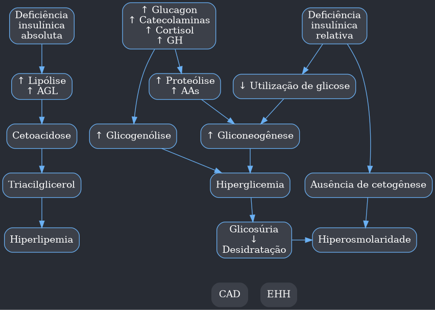
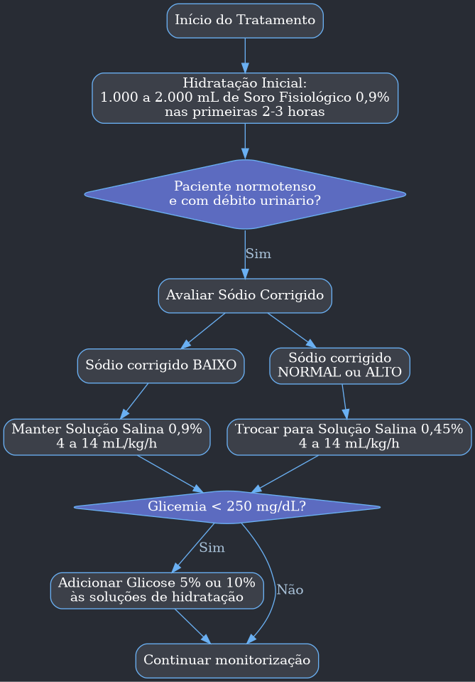
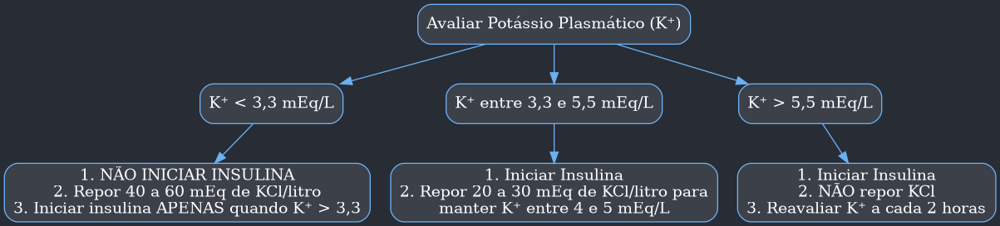
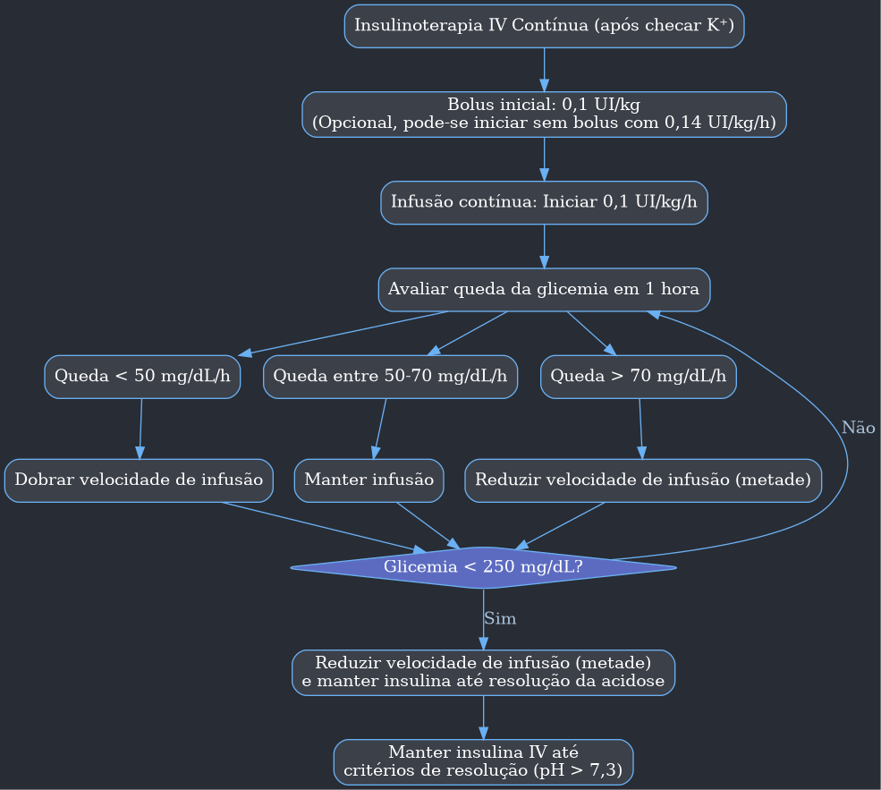

---
{"dg-publish":true,"permalink":"/9-periodo/aulas-segunda-rotacao/cetoacidose-diabetica/"}
---

***

# Cetoacidose Diabética (CAD)

## Introdução

-   A Cetoacidose Diabética (CAD) é uma complicação aguda e grave do Diabetes Mellitus (DM).
-   É responsável por até 8% das internações hospitalares relacionadas ao diabetes.
-   Cerca de 30% dos novos casos de DM tipo 1 (DM 1) se apresentam inicialmente com um quadro de CAD, sendo especialmente comum em crianças e adolescentes.
-   **Epidemiologia**:
    -   Embora seja mais comum em pacientes com DM 1, principalmente jovens do sexo feminino, a CAD pode ocorrer em pacientes com DM tipo 2 (DM 2) que são submetidos a um estresse intenso, como infarto do miocárdio ou sepse.
    -   O Estado Hiperosmolar Hiperglicêmico (EHH), por outro lado, é uma complicação exclusiva do DM 2.

## Fisiopatologia

-   O pilar da CAD é a **deficiência grave de insulina**, que pode ser:
    -   **Absoluta**: Ausência total de insulina circulante (comum no DM 1 sem tratamento).
    -   **Relativa**: Grande elevação dos hormônios contrarreguladores (glucagon, catecolaminas, cortisol, GH) que supera a ação da insulina presente (comum no DM 2 sob estresse).
-   Essa combinação de deficiência de insulina e excesso de hormônios contrarreguladores leva a uma tríade bioquímica característica:
    1.  **Hiperglicemia**
    2.  **Cetonemia** (acúmulo de corpos cetônicos)
    3.  **Acidose metabólica com ânion-gap elevado**.

-   **Mecanismos Detalhados**:
    -   **Hiperglicemia**:
        -   A falta de insulina e o excesso de hormônios contrarreguladores aumentam a produção de glicose pelo fígado e rins (glicogenólise e gliconeogênese).
        -   Ao mesmo tempo, a captação de glicose pelos tecidos periféricos (músculos, gordura) é reduzida.
        -   Isso resulta em hiperglicemia severa, que leva à hiperosmolaridade plasmática.
        -   Quando a glicemia ultrapassa o limiar renal (180-200 mg/dL), ocorre **glicosúria** (glicose na urina), que causa **diurese osmótica** (perda intensa de água e eletrólitos como sódio e potássio).
    -   **Cetogênese e Acidose**:
        -   A deficiência grave de insulina remove a inibição sobre a lipase hormônio-sensível no tecido adiposo.
        -   Isso leva a um aumento da **lipólise** (quebra de gordura), liberando uma grande quantidade de ácidos graxos livres na circulação.
        -   Os ácidos graxos são captados pelo fígado e, na mitocôndria, sofrem betaoxidação, resultando na produção massiva de **corpos cetônicos**: ácido acetoacético, ácido beta-hidroxibutírico e acetona.
        -   Como são ácidos orgânicos, seu acúmulo no sangue consome o bicarbonato (tampão do corpo) e causa **acidose metabólica com ânion-gap elevado**.
        -   > **Nota**: Normalmente, a cetogênese é bloqueada por níveis mesmo que baixos de insulina. Por isso, a CAD só ocorre em deficiência absoluta ou relativa muito grave.

## Fatores Desencadeantes

-   São os gatilhos que levam à descompensação diabética e ao desenvolvimento da CAD.
-   **Infecções (30-50% dos casos)**: São o principal fator. As mais comuns são pneumonia e infecção do trato urinário (ITU). Qualquer infecção pode aumentar a resistência à insulina e os hormônios contrarreguladores.
-   **Baixa adesão ao tratamento (20-25%)**: Principalmente a omissão ou uso irregular de insulina, muito relevante em adolescentes com DM 1.
-   **Primeira manifestação do DM 1 (primodescompensação)**: Em 25% dos casos, a CAD é o primeiro sinal da doença.
-   **Doenças cardiovasculares**: Infarto Agudo do Miocárdio (IAM) e Acidente Vascular Cerebral (AVC) são causas importantes em pacientes acima de 40 anos (até 5% dos casos).
-   **Outras causas**:
    -   Excesso de hormônios contrarreguladores (acromegalia, hipertireoidismo, Cushing).
    -   Drogas hiperglicemiantes (glicocorticoides, diuréticos tiazídicos).
    -   Uso abusivo de álcool ou cocaína.
    -   Complicações intra-abdominais (pancreatite, apendicite).
    -   Obstrução do cateter em usuários de bomba de infusão de insulina.
-   > **Importante**: A pesquisa de um fator desencadeante é obrigatória em todo paciente com CAD.

## Manifestações Clínicas

-   **Início**: Agudo, com evolução em horas ou dias.
-   **Pródromo (sintomas iniciais)**: Poliúria (urinar muito), polidipsia (sede excessiva), polifagia (fome excessiva) e mal-estar indefinido.
-   **Exame Físico**:
    -   Sinais de **desidratação**: mucosas secas, hipotensão, taquicardia.
    -   **Respiração de Kussmaul**: Movimentos respiratórios rápidos e profundos, uma tentativa do corpo de compensar a acidose metabólica eliminando CO₂. Ocorre tipicamente com pH entre 7,0 e 7,2.
    -   **Hálito cetônico**: Odor adocicado, comparado a "maçã podre", devido à exalação de acetona.
    -   **Dor abdominal**: Achado muito característico, pode ser grave a ponto de simular um abdome agudo cirúrgico. Tende a melhorar com a hidratação inicial e a reversão da cetoacidose.
-   **Estado Neurológico**:
    -   Geralmente, o paciente está alerta.
    -   Alterações do nível de consciência são mais comuns no EHH, mas 10-20% dos casos de CAD (os mais graves, com maior hiperosmolaridade) podem cursar com torpor ou coma.
-   **Febre**: Não é um achado frequente, e sua ausência não descarta uma infecção subjacente. Hipotermia é um sinal de mau prognóstico.
-   A base do diagnóstico é a **tríade laboratorial**: hiperglicemia, cetonemia/cetonúria e acidose.

## Avaliação Laboratorial

-   **Exames Iniciais na Emergência**:
    -   **Glicemia capilar**: Para detecção rápida de hiperglicemia.
    -   **Cetonas**: No sangue (cetonemia) ou na urina (cetonúria).
        -   **Cetonúria (fitas urinárias)**: Método mais comum no Brasil. Usa a reação do nitroprussiato, que **não detecta o ácido beta-hidroxibutírico**, o principal corpo cetônico na CAD. Mesmo assim, uma cetonúria fortemente positiva é um critério diagnóstico.
        -   **Cetonemia**: Exame de escolha se disponível, pois mede os três corpos cetônicos.
-   **Osmolaridade Efetiva**:
    -   Pode ser calculada pela fórmula: `Osmolaridade Efetiva = (2 × Na⁺) + (Glicose / 18)`.
    -   Valores normais: até 285-295 mEq/L.
    -   Valores > 320 mEq/L estão associados a rebaixamento do nível de consciência.
-   **Eletrólitos**:
    -   **Sódio (Na⁺)**: Geralmente está falsamente baixo (pseudo-hiponatremia) devido ao influxo de água para o plasma causado pela hiperglicemia. É necessário calcular o **sódio corrigido**:
        -   `Na⁺ corrigido = Na⁺ medido + [1,6 × (Glicose - 100) / 100]`
    -   **Potássio (K⁺)**: Este é um ponto crítico.
        -   O **potássio corporal total está sempre depletado** devido a perdas urinárias.
        -   No entanto, o potássio plasmático pode estar normal ou até elevado na chegada, devido à saída de K⁺ de dentro das células para o plasma (causada pela acidemia e falta de insulina).
        -   O tratamento com insulina irá jogar o potássio de volta para dentro das células, podendo causar uma **hipocalemia grave e fatal**. A reposição é fundamental.
-   **Outros Exames**:
    -   **Gasometria arterial ou venosa**: Para avaliar o pH e o bicarbonato.
    -   Hemograma: Leucocitose é comum e não significa necessariamente infecção.
    -   Função renal (ureia e creatinina): Insuficiência renal aguda é comum.
    -   Enzimas: Amilase, lipase (se suspeita de pancreatite), CPK, transaminases podem estar elevadas.
    -   **Eletrocardiograma (ECG)**: Para rastrear isquemia (IAM como gatilho) e complicações da hipercalemia (ondas T apiculadas).

## Diagnóstico e Classificação

Os critérios diagnósticos, segundo a Sociedade Brasileira de Diabetes (SBD), são:

| Critérios | Parâmetros Laboratoriais |
| :--- | :--- |
| **Hiperglicemia** | Glicemia ≥ 250 mg/dL¹ |
| **Acidose** | pH arterial ≤ 7,3 ou bicarbonato sérico ≤ 18 mEq/L² |
| **Cetose** | Cetonúria fortemente positiva ou cetonemia presente |
¹ *Raramente, a CAD pode ocorrer com glicemia < 250 mg/dL (ex: jejum, gestação, uso de inibidores de SGLT 2).*
² *A Federação Internacional de Diabetes considera o valor de 15 mEq/L.*

---

A gravidade da CAD é classificada para guiar o tratamento (UTI vs. Emergência). A classificação da American Diabetes Association (ADA) é a mais utilizada:

| Classificação | Leve | Moderada | Grave |
| :--- | :--- | :--- | :--- |
| **pH arterial** | 7,25 a 7,3 | 7,0 a 7,24 | < 7,0 |
| **Bicarbonato (mEq/L)** | 15 a 18 | 10 a 14,9 | < 10 |
| **Alteração do Sensório** | Alerta | Alerta / Sonolento | Estupor / Coma |
| **Ânion-gap** | > 10 | > 12 | > 12 |

## Diagnóstico Diferencial

-   **Outras causas de cetoacidose**:
    -   **Cetoacidose Alcoólica**: Ocorre em etilistas crônicos, geralmente após um período de jejum e vômitos. A glicemia é normal ou baixa.
    -   **Cetoacidose de Jejum**: Após jejum prolongado (> 3 dias), a cetose é leve e o pH é normal.
-   **Outras causas de acidose metabólica com ânion-gap alargado**:
    -   Acidose lática.
    -   Insuficiência renal crônica.
    -   Intoxicação por metanol, etilenoglicol, salicilatos.
-   **Cetoacidose Euglicêmica**:
    -   É uma forma de CAD com glicemia não muito elevada (< 250 mg/dL).
    -   Ocorre com mais frequência em gestantes, usuários de inibidores de SGLT 2, etilistas e em jejum prolongado.

## Tratamento

O tratamento da CAD é baseado em **três pilares fundamentais**:
1.  **Hidratação Intravenosa**
2.  **Reposição de Potássio**
3.  **Insulinoterapia**

A monitorização contínua de glicemia, eletrólitos e estado clínico é essencial.

### Reposição Volêmica

-   **Objetivo**: Restaurar o volume intra e extracelular e a perfusão renal. A hidratação por si só já ajuda a reduzir a glicemia.
-   O fluxograma abaixo detalha o processo:

### Reposição de Potássio

-   É uma etapa crucial e **deve ser avaliada ANTES de iniciar a insulina**. O manejo depende do nível de potássio plasmático.

### Insulinoterapia

-   Utiliza-se apenas insulina de ação rápida (Regular) por via intravenosa contínua.
-   O objetivo é uma queda gradual da glicemia (50 a 70 mg/dL por hora).

### Uso de Bicarbonato

-   **Uso controverso e restrito**.
-   **Indicação**: Apenas em casos de acidose muito grave (pH arterial < 6,9) com instabilidade hemodinâmica (choque) ou depressão miocárdica.
-   **Riscos**: Hipocalemia, piora paradoxal da acidose no sistema nervoso central, desvio da curva de dissociação da hemoglobina.
-   **Dose recomendada**: 50 a 100 mEq diluídos em 400 mL de solução isotônica, infundidos em 2 horas.

### Critérios de Resolução da CAD

O tratamento intensivo deve ser mantido até que o paciente atinja pelo menos **dois dos três** critérios seguintes:
1.  **pH > 7,3**
2.  **Bicarbonato ≥ 15 mEq/L**
3.  **Glicemia ≤ 200 mg/dL**
> **Nota**: A cetonúria não é um bom parâmetro de melhora, pois pode permanecer positiva por mais tempo.

### Cuidados Pós-Resolução

-   Após a resolução, deve-se fazer a transição da insulina intravenosa para a subcutânea.
-   **Ponto Crítico**: É fundamental administrar a primeira dose de insulina subcutânea (basal ou ultrarrápida) **1 a 2 horas ANTES de desligar a bomba de infusão intravenosa**.
-   **Por quê?** A insulina regular IV tem uma meia-vida muito curta (3-5 minutos). Sem essa sobreposição, o paciente fica sem ação insulínica, e a cetoacidose pode retornar rapidamente.
-   Ajustar o esquema de manutenção (geralmente basal-bolus) nos dias seguintes.

## Complicações

-   **Hipoglicemia**: A complicação mais comum. Requer monitorização glicêmica capilar de hora em hora.
-   **Hipocalemia**: Complicação grave do tratamento com insulina. Prevenível com reposição adequada. Pode levar a arritmias cardíacas fatais.
-   **Edema Cerebral**:
    -   A complicação mais grave, com alta mortalidade (20-40%).
    -   É rara em adultos, mas mais comum em crianças.
    -   **Fatores de risco**: Hidratação muito agressiva e correção muito rápida da glicemia e da osmolaridade.
    -   **Sintomas**: Cefaleia, vômitos, rebaixamento súbito do nível de consciência, convulsões.
    -   **Prevenção**: Corrigir a desidratação e a glicemia de forma gradual. Manter a queda da osmolaridade em no máximo 3 mOsm/L/h.
-   **Acidose Hiperclorêmica**: Pode ocorrer pelo uso de grandes volumes de soro fisiológico 0,9% (rico em cloro). Geralmente é transitória e se resolve espontaneamente.
-   **Tromboembolismo**: O risco é aumentado devido à desidratação e ao estado inflamatório.

## Prognóstico

-   A mortalidade associada à CAD é de cerca de 5 a 9%, mas pode ser inferior a 5% em centros de excelência.
-   O prognóstico é pior em idosos, gestantes, pacientes com múltiplas comorbidades, e na presença de coma ou hipotensão.
-   A CAD é a principal causa de morte em pessoas com diabetes com menos de 20 anos de idade.