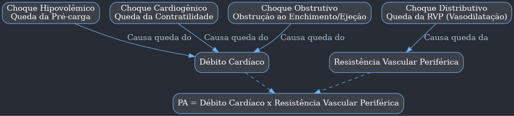
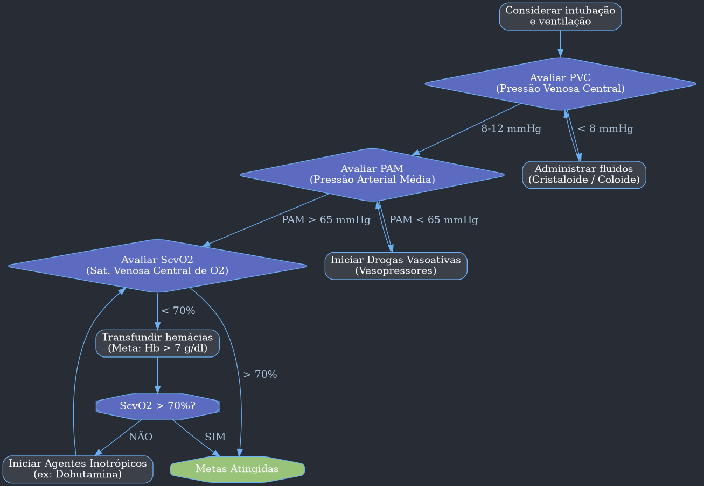

---
{"dg-publish":true,"permalink":"/9-periodo/aulas-segunda-rotacao/choques-e-condutas/","dgPassFrontmatter":true}
---

---

### **Aula Aprofundada: Abordagem ao Paciente Chocado - Foco em Choque Hipovolêmico e Séptico**

#### **Tópico 1: Definição e Fisiopatologia Fundamental do Choque**

-   **O que é Choque? A Definição Central**
    -   Choque é um estado de **hipoperfusão tecidual sistêmica**, que leva a um desequilíbrio crítico entre a oferta (DO₂) e o consumo (VO₂) de oxigênio pelas células.
    -   Quando a oferta de oxigênio é inadequada para a demanda metabólica, a célula é forçada a sair do metabolismo aeróbico (que gera ~36 ATP por molécula de glicose) e entrar no **metabolismo anaeróbico**.
    -   O subproduto do metabolismo anaeróbico é o **ácido lático**, levando à **acidose lática**. A produção de energia cai drasticamente (~2 ATP por glicose), o que é insuficiente para manter as funções celulares, resultando em disfunção e, eventualmente, morte celular.

-   **A Equação da Vida: Pressão Arterial = Débito Cardíaco x Resistência Vascular Periférica**
    -   Compreender esta fórmula é essencial para entender os diferentes tipos de choque.
        -   **Pressão Arterial (PA):** É a força que impulsiona o sangue pelo corpo.
        -   **Débito Cardíaco (DC):** É o volume de sangue que o coração bombeia por minuto (DC = Frequência Cardíaca x Volume Sistólico). Representa a eficiência da "bomba".
        -   **Resistência Vascular Periférica (RVP):** É o tônus dos vasos sanguíneos. Vasos contraídos aumentam a RVP; vasos dilatados diminuem a RVP. Representa a integridade dos "canos".

-   **Choque vs. Hipotensão: Uma Distinção Crucial**
    -   **Hipotensão** é um sinal, definido numericamente (ex: Pressão Arterial Média - PAM < 65 mmHg).
    -   **Choque** é um estado fisiopatológico (hipoperfusão).
    -   É possível ter choque com pressão normal (fase compensada) e hipotensão sem choque (condições fisiológicas). O diagnóstico do choque é, portanto, clínico e metabólico, não apenas hemodinâmico.

---

#### **Tópico 2: Os Quatro Tipos de Choque e Suas Causas**

-   Cada tipo de choque afeta a "equação da vida" de uma maneira diferente.

| Tipo de Choque | Problema Primário | Variável Afetada na Fórmula | Exemplos Clínicos Comuns |
| :--- | :--- | :--- | :--- |
| **Hipovolêmico** | "Tanque Vazio" (Volume inadequado) | **↓ Débito Cardíaco** (pré-carga) | Hemorragia (trauma, TGI), desidratação grave (vômitos, diarreia), grandes queimados (perda de plasma). |
| **Cardiogênico** | "Bomba Falha" (Coração não bombeia) | **↓ Débito Cardíaco** (contratilidade) | Infarto Agudo do Miocárdio, insuficiência cardíaca descompensada, miocardite, arritmias graves. |
| **Distributivo** | "Canos Dilatados" (Vasodilatação maciça) | **↓ Resistência Vascular Periférica** | **Sepse**, anafilaxia, choque neurogênico (lesão medular alta), crise adrenal. |
| **Obstrutivo** | Obstrução mecânica ao fluxo sanguíneo | **↓ Débito Cardíaco** (obstrução) | Tamponamento cardíaco, Tromboembolismo Pulmonar (TEP) maciço, pneumotórax hipertensivo. |

---

#### **Tópico 3: As Fases do Choque - A Progressão da Falha Orgânica**

-   O choque é um processo contínuo que pode ser didaticamente dividido em três fases.

-   **Fase 1: Choque Compensado (Pré-choque)**
    -   **Fisiopatologia:** O corpo detecta a queda inicial na perfusão e ativa o sistema nervoso simpático (liberando adrenalina/noradrenalina) e o sistema renina-angiotensina-aldosterona.
    -   **Clínica:** O paciente apresenta **taquicardia**, extremidades podem começar a ficar frias e o tempo de enchimento capilar pode estar discretamente aumentado. **A pressão arterial ainda está normal**.
    -   **Marcador Laboratorial:** O **lactato** é o primeiro a se alterar, sendo um indicador sensível de hipoperfusão oculta.

-   **Fase 2: Choque Descompensado**
    -   **Fisiopatologia:** Os mecanismos compensatórios são superados. A vasoconstrição não consegue mais manter a pressão, e a contratilidade cardíaca pode começar a falhar devido à acidose.
    -   **Clínica:** A **hipotensão** se manifesta. O paciente apresenta os sinais clássicos: pele fria e pegajosa, oligúria (redução da diurese), e rebaixamento do nível de consciência.

-   **Fase 3: Choque Irreversível**
    -   **Fisiopatologia:** O dano celular é tão severo que a homeostase não pode ser restaurada. A falha na produção de ATP leva à falência da bomba de sódio-potássio, edema celular, lise e morte. Isso desencadeia uma cascata inflamatória sistêmica.
    -   **Clínica:** Disfunção de múltiplos órgãos (pulmão, rim, fígado, cérebro) que não responde mais ao tratamento, culminando na morte.

---

#### **Tópico 4: Abordagem ao Choque Hipovolêmico/Hemorrágico**

-   **Princípio Mestre:** Não se enche um balde furado. **A prioridade número um é o controle da hemorragia.**

-   **Identificando a Fonte da Hemorragia no Trauma ("5 Fontes")**
    1.  **Hemorragia Externa:** Ferimentos visíveis. Controle com compressão direta, torniquete.
    2.  **Tórax:** Hemotórax. Diagnóstico por E-FAST, radiografia. Tratamento com drenagem torácica.
    3.  **Abdome:** Lesão de órgãos sólidos (fígado, baço) ou vasos. Diagnóstico por E-FAST, tomografia. Tratamento com laparotomia.
    4.  **Pelve:** Fraturas pélvicas podem sangrar litros. Suspeitar em traumas de alta energia. Tratamento com estabilização pélvica ("lençol", *pelvic binder*).
    5.  **Ossos Longos:** Uma fratura de fêmur pode sangrar de 1 a 1.5 litros. Imobilizar a fratura ajuda a conter o sangramento.

-   **Classificação do Choque Hemorrágico (ATLS) - Detalhada**

| Classe | Perda Sanguínea | FC (bpm) | PA | FR (rpm) | Diurese | Estado Mental | O que Fazer? |
| :--- | :--- | :--- | :--- | :--- | :--- | :--- | :--- |
| **I** | < 15% (<750mL) | < 100 | Normal | 14-20 | >30 mL/h | Ansioso | Observar, controlar sangramento menor. |
| **II** | 15-30% (750-1500 mL) | > 100 | Normal | 20-30 | 20-30 mL/h | Mais ansioso | Iniciar cristaloides. Reavaliar. |
| **III** | **30-40% (1500-2000 mL)** | **> 120** | **Hipotenso** | **30-40** | **5-15 mL/h** | **Confuso** | **Cristaloides + INICIAR SANGUE.** |
| **IV** | **> 40% (>2000 mL)** | **> 140** | **Muito Hipotenso** | **> 35** | **Mínima** | **Letárgico/Coma** | **ATIVAR PROTOCOLO DE TRANSFUSÃO MACIÇA.** |

-   **Reposição Volêmica: O Que, Quanto e Quando?**
    -   **O Quê?**
        -   **Cristaloides Balanceados (Ringer Lactato):** São a primeira escolha. O lactato do Ringer é metabolizado no fígado a bicarbonato, ajudando a combater a acidose.
        -   **Soro Fisiológico 0,9%:** Deve ser evitado em grandes volumes, pois pode causar **acidose metabólica hiperclorêmica**, piorando a acidose já existente no choque.
        -   **Coloides (Albumina):** Não mostraram superioridade aos cristaloides no choque e são muito mais caros. Seu uso é restrito a situações específicas.
    -   **Quanto?**
        -   O valor de **30 mL/kg** é um **ponto de partida** para a ressuscitação inicial na sepse, mas no trauma, a abordagem é mais cautelosa.
        -   O ideal é guiar-se pela **fluido-responsividade**: o paciente melhora com volume?
    -   **Como avaliar a Fluido-Responsividade?**
        1.  **Elevação Passiva das Pernas (Passive Leg Raising - PLR):** Manobra que "transfunde" cerca de 300 mL de sangue das pernas para o coração. Se a pressão/débito cardíaco sobe, o paciente é responsivo a volume.
        2.  **Ultrassom da Veia Cava Inferior (VCI):** Uma VCI colapsada que varia muito com a respiração sugere que o paciente precisa de volume. Uma VCI pletórica (cheia) sugere que mais volume pode ser deletério.
        3.  **Variação da Pressão de Pulso (VPP):** Em pacientes intubados, uma variação > 13% na curva de pressão arterial invasiva indica fluido-responsividade.

---

#### **Tópico 5: Abordagem ao Choque Séptico**

-   **Definições Modernas (Sepsis-3)**
    -   **Sepse:** É uma **disfunção orgânica** ameaçadora à vida causada por uma **resposta desregulada do hospedeiro a uma infecção**.
    -   **Choque Séptico:** É um subgrupo da sepse em que as anormalidades circulatórias, celulares e metabólicas são tão profundas que aumentam substancialmente a mortalidade.
        -   **Critérios Clínicos:** Sepse + Necessidade de **vasopressor** para manter PAM ≥ 65 mmHg **E** **Lactato > 2 mmol/L**, APESAR de reposição volêmica adequada.

-   **Ferramentas de Diagnóstico e Estratificação**
    -   **SOFA Score (Sequential Organ Failure Assessment):** Usado para diagnosticar e quantificar a disfunção orgânica.
        -   **Diagnóstico de Sepse:** Aumento de **≥ 2 pontos** no SOFA score basal em um paciente com infecção suspeita.

| Sistema | 0 pontos | 1 ponto | 2 pontos | 3 pontos | 4 pontos |
| :--- | :--- | :--- | :--- | :--- | :--- |
| **Respiratório (PaO₂/FiO₂)** | ≥ 400 | < 400 | < 300 | < 200 (com VM) | < 100 (com VM) |
| **Coagulação (Plaquetas)** | ≥ 150.000 | < 150.000 | < 100.000 | < 50.000 | < 20.000 |
| **Fígado (Bilirrubina)** | < 1.2 | 1.2-1.9 | 2.0-5.9 | 6.0-11.9 | > 12.0 |
| **Cardiovascular (PA Média)**| PAM ≥ 70 | PAM < 70 | Dopamina ≤ 5 ou Dobutamina | Dopamina > 5 ou Adrenalina ≤ 0.1 | Dopamina > 15 ou Adrenalina > 0.1 |
| **SNC (Glasgow)** | 15 | 13-14 | 10-12 | 6-9 | < 6 |
| **Renal (Creatinina ou Diurese)**| < 1.2 | 1.2-1.9 | 2.0-3.4 | 3.5-4.9 ou < 500 mL/dia | > 5.0 ou < 200 mL/dia |

-   **qSOFA (Quick-SOFA):** Ferramenta de **triagem** rápida à beira-leito. Não diagnostica sepse, mas identifica pacientes com alto risco de desfecho ruim.
	-   **Critérios (1 ponto cada):**
		1.  **Frequência Respiratória ≥ 22 rpm**
		2.  **Alteração do Nível de Consciência (Glasgow < 15)**
		3.  **Pressão Arterial Sistólica ≤ 100 mmHg**
	-   **qSOFA ≥ 2 pontos:** Indica alta suspeita e necessidade de investigação com o SOFA completo e manejo agressivo.

-   **O Pacote da Primeira Hora (1-Hour Bundle - Surviving Sepsis Campaign)**
    -   Um conjunto de medidas que devem ser iniciadas o mais rápido possível (idealmente na primeira hora) após o reconhecimento da sepse.

```plantuml
@startuml
digraph G {
  // --- Configurações Globais e Tema Escuro ---
  rankdir=TD;
  bgcolor="#282c34";
  fontname="Arial";
  
  // --- Estilos Padrão ---
  node [
    shape=box, 
    style="filled,rounded", 
    fillcolor="#3c4049", 
    color="#6ab0f3",
    fontcolor="white"
  ];
  edge [color="#6ab0f3", fontcolor="#a9c2d9"];

  // --- Nós do Diagrama ---
  Inicio [label="Reconhecimento de Sepse / Choque Séptico"];
  
  Passo1 [label="1. Medir Lactato\n(Re-medir se > 2 mmol/L)"];
  Passo2 [label="2. Obter Hemoculturas ANTES de iniciar antibióticos"];
  Passo3 [label="3. Administrar Antibióticos de Amplo Espectro"];
  Passo4 [label="4. Iniciar Cristaloides (30 mL/kg)\npara hipotensão ou lactato > 4"];
  Passo5 [label="5. Iniciar Vasopressores\nse hipotenso durante ou após fluidos\npara manter PAM ≥ 65 mmHg"];

  // --- Conexões ---
  Inicio -> {Passo1, Passo2, Passo3, Passo4, Passo5} [style=dashed, label="Iniciar IMEDIATAMENTE"];
}
@enduml
```

---

#### **Tópico 6: Drogas Vasoativas - Uma Análise Comparativa**

| Droga             | Receptores                            | Efeito Principal                                                | Indicação Primária                                                                  | Observação Clínica                                                              |
| :---------------- | :------------------------------------ | :-------------------------------------------------------------- | :---------------------------------------------------------------------------------- | :------------------------------------------------------------------------------ |
| **Noradrenalina** | **α1 +++** , β1 ++                    | **Vasoconstrição potente** + Aumento moderado da contratilidade | **Primeira escolha** para a maioria dos choques (séptico, hipovolêmico refratário). | O padrão-ouro. Comece com ela.                                                  |
| **Dobutamina**    | **β1 +++** , β2 +                     | **Aumento da contratilidade** (Inotropismo)                     | Choque cardiogênico, ou disfunção miocárdica na sepse.                              | Pode causar hipotensão por vasodilatação (β2). Geralmente associada à nora.     |
| **Vasopressina**  | V 1                                   | Vasoconstrição (não adrenérgica)                                | **Adjuvante** no choque séptico refratário à noradrenalina.                         | Não titular. Dose fixa (0.03 U/min). Ajuda a diminuir a necessidade de nora.    |
| **Adrenalina**    | α1 +++ , **β1 +++** , β2 ++           | Vasoconstrição e Inotropismo potentes                           | Choque anafilático, parada cardíaca, 2ª/3ª linha no choque séptico.                 | Muito taquicardizante e arritmogênica. Aumenta o lactato.                       |
| **Dopamina**      | Dopaminérgico, β, α (depende da dose) | Variável. Em desuso.                                            | Antigamente usada para tudo. Hoje, quase nunca.                                     | Aumenta a mortalidade e arritmias quando comparada à noradrenalina. **Evitar.** |
|                   |                                       |                                                                 |                                                                                     |                                                                                 |

