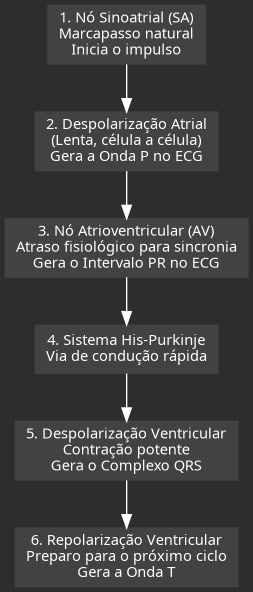
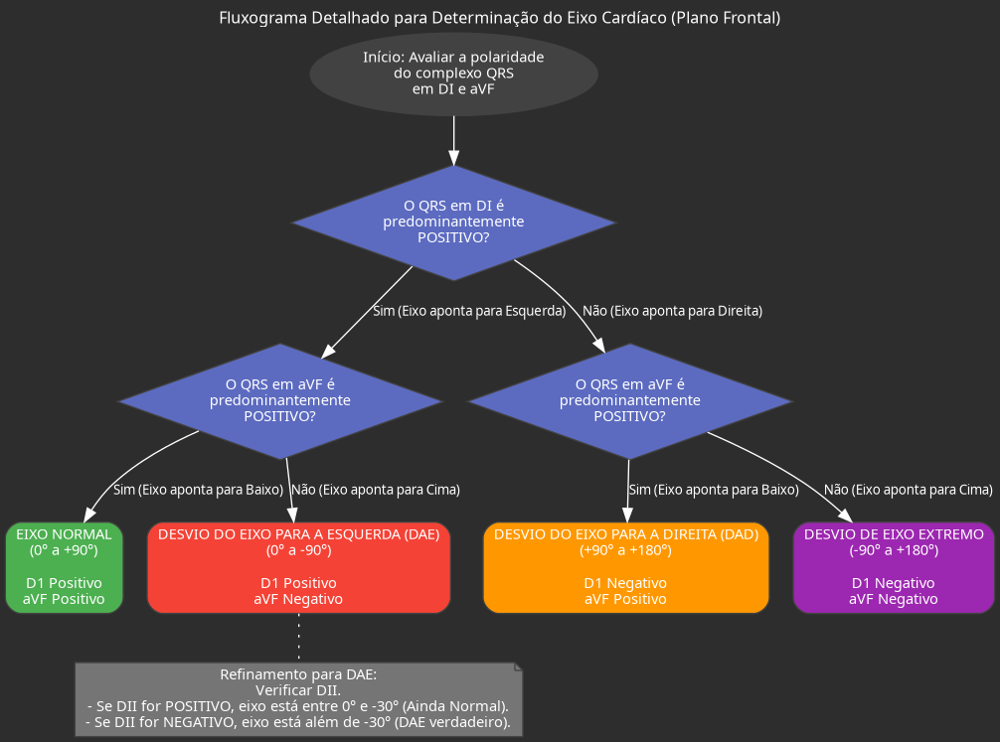

---
{"dg-publish":true,"permalink":"/9-periodo/aulas-segunda-rotacao/eletro-com-gerardo/","dgPassFrontmatter":true}
---

### **1. Formação e Propagação do Impulso Elétrico Cardíaco**

*   **Pressuposto Fundamental:** A aula parte do entendimento que o impulso elétrico já foi gerado no coração. O foco não é a fisiologia celular do potencial de ação (trocas iônicas de sódio, potássio e cálcio), mas sim o trajeto e as consequências elétricas da propagação desse impulso.

*   **O Esqueleto Elétrico do Coração:** Existe um caminho obrigatório e predefinido que o impulso elétrico deve seguir para garantir uma contração cardíaca sincronizada e eficiente. Qualquer alteração ou desvio nesse trajeto resulta em anomalias no eletrocardiograma (ECG), que são a base para o diagnóstico de diversas patologias.

*   **Trajeto Normal e Sequencial do Impulso:**
    *   **Início no Nó Sinoatrial (SA):** É o marcapasso natural do coração. O impulso elétrico se origina nesta estrutura localizada no teto do átrio direito.
    *   **Despolarização Atrial:**
        *   O impulso se propaga pelos átrios de forma relativamente **lenta**, majoritariamente de célula a célula. Não há um sistema de condução super especializado como nos ventrículos.
        *   Essa atividade elétrica de baixa voltagem e mais demorada é traduzida no ECG como a **Onda P**, que por natureza é mais achatada e pequena.
        *   Para garantir a despolarização do átrio esquerdo, existe um feixe de condução preferencial chamado **Feixe de Bachmann**, que acelera a chegada do impulso ao outro lado.
    *   **Pausa no Nó Atrioventricular (AV):**
        *   Localizado na junção entre os átrios e os ventrículos, o nó AV funciona como um **filtro fisiológico**, impondo um atraso deliberado na condução do impulso.
        *   **Importância Vital:** Esse atraso, representado no ECG pelo **intervalo PR**, é crucial. Ele garante que os átrios terminem sua contração (sístole atrial), ejetando o sangue para os ventrículos, antes que os ventrículos comecem a se contrair. Sem essa pausa, a eficiência hemodinâmica seria drasticamente reduzida.
    *   **Despolarização Ventricular Rápida:**
        *   Após a pausa no nó AV, o impulso entra em um sistema de condução de alta velocidade: o **Feixe de His**, seus ramos (direito e esquerdo) e as **Fibras de Purkinje**.
        *   Essa rede distribui o impulso quase que instantaneamente por toda a massa muscular dos ventrículos.
        *   A combinação da alta velocidade de condução e da grande massa muscular ventricular gera um evento elétrico de alta voltagem, representado no ECG pelo **Complexo QRS**, que é a maior deflexão do traçado.
    *   **Repolarização Ventricular:** Após a contração, as células ventriculares precisam "recarregar" para um próximo batimento. Esse processo de repolarização é representado pela **Onda T**.

### **2. Morfologia do ECG: Ondas, Segmentos e Intervalos**

*   **Onda P:** Representa a **despolarização dos átrios**. A sua presença e morfologia são essenciais para definir se o ritmo é **sinusal** (originado no nó SA).
    *   **Ritmo Sinusal:** Para ser considerado sinusal, a onda P deve ser positiva nas derivações DII, DIII e aVF, e negativa em aVR, precedendo todo complexo QRS.

*   **Intervalo PR:** Medido do início da onda P ao início do complexo QRS. Representa o tempo total da condução atrial mais o atraso no nó AV.

*   **Complexo QRS:** Representa a **despolarização dos ventrículos**. Sua morfologia varia, mas é composta por:
    *   **Onda Q:** A primeira deflexão *negativa* do complexo.
    *   **Onda R:** A primeira deflexão *positiva*.
    *   **Onda S:** A deflexão *negativa* que se segue à onda R.

*   **Onda T:** Representa a **repolarização ventricular**.

*   **Repolarização Atrial:** É um evento elétrico que ocorre, mas é "invisível" no ECG de superfície, pois sua baixa voltagem é completamente mascarada pela grande amplitude do complexo QRS, que acontece simultaneamente.

### **3. O Eixo Elétrico, Vetores e as Derivações do ECG**

*   **Conceito de Vetor:** Cada célula que despolariza gera um pequeno vetor elétrico. A soma de todos esses vetores ao longo do ciclo cardíaco cria um **vetor resultante principal**, que representa a direção e a magnitude média da atividade elétrica do coração. Em um coração normal, esse vetor aponta para **"baixo e para a esquerda"**, em um ângulo aproximado de +60 graus.

*   **As Derivações como "Câmeras":** Cada derivação do ECG funciona como uma câmera que observa o vetor elétrico de um ângulo diferente.
    *   Se o vetor se **aproxima** da derivação, ela registra uma deflexão **positiva**.
    *   Se o vetor se **afasta** da derivação, ela registra uma deflexão **negativa**.
    *   Se o vetor passa **perpendicularmente** à derivação, ela registra uma onda **isodifásica** (parte positiva e parte negativa com amplitudes semelhantes).

*   **Derivações Precordiais (Plano Horizontal):**
    *   **V1 e V2:** Posicionadas à direita e à esquerda do esterno, elas veem o vetor principal se afastando. Por isso, o QRS é predominantemente **negativo**.
    *   **V5 e V6:** Posicionadas na parede lateral esquerda do tórax, elas veem o vetor principal se aproximando. Por isso, o QRS é predominantemente **positivo**.
    *   **V3 e V4:** São a **zona de transição**, onde o padrão do QRS muda de predominantemente negativo para predominantemente positivo.
    *   **Progressão da Onda R:** Em um ECG normal, a amplitude da onda R deve aumentar progressivamente de V1 a V6, refletindo a aproximação gradual do vetor elétrico.

*   **Derivações Periféricas (Plano Frontal) e Determinação do Eixo:**
    *   As derivações DI, DII, DIII, aVR, aVL e aVF formam o plano frontal (a "Rosa dos Ventos").
    *   **Método Rápido para Avaliar o Eixo:** Olhar para as derivações **DI** e **aVF**.
        *   **DI (+) e aVF (+):** Eixo normal (entre -30° e +90°).
        *   **DI (+) e aVF (-):** Desvio do eixo para a esquerda (DAE).
        *   **DI (-) e aVF (+):** Desvio do eixo para a direita (DAD).
        *   **DI (-) e aVF (-):** Desvio de eixo extremo.

### **4. Sobrecargas de Câmaras Cardíacas**

#### **4.1. Sobrecarga Atrial Direita (SAD)**
*   **Fisiopatologia:** O aumento do átrio direito (AD) gera uma despolarização mais potente e verticalizada.
*   **Achado Clássico:** **Onda P *apiculada*** (pontuda) com **amplitude > 2,5 mm** (2,5 quadradinhos) na derivação DII. É também chamada de "P pulmonale".

#### **4.2. Sobrecarga Atrial Esquerda (SAE)**
*   **Fisiopatologia:** O aumento do átrio esquerdo (AE) torna sua despolarização (a segunda metade da onda P) mais lenta e prolongada.
*   **Achados Clássicos:**
    *   **Onda P bífida (entalhada)**, com formato de "M" ou "corcova de camelo" em DII.
    *   **Duração da Onda P > 120 ms** (3 quadradinhos). É também chamada de "P mitrale".
    *   **Índice de Morris:** Em V1, a porção negativa da onda P é aprofundada e alargada (área ≥ 1 mm²).

#### **4.3. Sobrecarga Ventricular Esquerda (SVE)**
*   **Fisiopatologia:** O aumento da massa do ventrículo esquerdo (VE) amplifica os vetores elétricos direcionados para a esquerda, causando um desvio do eixo e aumentando a amplitude do QRS nas derivações laterais.
*   **Critérios Diagnósticos:**
    *   **Critérios de Amplitude (Índices):**
        *   **Índice de Sokolov-Lyon:** Soma da **S de V1 + R de V5 ou V6 > 35 mm**.
        *   **Índice de Cornell:** (R em aVL + S em V3) > 28 mm para homens ou > 20 mm para mulheres.
    *   **Padrão de *Strain* Ventricular:** Alteração secundária da repolarização devido à sobrecarga. Caracteriza-se por **infradesnivelamento do segmento ST** e **inversão assimétrica da onda T** nas derivações laterais (DI, aVL, V5, V6).

#### **4.4. Sobrecarga Ventricular Direita (SVD)**
*   **Fisiopatologia:** O aumento da massa do ventrículo direito (VD) faz com que os vetores elétricos se desloquem para a direita, invertendo o padrão normal do ECG.
*   **Achados Clássicos:**
    *   **Desvio do eixo para a direita (DAD).**
    *   **Onda R proeminente em V1** (R > S em V1), o oposto do normal.
    *   **Sinal de Peñaloza-Tranchesi:** Uma transição abrupta do QRS, de positivo em V1 para predominantemente negativo já em V2.
    *   Pode apresentar padrão de *strain* do VD (infradesnivelamento de ST e inversão de T em V1-V2).

### **5. Bloqueios de Ramo**

#### **5.1. Bloqueio de Ramo Direito (BRD)**
*   **Fisiopatologia:** O impulso desce normalmente pelo ramo esquerdo, despolarizando o VE rapidamente. Em seguida, o estímulo passa para o lado direito de forma lenta, de miócito a miócito, pois o "atalho" do ramo direito está bloqueado.
*   **Critérios Diagnósticos:**
    *   **QRS alargado (duração ≥ 120 ms).**
    *   **Morfologia rsR' em V1 ("orelha de coelho"):**
        *   `r` inicial: despolarização do septo.
        *   `s`: despolarização do VE.
        *   `R'` final e alargada: despolarização lenta e tardia do VD.

#### **5.2. Bloqueio de Ramo Esquerdo (BRE)**
*   **Fisiopatologia:** O oposto do BRD. O impulso desce pelo ramo direito e depois se propaga lentamente pela grande massa do ventrículo esquerdo.
*   **Critérios Diagnósticos:**
    *   **QRS alargado (duração ≥ 120 ms).**
    *   **Ondas R largas e monofásicas ("em torre" ou "empastadas") em V5, V6, DI e aVL.**
    *   Ausência de onda Q septal nessas mesmas derivações.
    *   **Importância Clínica:** Um **BRE novo** (que não existia em ECGs prévios) em um paciente com dor torácica é considerado um **equivalente de infarto com supra de ST** até que se prove o contrário.

### **6. Síndrome Coronariana Aguda (SCA) e Estratificação de Risco**

*   **Diagnóstico Diferencial da Dor Torácica:** É fundamental descartar outras condições graves que mimetizam o infarto:
    *   **Dissecção de Aorta:** Dor súbita, lancinante, que irradia para o dorso.
    *   **Tromboembolismo Pulmonar (TEP):** Dor pleurítica, dispneia, taquicardia.
    *   **Pericardite Aguda:** Dor que piora com a respiração e melhora ao inclinar o tronco para frente.

*   **Infarto Agudo do Miocárdio (IAM):**
    *   **Com Supra de ST (IAMCSST):** Oclusão total da coronária. O ECG mostra elevação do segmento ST. O tratamento é a **reperfusão de emergência** (angioplastia ou trombólise).
    *   **Sem Supra de ST (IAMSSST):** Oclusão parcial. O ECG pode ter infra de ST, inversão de T ou ser normal. O tratamento inicial é clínico, e a necessidade de cateterismo é definida pela estratificação de risco.

*   **Estratificação de Risco com o Escore HEART:** Utilizado em pacientes com dor torácica na emergência para determinar o risco de eventos cardíacos adversos maiores em 6 semanas.

| Critério | Descrição | Pontos |
| :--- | :--- | :--- |
| **H**istory (História Clínica da Dor) | Ligeiramente suspeita | 0 |
| | Moderadamente suspeita | 1 |
| | Altamente suspeita (típica) | 2 |
| **E**CG | Normal | 0 |
| | Alterações não específicas (ex: BRE prévio) | 1 |
| | Alterações de ST significativas | 2 |
| **A**ge (Idade) | < 45 anos | 0 |
| | 45-64 anos | 1 |
| | ≥ 65 anos | 2 |
| **R**isk Factors (Fatores de Risco) | Nenhum | 0 |
| | 1-2 fatores (HAS, DM, DLP, Tabagismo, HF) | 1 |
| | ≥ 3 fatores ou doença aterosclerótica conhecida | 2 |
| **T**roponin (Troponina) | Dentro do limite da normalidade (LSN) | 0 |
| | 1 a 3 vezes o LSN | 1 |
| | > 3 vezes o LSN | 2 |

**Interpretação e Conduta com Base no Escore HEART:**
*   **0-3 pontos (Baixo Risco):** Risco de evento cardíaco < 2%. Paciente pode receber alta segura após descartar outras causas.
*   **4-6 pontos (Risco Intermediário):** Risco de 12-16%. Paciente deve ser internado para monitorização e investigação adicional.
*   **≥ 7 pontos (Alto Risco):** Risco > 50%. Paciente necessita de internação e, muito provavelmente, estratégia invasiva precoce (cateterismo).

### **7. Tratamento Farmacológico da Insuficiência Cardíaca (IC)**

*   **Objetivo do Tratamento:** Equilibrar a hemodinâmica, reduzindo a pré-carga (volume que chega ao coração), a pós-carga (resistência que o coração enfrenta para ejetar o sangue) e otimizando a contratilidade.

*   **O "Quadripé" do Tratamento da IC com Fração de Ejeção Reduzida (ICFER):**
    *   **IECA/BRA ou ARNI (Sacubitril/Valsartana):** Bloqueiam o sistema renina-angiotensina-aldosterona, promovendo vasodilatação e reduzindo a retenção de sódio e água.
    *   **Beta-bloqueadores:** Reduzem a frequência cardíaca e o consumo de oxigênio pelo miocárdio, além de combaterem o remodelamento cardíaco deletério a longo prazo. **Importante:** Não devem ser iniciados na fase aguda da descompensação ("perfil B úmido").
    *   **Antagonistas Mineralocorticoides (ex: Espironolactona):** Bloqueiam a aldosterona, reduzindo a fibrose e o remodelamento cardíaco.
    *   **Inibidores de SGLT2 (as "gliflozinas", ex: Dapagliflozina):** Promovem glicosúria (eliminação de glicose na urina), que leva à diurese osmótica, reduzindo o volume (pré-carga) e promovendo benefícios de remodelamento. **Contraindicações:** Insuficiência renal aguda, cetoacidose, infecções do trato urinário ativas.

*   **Outras Medicações:**
    *   **Diuréticos de Alça (ex: Furosemida):** Usados para alívio rápido da congestão (falta de ar, inchaço) na fase aguda da descompensação.