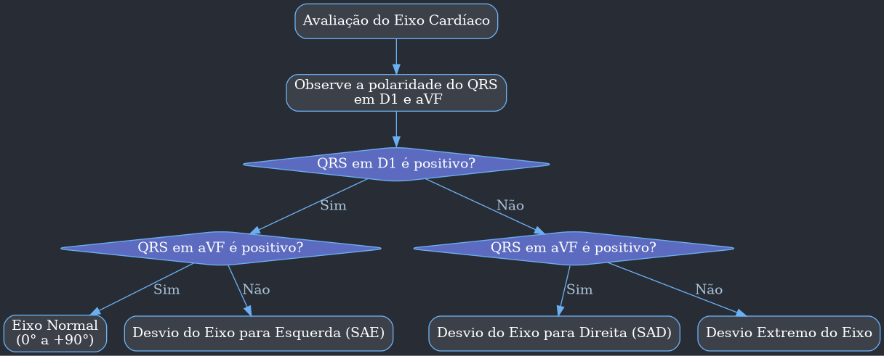
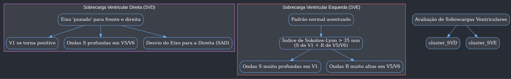
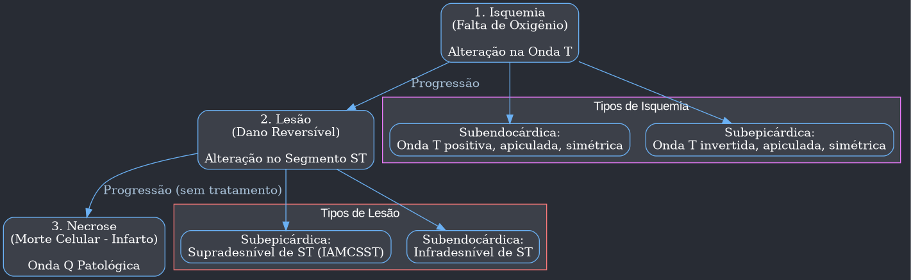

---
{"dg-publish":true,"permalink":"/9-periodo/aulas-segunda-rotacao/eletrocardiograma-luis-bizerra/"}
---

Claro, aqui está um resumo detalhado da aula em formato de texto para o Obsidian.

## Eletrocardiograma (ECG) - Análise Detalhada

### **Intervalo QT e QTc (Corrigido)**

- **Definição**: O intervalo QT representa a sístole ventricular elétrica, desde o início da despolarização até o final da repolarização dos ventrículos.
- **Correção pela Frequência Cardíaca (QTc)**: O intervalo QT varia com a frequência cardíaca (FC). Para uma análise precisa, ele deve ser corrigido, resultando no QTc.
- **Fórmula de Bazett**: A fórmula mais comum para o cálculo do QTc é a Fórmula de Bazett.
    - `QTc = QT / √RR`
    - Onde `RR` é o intervalo entre duas ondas R consecutivas, medido em segundos.
- **Método Simplificado de Análise Visual**:
    - **Normal**: Um intervalo QT corrigido (QTc) normal tem aproximadamente **11 quadradinhos** no traçado do ECG (considerando a velocidade padrão de 25 mm/s).
    - **Prática**: Para facilitar, conte o número de quadradinhos (unidades de 1 mm) desde o início do complexo QRS até o final da onda T.

### **Intervalo PR**

- **Definição**: Representa o tempo que o impulso elétrico leva para viajar do nó sinoatrial (início da onda P) até o início da despolarização ventricular (início do complexo QRS).
- **Valores de Referência**:
    - **Normal**: O intervalo PR deve ter **entre 3 e 5 quadradinhos** (120 a 200 milissegundos).
    - **Análise Prática**:
        - **Menor que 3 quadradinhos**: Pode indicar uma via de pré-excitação (ex: Síndrome de Wolff-Parkinson-White).
        - **Maior que 5 quadradinhos**: Indica um bloqueio atrioventricular (BAV) de primeiro grau.
- **Como Medir**: Conte os quadradinhos do início da onda P até o começo do QRS. Com um ECG digital, é possível usar ferramentas de medição (calipers) para maior precisão. A medição pode ser desafiadora em traçados pequenos, exigindo atenção ou o uso de uma lupa.

### **Eixo Cardíaco**

- **Conceito**: O eixo cardíaco representa a direção média do vetor de despolarização ventricular no plano frontal. O coração normalmente se posiciona de cima para baixo e da direita para a esquerda.
- **Eixo Normal**: O eixo normal está localizado no primeiro quadrante do sistema de eixos, entre **0° e +90°**.
- **Método Rápido de Avaliação (Derivações D1 e aVF)**: Para determinar rapidamente se o eixo é normal, observe a polaridade (positiva ou negativa) do complexo QRS nas derivações D1 e aVF.

| Derivação D1 | Derivação aVF | Eixo Cardíaco |
| :--- | :--- | :--- |
| **Positivo** | **Positivo** | **Normal (0° a +90°)** |
| **Positivo** | Negativo | Desvio do Eixo para a Esquerda (SAE) |
| Negativo | **Positivo** | Desvio do Eixo para a Direita (SAD) |
| Negativo | Negativo | Desvio Extremo do Eixo |

- **Desvios do Eixo**:
    - **Desvio para a Esquerda (SAE)**: Ocorre quando D1 é positivo e aVF é negativo. O vetor aponta para a esquerda.
    - **Desvio para a Direita (SAD)**: Ocorre quando D1 é negativo e aVF é positivo. O vetor aponta para a direita.

### **Bloqueios de Ramo**

- **Critério Diagnóstico Principal**: Um bloqueio de ramo é diagnosticado quando a duração do complexo QRS é **maior que 3 quadradinhos** (> 120 ms). Se for menor, o QRS é considerado normal ou estreito.
- **Diferenciação entre Bloqueio de Ramo Direito (BRD) e Esquerdo (BRE)**: A análise é feita nas derivações precordiais.
    - **Olhe para V1 e V2** para identificar um BRD.
    - **Olhe para V5 e V6** para identificar um BRE.

| Tipo de Bloqueio                    | Derivações Chave | Padrão Morfológico no ECG                          | Mnemônico         |
| :---------------------------------- | :--------------- | :------------------------------------------------- | :---------------- |
| **Bloqueio de Ramo Direito (BRD)**  | **V1 / V2**      | Padrão **rSR'** (semelhante a "orelhas de coelho") | Orelhas de Coelho |
| **Bloqueio de Ramo Esquerdo (BRE)** | **V5 / V6**      | Onda R alargada e com entalhes (padrão em "torre") | Torre             |

- **Análise Visual**:
    - **BRD**: Em V1, você verá uma pequena onda R inicial, seguida por uma onda S profunda e, finalmente, uma segunda onda R mais larga (R').
    - **BRE**: Em V5 ou V6, a onda R aparece "empastada", larga e pode ter um entalhe no topo, parecendo uma torre. Em V1, observa-se um complexo QS ou rS largo e profundo.

### **Sobrecargas Ventriculares (Hipertrofia)**

A sobrecarga de um ventrículo causa alterações no padrão normal do ECG, refletindo o aumento da massa muscular.

- **Sobrecarga Ventricular Direita (SVD)**:
    - O ventrículo direito, que normalmente tem pouca influência no ECG, se torna mais proeminente.
    - O eixo elétrico, que normalmente aponta para trás e para a esquerda, é "puxado" para a frente e para a direita.
    - **Critérios no ECG**:
        - **Inversão do Padrão Normal**: V1, que é normalmente negativo, torna-se predominantemente positivo.
        - **V5 e V6**: Que são normalmente positivos, podem apresentar ondas S profundas e persistentes.
        - **Desvio do Eixo para a Direita (SAD)**: D1 torna-se negativo.
- **Sobrecarga Ventricular Esquerda (SVE)**:
    - O padrão normal do ECG é acentuado, pois o ventrículo esquerdo já é dominante.
    - **Critérios no ECG (Índice de Sokolow-Lyon)**:
        - **Soma da Amplitude**: Some a amplitude da **onda S em V1** com a amplitude da **onda R em V5 ou V6**.
        - **Diagnóstico**: Se a soma for **maior que 35 mm (35 quadradinhos)**, é diagnóstico de SVE.
        - **Acentuação do Padrão**: V1 fica com uma onda S ainda mais profunda, e V5/V6 apresentam ondas R ainda mais altas.

### **Isquemia, Lesão e Necrose (Infarto)**

Esses eventos representam uma progressão da doença coronariana e têm manifestações distintas no ECG, principalmente no segmento ST e nas ondas T e Q.

1.  **Isquemia (Falta de Oxigênio)**:
    - A primeira alteração a surgir.
    - **Manifestação no ECG**: Alterações na **onda T**.
        - **Isquemia Subendocárdica**: A onda T torna-se **apiculada, simétrica e positiva** (T "hiperaguda").
        - **Isquemia Subepicárdica (ou Transmural)**: A onda T torna-se **invertida, simétrica e apiculada**.

2.  **Lesão (Sofrimento Celular Prolongado)**:
    - Indica um dano mais severo, mas ainda potencialmente reversível.
    - **Manifestação no ECG**: Alterações no **segmento ST**.
        - **Lesão Subepicárdica (Transmural)**: Causa o **supradesnivelamento do segmento ST**. Este é o sinal clássico de um Infarto Agudo do Miocárdio com Supra de ST (IAMCSST).
        - **Lesão Subendocárdica**: Causa o **infradesnivelamento do segmento ST**.

3.  **Necrose (Morte Celular / Infarto Consolidado)**:
    - Dano irreversível ao músculo cardíaco.
    - **Manifestação no ECG**: Surgimento da **onda Q patológica**.
    - **Critérios para Onda Q Patológica**:
        - **Duração**: Deve ter duração **maior que 1 quadradinho** (0,04 s).
        - **Amplitude**: Deve ter amplitude **maior que 1/3** da amplitude total do complexo QRS.
        - **Significado**: Uma onda Q patológica representa uma "cicatriz" elétrica e geralmente permanece no ECG para sempre, indicando um infarto prévio.

- **Progressão Típica do Infarto Agudo**:
    - **Minutos iniciais**: Onda T hiperaguda (isquemia).
    - **Horas iniciais**: Supradesnivelamento do ST (lesão).
    - **Após ~6 horas**: Inversão da onda T e aparecimento da onda Q patológica (necrose).

### **Convenções de Ondas no Complexo QRS**

- **Onda R**: Qualquer onda **positiva** (para cima) no complexo QRS é uma onda R. Se houver mais de uma, são chamadas de R e R' (R linha).
- **Onda S**: Qualquer onda **negativa** (para baixo) que aparece **após** uma onda R.
- **Onda Q**: A **primeira** onda **negativa** do complexo QRS (antes de qualquer onda R). Ela só é considerada uma onda Q se for a deflexão inicial. Se houver uma pequena onda positiva antes da negativa, a negativa é uma onda S.