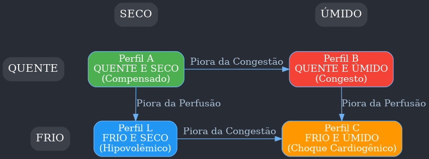
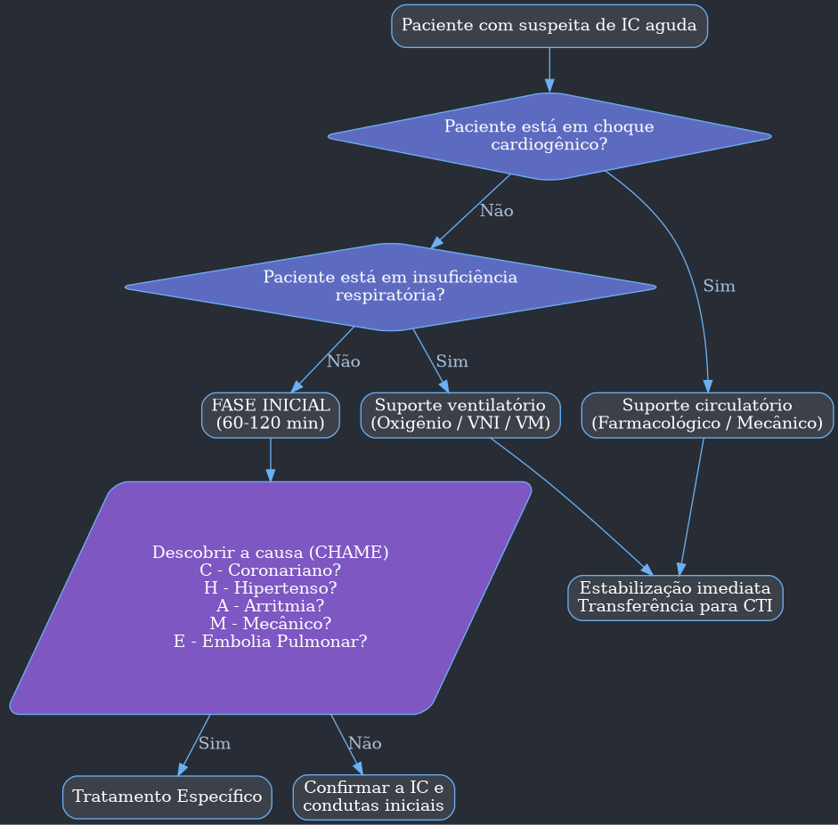
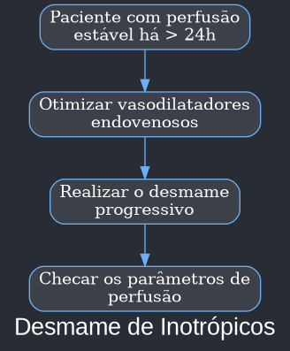
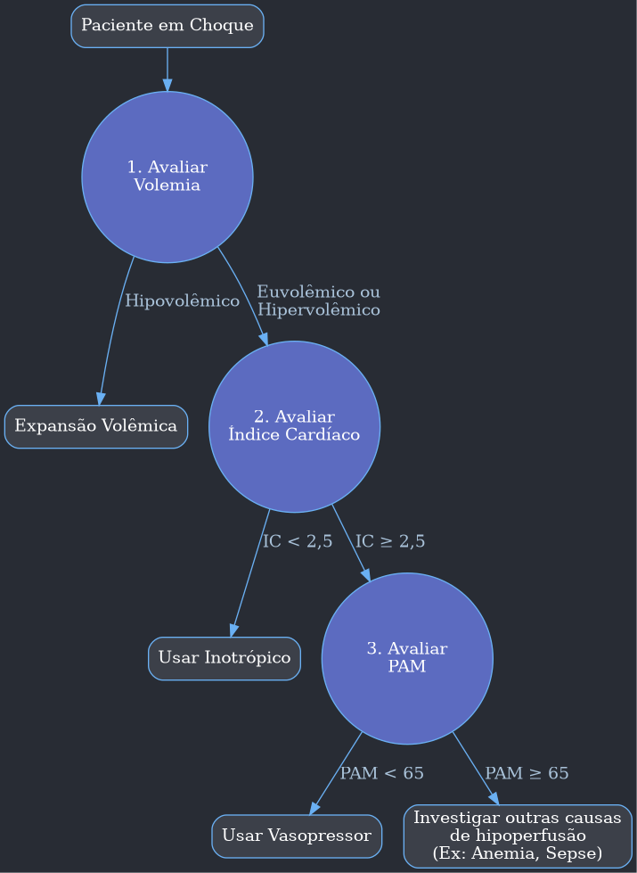

---
{"dg-publish":true,"permalink":"/9-periodo/aulas-segunda-rotacao/ic-descompensada/"}
---

***

# Cardiologia - Insuficiência Cardíaca Aguda (ICA)

## 1.0 Definição

- A **Insuficiência Cardíaca (IC) Aguda ou Descompensada** é definida como um quadro de início rápido e progressivo de falência da função cardíaca, seja ela sistólica ou diastólica.
- Pode ocorrer em pacientes com ou sem diagnóstico prévio de IC.
- A manifestação mais comum é a **dispneia progressiva**, mas pode se apresentar como um quadro súbito, característico do **edema agudo de pulmão**.
- A descompensação pode ser precipitada por um fator causal, que deve ser ativamente investigado e tratado, pois sua correção é a chave para a estabilização do paciente.

| Fatores que Desencadeiam a Descompensação da Insuficiência Cardíaca |
| :--- |
| **Síndrome coronariana aguda** |
| Taquiarritmias (ex: fibrilação atrial, taquicardia ventricular) |
| Elevação da pressão arterial (Crise Hipertensiva) |
| Infecção |
| Má aderência terapêutica (ex: ingestão excessiva de sal, uso inadequado de medicamentos) |
| Bradiarritmias |
| Substâncias tóxicas (álcool, drogas ilícitas) |
| Drogas cardiotóxicas (AINES, corticoides, quimioterapia) |
| Exacerbação de DPOC |
| Embolia pulmonar |
| Cirurgia ou complicações perioperatórias |
| Aumento do tônus simpático (cardiomiopatia por estresse) |
| Alterações metabólicas/hormonais (disfunção tireoidiana, cetoacidose diabética) |
| Insulto cerebrovascular |
| Causa mecânica aguda (ex: ruptura de parede livre, insuficiência mitral aguda) |

## 2.0 Classificação (Perfis Hemodinâmicos de Stevenson)

A abordagem inicial do paciente com ICA é guiada pela sua classificação em perfis hemodinâmicos, que avaliam dois parâmetros clínicos fundamentais: **Congestão** (volemia) e **Perfusão** (débito cardíaco).

- **Congestão ("Úmido" vs. "Seco"):**
    - **Úmido (Congesto):** Presença de sinais de hipervolemia, como turgência jugular, estertores pulmonares, edema de membros inferiores, ascite, hepatomegalia.
    - **Seco (Não Congesto):** Ausência de sinais de hipervolemia.
- **Perfusão ("Quente" vs. "Frio"):**
    - **Quente (Bem Perfundido):** Extremidades quentes, pulso cheio, nível de consciência preservado.
    - **Frio (Mal Perfundido):** Extremidades frias e pegajosas, pulso filiforme, rebaixamento do nível de consciência, oligúria, hipotensão arterial.

A combinação desses parâmetros gera 4 perfis que norteiam a terapêutica:

- **Perfil A (Quente e Seco):** Paciente compensado. Boa perfusão e sem congestão. Tratamento: Ajuste da medicação oral.
- **Perfil B (Quente e Úmido):** Boa perfusão, mas com congestão. É o perfil mais comum. Tratamento: **Diuréticos** e **Vasodilatadores**.
- **Perfil L (Frio e Seco):** Má perfusão e sem congestão. Geralmente hipovolêmico. Tratamento: **Reposição volêmica** cautelosa. Se não responder, considerar inotrópicos.
- **Perfil C (Frio e Úmido):** Má perfusão e com congestão. Caracteriza o **choque cardiogênico**. Tratamento: **Inotrópicos** e, se hipotensão severa, **vasopressores**. Diuréticos devem ser usados apenas após a melhora da perfusão.

## 3.0 Características Fisiopatológicas e Clínicas

A ICA pode se apresentar de duas formas principais: como agudização de uma IC crônica pré-existente ou como um evento novo (*de novo*).

| Característica | IC Aguda Crônica Descompensada (60-75%) | IC Aguda Nova (25-40%) |
| :--- | :--- | :--- |
| **Mecanismo** | ↓ Contratilidade, Retenção de água e sódio | ↑ Pós-carga e/ou Disfunção diastólica, Perda aguda da contração |
| **Padrão de congestão** | Aumento global da volemia (hipervolemia sistêmica) | Redistribuição da volemia da periferia para o pulmão (hipervolemia pulmonar) |
| **Início dos sintomas** | Gradual (dias) | Rápido (horas) |
| **Sintoma principal** | Dispneia ou fadiga | Dispneia |
| **Pressão Arterial** | Normal ou baixa | Alta ou normal (PA baixa é incomum) |
| **Edema de mmii** | Frequente | Infrequente |
| **Ganho de peso** | Sim | Não |

A fisiopatologia da ICA envolve três componentes principais:
1.  **Pré-carga:** Volume de sangue no ventrículo no final da diástole. Aumentada na congestão.
    - **Como reduzir?** Diuréticos, Vasodilatadores (venosos).
2.  **Pós-carga:** Resistência que o ventrículo precisa vencer para ejetar o sangue. Aumentada na hipertensão.
    - **Como reduzir?** Vasodilatadores (arteriais).
3.  **Contratilidade (Inotropismo):** Força de contração do músculo cardíaco. Reduzida na disfunção sistólica.
    - **Como melhorar?** Inotrópicos.

## 4.0 Avaliação Inicial

A avaliação deve ser rápida e focada em identificar e tratar condições de risco iminente de morte.

#### Exames Complementares:
- **Radiografia de Tórax:** Avalia congestão pulmonar (inversão do padrão vascular, infiltrado peri-hilar "em asa de borboleta", linhas B de Kerley, derrame pleural) e cardiomegalia.
- **Eletrocardiograma (ECG):** Fundamental para avaliar a etiologia (isquemia, arritmias) e o fator de descompensação. Um ECG normal torna ICA menos provável.
- **Ecocardiograma:** Essencial em pacientes instáveis ou no primeiro episódio de IC. Avalia função ventricular, valvopatias e pressões de enchimento.
- **Exames Laboratoriais:**
    - **Peptídeos Natriuréticos (BNP/NT-proBNP):** Altos valores confirmam o diagnóstico. Um valor baixo praticamente exclui ICA.
    - **Função Renal e Eletrólitos:** Avalia a síndrome cardiorrenal e distúrbios de potássio.
    - **Troponina:** Para descartar síndrome coronariana aguda.
    - **Hemograma:** Anemia pode ser causa ou consequência.
    - **Gasometria Arterial:** Em pacientes com dispneia ou desconforto respiratório.

## 5.0 Abordagem Terapêutica

| Fase | Alvos no Tratamento da Insuficiência Cardíaca Aguda |
| :--- | :--- |
| **Fase Precoce** | 1. Diminuir sinais e sintomas de congestão em 6 h   2. Adequar oxigenação (Sat O 2 > 90%)   3. Manter diurese adequada (> 0,5 ml/Kg/h)   4. Evitar PAS < 90 mmHg |
| **Fase Tardia** | 1. Prevenção de re-hospitalização   2. Diminuição de mortalidade |
| **Laboratorial** | 1. Normalização eletrolítica   2. Evitar elevação de creatinina > 0,3 mg/dL |
| **Hemodinâmica** | 1. Reduzir pressões de enchimento   2. Otimizar débito cardíaco |
| **Metabólico** | 1. Normalização lactato arterial   2. SvO 2 >70% |

#### 5.1 Oxigenioterapia e Suporte Ventilatório
- **Indicação:** Apenas para pacientes hipoxêmicos (SpO₂ < 90% ou PaO₂ < 60 mmHg). O uso indiscriminado pode causar vasoconstrição e piorar o débito cardíaco.
- **Métodos:**
    - **Cateter nasal / Máscara:** Para hipoxemia leve sem desconforto respiratório.
    - **Ventilação Não Invasiva (VNI - CPAP/BiPAP):** Indicada precocemente em pacientes com desconforto respiratório. Reduz a necessidade de intubação. **Cuidado** em pacientes hipotensos, pois a pressão positiva pode reduzir o retorno venoso e a pressão arterial.
    - **Intubação Orotraqueal:** Para pacientes com insuficiência respiratória refratária, hipoxemia grave, acidose ou rebaixamento de sensório.

#### 5.2 Diuréticos
- **Indicação:** Pacientes congestos (Perfil B e C). **Não altera a mortalidade**.
- **Droga de escolha:** Diurético de alça endovenoso (Furosemida).
- **Como usar:**
    - **IC Aguda Nova:** Dose inicial de 20-40 mg EV em bolus.
    - **IC Crônica Agudizada:** Pacientes são mais resistentes. Usar no mínimo a dose oral prévia, convertida para EV (dose venosa = metade da dose oral). Para maior alívio, pode-se usar uma dose 2,5 vezes maior que a dose habitual.
- **Avaliação da Resposta:** Espera-se uma diurese de pelo menos 1 L nas primeiras 6 horas.
- **Síndrome Cardiorrenal:** Piora da função renal devido à ICA, seja por baixo débito ou por congestão renal.
- **Resistência a Diuréticos:** Se não houver resposta, considerar associação com diuréticos tiazídicos, doses mais altas, ou em último caso, ultrafiltração/diálise.
- **Atenção:** Em pacientes **Frio-Úmidos (Perfil C)**, o diurético só deve ser administrado **após a melhora da perfusão** com inotrópicos. O rim mal perfundido não responde ao diurético.

#### 5.3 Vasodilatadores Endovenosos
- **Indicação:** Principalmente no Perfil B (Quente-Úmido), especialmente se houver hipertensão associada.
- **Ação:** Promovem venodilatação (reduzem pré-carga) e arteriodilatação (reduzem pós-carga), melhorando a congestão pulmonar e o débito cardíaco.
- **Drogas:**
    - **Nitroglicerina:** Mais venodilatadora. Preferencial em síndromes coronarianas, pois dilata as coronárias.
    - **Nitroprussiato de Sódio:** Arteriodilatador mais potente. Cuidado com hipotensão severa e risco de intoxicação por tiocianato em uso prolongado ou disfunção renal/hepática.
- **Como usar:** Infusão contínua, com titulação da dose para manter PAS > 90 mmHg.

#### 5.4 Inotrópicos
- **Indicação:** Pacientes com má perfusão (Frios - Perfis C e L).
- **Ação:** Aumentam a contratilidade miocárdica e, consequentemente, o débito cardíaco.
- **Drogas:**
    - **Dobutamina:** Agonista beta-adrenérgico. É o mais utilizado. Seu efeito pode ser reduzido em pacientes que usam betabloqueadores. Potencial arritmogênico.
    - **Milrinona:** Inibidor da fosfodiesterase III. Alternativa para quem usa betabloqueador. Tem efeito vasodilatador, podendo causar hipotensão. Evitar em cardiopatia isquêmica.
    - **Levosimendana:** Sensibilizador de cálcio. Efeito inotrópico e vasodilatador. Infusão única de 24 h com efeito prolongado.
- **Como usar:** Infusão contínua com bomba, iniciando com a dose mínima e ajustando conforme os parâmetros de perfusão (débito urinário, nível de consciência, temperatura de extremidades, lactato).

#### 5.5 Vasopressores
- **Indicação:** Pacientes em choque cardiogênico (Perfil C) com hipotensão severa refratária, que compromete a perfusão tecidual.
- **Ação:** Aumentam a pressão arterial.
- **Droga de escolha:** **Noradrenalina**.
- **Como usar:** Deve ser usada em conjunto com um inotrópico (dobutamina). Aumentam a pós-carga, o que pode piorar o débito cardíaco se usados isoladamente.

#### 5.10 Manejo de Medicações Orais
- **Betabloqueadores:**
    - **Perfil Quente:** Manter a dose se o paciente já usava.
    - **Perfil Frio:** Reduzir a dose em 50% ou suspender, dependendo da gravidade.
    - A introdução só deve ser feita após a melhora completa dos sintomas de congestão.
- **IECA/BRA:** Manter ou iniciar após a estabilização clínica, com o paciente euvolêmico e sem hipotensão sintomática.

---
### **Tópico Adicional: Edema Agudo de Pulmão (EAP)**

O EAP é a manifestação mais dramática da Insuficiência Cardíaca Aguda, frequentemente correspondendo a um **Perfil B (Quente e Úmido)** de instalação súbita, também conhecido como "flash pulmonary edema".

- **Fisiopatologia:**
    - Geralmente é desencadeado por uma **crise hipertensiva severa**. A elevação abrupta da pós-carga dificulta a ejeção de sangue pelo ventrículo esquerdo.
    - Isso causa um "represamento" de sangue retrógrado, aumentando rapidamente a pressão no átrio esquerdo, nas veias pulmonares e, finalmente, nos capilares pulmonares.
    - Quando a pressão capilar pulmonar ultrapassa a pressão oncótica do plasma (geralmente > 20-25 mmHg), ocorre extravasamento de líquido para o interstício e alvéolos pulmonares, caracterizando o edema.
    - O paciente não está necessariamente com excesso de volume corporal total, mas sim com uma **redistribuição** de volume da circulação sistêmica para a pulmonar.

- **Apresentação Clínica Clássica:**
    - **Início súbito:** Paciente refere dispneia intensa de início abrupto.
    - **Agitação e Ansiedade:** Sensação de "morte iminente".
    - **Taquipneia e uso de musculatura acessória.**
    - **Sudorese fria e pegajosa.**
    - **Ausculta pulmonar:** Estertores crepitantes difusos, subindo das bases para os ápices ("maré montante").
    - **Expectoração:** Tosse com secreção rosada e espumosa (clássico, mas nem sempre presente).
    - **Sinais vitais:** **Hipertensão arterial severa** é a regra, acompanhada de taquicardia.
    - **Posição:** O paciente instintivamente senta-se com as pernas pendentes para tentar reduzir o retorno venoso.

- **Manejo Imediato ("Sentar o Paciente e MOV"):**
    1.  **Posição:** Colocar o paciente **sentado** com as pernas para fora do leito. Isso reduz o retorno venoso (pré-carga) por efeito da gravidade.
    2.  **Monitorização, Oxigênio, Veia (MOV):**
        - **M**onitorização: Cardíaca, oximetria de pulso, pressão arterial não invasiva contínua.
        - **O**xigênio: Oferecer oxigênio em alto fluxo. A **Ventilação Não Invasiva (VNI)** com CPAP é o tratamento de primeira linha. A pressão positiva intratorácica diminui a pré-carga e a pós-carga, além de "empurrar" o líquido de volta para os capilares e melhorar a troca gasosa.
        - **V**eia: Obter acesso venoso periférico calibroso.
    3.  **Drogas:**
        - **Vasodilatadores:** São a pedra angular do tratamento. A meta é reduzir a pós-carga agressivamente.
            - **Nitroglicerina** endovenosa em infusão contínua, com aumentos rápidos da dose a cada 3-5 minutos até a melhora dos sintomas ou controle da pressão (cuidado para não causar hipotensão).
        - **Diuréticos:**
            - **Furosemida** endovenosa (ex: 40-80 mg em bolus). Seu efeito inicial é venodilatador (minutos), e o efeito diurético é mais tardio (horas). É importante, mas secundário aos vasodilatadores na fase hiperaguda.
        - **Morfina:**
            - Em pequenas doses (2-4 mg EV). Promove venodilatação e, crucialmente, **ansiólise**, quebrando o ciclo de agitação, descarga adrenérgica e piora da hipertensão. Usar com cautela pelo risco de depressão respiratória.

## 6.0 Monitorização do Paciente com IC Aguda

#### 6.1 Monitorização Básica
É a vigilância mínima para todos os pacientes.

| Parâmetro | Significado Clínico | Valores Normais |
| :--- | :--- | :--- |
| **Lactato** | Marcador de hipoperfusão tecidual (metabolismo anaeróbio) | < 2 mmol/L |
| **Saturação Venosa Central (SvcO 2)** | Reflete o equilíbrio entre oferta e consumo de O 2 | 65 a 75% |
| **ΔPCO 2 (GAP CO 2)** | Diferença entre o CO 2 venoso e arterial. Elevado no baixo débito | < 6 mmHg |
| **ΔPP (Delta PP)** | Variação da pressão de pulso. Marcador de fluido-responsividade | < 12% |

#### 6.2 Monitorização Avançada
Indicada em pacientes mais graves, com choque ou instabilidade persistente. O objetivo é guiar a terapia de forma mais precisa.

- **Pressão Arterial Média (PAM):** Medida através de uma linha arterial invasiva. Objetivo: > 65 mmHg.
- **Pressão Venosa Central (PVC):** Estima a pressão no átrio direito (pré-carga do VD). Valores muito baixos (< 5 mmHg) sugerem hipovolemia.
- **Débito Cardíaco (DC) e Índice Cardíaco (IC):** Medem a quantidade de sangue que o coração bombeia. O IC corrige o DC pela superfície corporal. IC < 2,5 L/min/m² indica baixo débito.
- **Cateter de Swan-Ganz:** Padrão-ouro (hoje menos usado) que fornece medidas diretas de PVC, pressão da artéria pulmonar (PAP) e pressão capilar pulmonar (PCAP), além do débito cardíaco. A PCAP reflete a pressão no átrio esquerdo, sendo um excelente marcador de congestão.

## 7.0 Transplante Cardíaco

É o tratamento de escolha para pacientes com IC em estágio terminal (Estágio D), refratários ao tratamento clínico otimizado.

#### Principais Indicações (Classe I)
- IC avançada dependente de inotrópicos ou suporte circulatório mecânico.
- IC avançada (Classe Funcional III-IV) com tratamento otimizado e fatores de mau prognóstico.
- Consumo de oxigênio de pico (VO 2 pico) ≤ 14 ml/kg/min.
- Arritmias ventriculares refratárias.

#### Principais Contraindicações Absolutas
- Hipertensão pulmonar fixa e severa.
- Infecção sistêmica ativa.
- Neoplasia com risco de recorrência.
- Doença cerebrovascular, hepática ou pulmonar avançada.
- Incompatibilidade ABO.
- Perda de função renal irreversível.