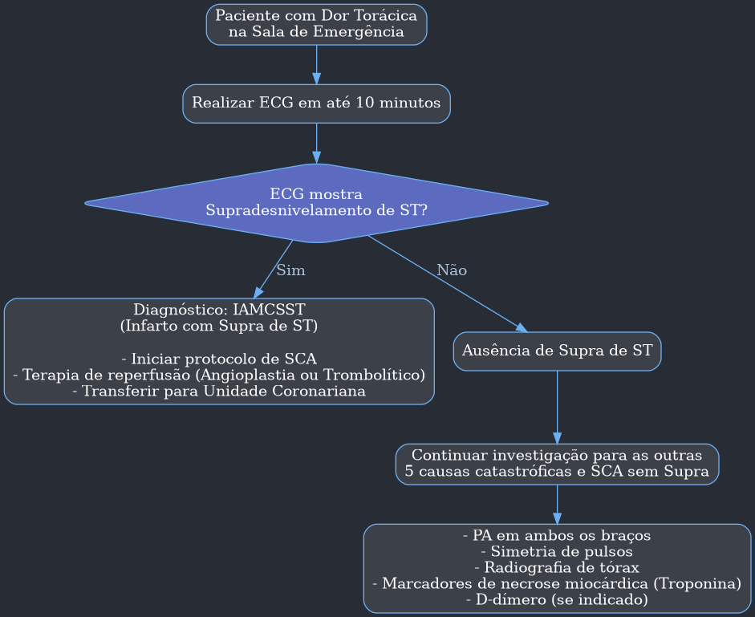
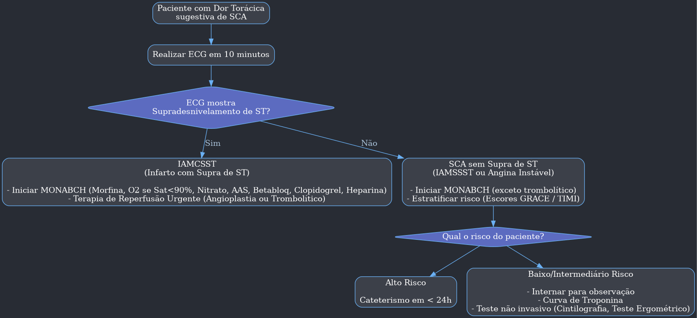
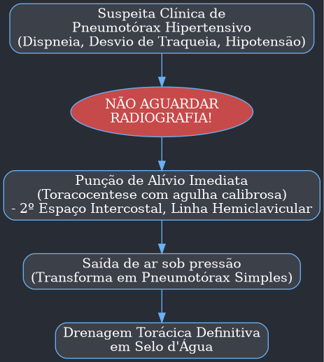
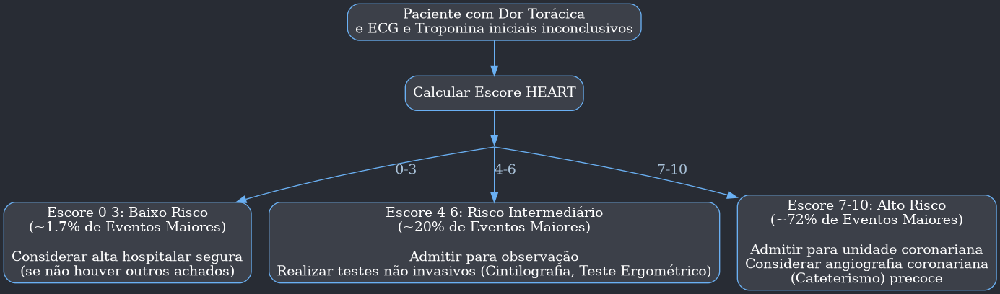

---
{"dg-publish":true,"permalink":"/9-periodo/aulas-segunda-rotacao/protocolo-dor-toracica-hmc/"}
---

---

# 📚 Aula: Abordagem da Dor Torácica na Sala de Emergência

## Introdução: A Relevância da Dor Torácica

- A dor torácica é uma das queixas mais comuns na sala de emergência, mas sua aparente banalidade esconde um alto potencial de gravidade.
- A intenção desta aula é mudar a perspectiva sobre a abordagem da dor torácica, focando em um diagnóstico diferencial rápido e eficaz para identificar e tratar condições de risco de vida iminente.
- A principal armadilha é pensar exclusivamente em **Infarto Agudo do Miocárdio (IAM)**, que, embora seja a principal causa de mortalidade, é apenas uma das várias emergências que se apresentam com dor no peito.

### Realidades da Sala de Emergência

- **Frequência:** Entre 5% e 10% dos atendimentos em salas de emergência são relacionados à dor torácica.
- **Desafio Diagnóstico:** Fazer um diagnóstico preciso é frequentemente um desafio, exigindo uma investigação cuidadosa.
- **Internação:** Muitos casos resultam em internação para observação, mesmo quando a causa exata não é imediatamente clara, por precaução.
- **Referenciamento:** É crucial saber quando referenciar o paciente para unidades especializadas, especialmente em emergências menos complexas. O objetivo é afastar as causas mais graves e, em seguida, encaminhar o paciente com segurança.

## Princípio Fundamental: O Diagnóstico Diferencial das "6 Catástrofes"

> "Quem não sabe o que busca, não identifica o que acha." - **Immanuel Kant**

> "Para quem não sabe para onde vai, qualquer caminho serve." - **Sêneca**

- Essas citações ressaltam a importância de ter um processo mental organizado. Sem um roteiro de diagnóstico diferencial, é fácil se perder.
- **Estatística Alarmante:** Estima-se que ocorram cerca de 18 milhões de erros de diagnóstico por ano, com 10% impactando a mortalidade hospitalar. Cada médico, em média, pode cometer cerca de 62 erros de diagnóstico por ano.
- **O Objetivo Principal:** O primeiro passo na abordagem da dor torácica não é diagnosticar o que o paciente *tem*, mas sim **descartar as 6 condições que podem matá-lo rapidamente**.

---
#### **As 6 Catástrofes Torácicas (The Killers)**

| Categoria | Condição |
| :--- | :--- |
| **Cardíacas** | 1. Síndrome Coronariana Aguda (SCA) |
| | 2. Dissecção Aguda de Aorta |
| | 3. Tamponamento Cardíaco (associado à Pericardite) |
| **Pulmonares** | 4. Tromboembolismo Pulmonar (TEP) |
| | 5. Pneumotórax Hipertensivo |
| **Gastroesofágicas** | 6. Rotura Esofágica (Síndrome de Boerhaave) |

---

## Abordagem Sistemática Inicial

- Tudo começa com uma anamnese e exame físico detalhados e rápidos. Não se pode pular etapas. A tecnologia é um complemento, não um substituto para a avaliação clínica.

### 1. Anamnese Dirigida

- **Caracterização da Dor:**
    - **Tipo:** Aperto, queimação, pontada, "rasgando" (lancinante)?
    - **Irradiação:** Para onde a dor vai? (braço esquerdo, mandíbula, dorso).
    - **Duração:** Há quanto tempo começou?
    - **Fatores de Melhora/Piora:** Melhora com repouso? Piora com esforço, respiração (pleurítica), ou mudança de posição (pericárdica)?
    - **Sintomas Associados:** Sudorese, náuseas, vômitos, dispneia, síncope?

### 2. Exame Físico Essencial

- **Mandatório e Inegociável:**
    - **Pressão Arterial (PA) nos dois membros superiores:** Uma diferença maior que 20 mmHg na pressão sistólica entre os braços é um forte indicativo de **Dissecção de Aorta**.
    - **Simetria de Pulsos:** Verificar a simetria de pulsos em **6 pontos**:
        - 2 Carotídeos
        - 2 Femorais
        - 2 Radiais (ou Braquiais)
    - A assimetria de pulsos também é um sinal clássico de **Dissecção de Aorta**.

### 3. Exames Iniciais Obrigatórios

- **Eletrocardiograma (ECG) em 10 minutos:** O ECG é o primeiro divisor de águas. Ele pode confirmar imediatamente um Infarto com Supradesnivelamento do segmento ST (IAMCSST).
- **Radiografia de Tórax:** Essencial para avaliar o tamanho da área cardíaca, alargamento de mediastino, pneumotórax, derrames pleurais, etc.
# Fluxograma manejo inicial 

## 1. Síndrome Coronariana Aguda (SCA)

A SCA é a causa mais comum e temida de dor torácica. Refere-se a um espectro de condições que envolvem a redução súbita do fluxo sanguíneo para o coração, incluindo o Infarto Agudo do Miocárdio (IAM) e a Angina Instável.

### ⚫ **Quadro Clínico (Anamnese e Exame Físico)**

-   **Dor (Angina Típica):**
    -   **Qualidade:** Descrita como **aperto, pressão, queimação ou peso** na região retroesternal.
    -   **Irradiação:** Comumente para o membro superior esquerdo, mandíbula, pescoço ou dorso.
    -   **Fatores Desencadeantes/Alívio:** Geralmente associada a esforço físico ou estresse emocional e aliviada pelo repouso ou uso de nitratos. Na SCA, a dor pode ocorrer em repouso e não aliviar.
    -   **Duração:** Tipicamente dura mais de 20 minutos no infarto.
-   **Sintomas Associados:**
    -   Sudorese fria (diaforese), náuseas, vômitos, dispneia e síncope são sinais de alerta para maior gravidade.
-   **Exame Físico:**
    -   Pode ser completamente normal.
    -   Sinais de complicação podem estar presentes:
        -   **Terceira bulha (B3):** Indica disfunção ventricular e insuficiência cardíaca.
        -   **Quarta bulha (B4):** Sugere diminuição da complacência ventricular.
        -   **Estertores pulmonares:** Indicam congestão pulmonar (insuficiência cardíaca esquerda).

### ⚫ **Achados nos Exames Complementares**

-   **Eletrocardiograma (ECG):**
    -   **Ferramenta crucial e deve ser realizada em até 10 minutos.**
    -   **IAM com Supradesnivelamento de ST (IAMCSST):** Presença de elevação do segmento ST em duas ou mais derivações contíguas. É uma emergência que exige reperfusão imediata.
    -   **IAM sem Supradesnivelamento de ST (IAMSSST) ou Angina Instável:** Pode apresentar infradesnivelamento do segmento ST, inversão da onda T ou ser completamente normal.
    -   **Um ECG normal não exclui SCA.**
-   **Biomarcadores Cardíacos (Troponina Ultrassensível):**
    -   É o marcador de necrose miocárdica de escolha.
    -   O mais importante é a **curva de troponina**, ou seja, a variação (delta) entre a primeira dosagem (na chegada) e as coletas subsequentes (geralmente em 1 ou 3 horas). Uma elevação ou queda significativa confirma o diagnóstico de IAM.

---
#### **Tabela: Algoritmo de Troponina Ultrassensível (Exemplo Roche 0h/1h)**

| Nível de Troponina (ng/L) | Conduta |
| :--- | :--- |
| **Na Chegada (0h)** | |
| **< 5 (Nível A)** | ➡️ **Rule-out (Descartado)** |
| **5 a 12 (Nível B)** | ➡️ **Repetir em 1 hora** |
| **> 52 (Nível D)** | ➡️ **Rule-in (Confirmado)** |
| **12 a 52 (Nível C)** | ➡️ **Repetir em 1 hora** |
| **Variação em 1 Hora (Delta 1h)** | |
| **Se 0h entre 5-12 e Delta < 3** | ➡️ **Rule-out (Descartado)** |
| **Se 0h entre 12-52 e Delta < 5 (Nível E)** | ➡️ **Observar / Repetir em 3h** |
| **Se Delta ≥ 3 (para 0h 5-12) ou ≥ 5 (para 0h 12-52)** | ➡️ **Rule-in (Confirmado)** |

---

### ⚫ **Conduta de Emergência**

-   A conduta inicial é guiada pelo resultado do ECG.

---
#### **Fluxograma: Manejo da Síndrome Coronariana Aguda**

---

## 2. Dissecção Aguda de Aorta

Esta é uma emergência cirúrgica com altíssima mortalidade se não for reconhecida a tempo. Ocorre quando há uma laceração na camada íntima da aorta, permitindo que o sangue flua entre as camadas da parede do vaso, criando uma "falsa luz" que pode se propagar e ocluir ramos importantes ou romper.

### ⚫ **Quadro Clínico**

-   **Dor:** A principal característica.
    -   **Qualidade:** Súbita, de intensidade máxima desde o início, descrita como **"rasgando", "lancinante" ou "em facada"**.
    -   **Localização/Irradiação:** Geralmente torácica anterior, com irradiação para o **dorso ou região interescapular**.
-   **Exame Físico (Sinais Cardinais):**
    -   **Assimetria de Pulsos:** Diferença na amplitude dos pulsos entre os membros (ex: radial direito vs. esquerdo, ou radial vs. femoral).
    -   **Diferença de Pressão Arterial:** **PA sistólica > 20 mmHg** entre os membros superiores.
    -   **Sopro de Insuficiência Aórtica:** Pode surgir um sopro diastólico novo se a dissecção acometer a valva aórtica.

### ⚫ **Achados nos Exames Complementares**

-   **ECG:**
    -   Pode ser normal.
    -   **Cuidado:** Pode mimetizar um IAM (especialmente de parede inferior) se a dissecção se estender para o óstio da coronária direita. **Trombolisar um paciente com dissecção de aorta é fatal.**
-   **Radiografia de Tórax:**
    -   O achado mais sensível é o **alargamento do mediastino** (presente em cerca de 90% dos casos).
-   **Diagnóstico de Confirmação (Padrão-Ouro):**
    -   **Angiotomografia de tórax** é o exame de escolha por sua rapidez e alta acurácia.

### ⚫ **Conduta de Emergência**

-   **Controle Agressivo da PA e da Frequência Cardíaca:**
    -   **Meta:** PA sistólica entre 100-120 mmHg e FC < 60 bpm.
    -   **Drogas:**
        1.  **Primeiro: Betabloqueador intravenoso** (ex: Esmolol, Metoprolol) para reduzir a contratilidade cardíaca (força de cisalhamento na parede da aorta).
        2.  **Segundo: Vasodilatador intravenoso** (ex: Nitroprussiato de sódio) para reduzir a pressão. **Nunca administrar o vasodilatador antes do betabloqueador**, pois isso pode causar taquicardia reflexa e piorar a dissecção.
-   **Acionar a Cirurgia Vascular/Cardíaca:** O tratamento definitivo para a maioria das dissecções (especialmente as do tipo A de Stanford) é cirúrgico.

---

## 3. Pericardite Aguda e Tamponamento Cardíaco

A pericardite é a inflamação do pericárdio. Sua complicação mais temida é o derrame pericárdico volumoso ou de instalação rápida, que pode evoluir para tamponamento cardíaco, uma condição de choque obstrutivo.

### ⚫ **Quadro Clínico**

-   **Dor (Pericardite):**
    -   **Qualidade:** Aguda, retroesternal, frequentemente descrita como **"em pontada"**.
    -   **Característica Patognomônica:** É uma dor **pleurítica** (piora com a inspiração e tosse) e **postural** (piora ao deitar e **melhora ao sentar e inclinar o tronco para frente** - posição de prece maometana).
-   **Ausculta Cardíaca:**
    -   **Atrito pericárdico:** Som áspero, de alta frequência, como "couro sendo esfregado", ouvido na sístole e diástole.
-   **Tamponamento Cardíaco (Sinais de Choque Obstrutivo):**
    -   **Tríade de Beck:**
        1.  **Hipotensão Arterial**
        2.  **Turgência Jugular Patológica**
        3.  **Hipofonese (abafamento) de Bulhas Cardíacas**
    -   **Pulso Paradoxal:** Queda da pressão arterial sistólica > 10 mmHg durante a inspiração.

### ⚫ **Achados nos Exames Complementares**

-   **ECG:**
    -   **Pericardite:** **Supradesnivelamento difuso do segmento ST** (em quase todas as derivações, exceto aVR e V1) com concavidade para cima ("em bandeira" ou "feliz"), associado a **infradesnivelamento do segmento PR**.
    -   **Tamponamento:** **Baixa voltagem** dos complexos QRS e **alternância elétrica** (variação da amplitude do QRS a cada batimento).
-   **Radiografia de Tórax:**
    -   Pode ser normal na pericardite.
    -   No derrame volumoso/tamponamento, mostra um aumento da área cardíaca em formato de **"moranga" ou "cabaça"**.
-   **Diagnóstico de Confirmação:**
    -   **Ecocardiograma à beira do leito:** É o padrão-ouro. Confirma a presença do derrame, quantifica o volume e mostra sinais de restrição ao enchimento ventricular (colapso de câmaras direitas na diástole).

### ⚫ **Conduta de Emergência**

-   **Pericardite Não Complicada:** Anti-inflamatórios não esteroidais (AINEs) em altas doses + Colchicina.
-   **Tamponamento Cardíaco:**
    -   **Medida salvadora de vida:** **Pericardiocentese de alívio**, que consiste na punção do saco pericárdico para drenar o excesso de líquido e aliviar a compressão sobre o coração.

---

## 4. Tromboembolismo Pulmonar (TEP)

O TEP é a obstrução da artéria pulmonar ou de um de seus ramos por um trombo, geralmente originado de uma Trombose Venosa Profunda (TVP) nos membros inferiores.

### ⚫ **Quadro Clínico**

-   **Sintomas:** A apresentação é muito variável.
    -   O sintoma mais comum é a **dispneia súbita**.
    -   A dor, quando presente, é tipicamente **pleurítica**.
    -   Taquicardia e taquipneia são os sinais mais frequentes.
-   **Exame Físico:**
    -   Frequentemente inespecífico.
    -   **Procurar ativamente por sinais de TVP:** Edema, dor e empastamento de panturrilha de forma assimétrica.

---
#### **Tabela: Escore de Wells para Probabilidade de TEP**

| Critério Clínico                                                     | Pontos         |
| :------------------------------------------------------------------- | :------------- |
| Sinais/sintomas clínicos de TVP                                      | 3.0            |
| TEP como diagnóstico mais provável                                   | 3.0            |
| Frequência Cardíaca > 100 bpm                                        | 1.5            |
| Imobilização (≥ 3 dias) ou cirurgia nas 4 semanas prévias            | 1.5            |
| TEP ou TVP prévios                                                   | 1.5            |
| Hemoptise                                                            | 1.0            |
| Malignidade (em tratamento, paliativo ou diagnosticada há < 6 meses) | 1.0            |
| **Interpretação**                                                    |                |
| **Escore > 4.0**                                                     | TEP Provável   |
| **Escore ≤ 4.0**                                                     | TEP Improvável |

---
### ⚫ **Achados nos Exames Complementares**

-   **ECG:**
    -   A alteração mais comum é a **taquicardia sinusal**.
    -   O padrão **S1Q3T3** é clássico, mas infrequente.
    -   Sinais de sobrecarga de ventrículo direito podem estar presentes.
-   **Radiografia de Tórax:**
    -   Pode ser normal.
    -   Achados clássicos (raros): **Sinal de Westermark** (oligoemia focal), **Corcova de Hampton** (opacidade periférica em cunha).
-   **Biomarcador (D-dímero):**
    -   Possui **alto valor preditivo negativo**.
    -   Se o Escore de Wells indica TEP **improvável** e o D-dímero é **negativo**, o TEP é praticamente excluído.
-   **Diagnóstico de Confirmação:**
    -   **Angiotomografia de artérias pulmonares** é o padrão-ouro.

### ⚫ **Conduta de Emergência**

-   **Suporte de Oxigênio.**
-   **Anticoagulação Plena:** Iniciar imediatamente em pacientes com alta suspeita ou TEP confirmado (ex: Enoxaparina ou Heparina não fracionada).
-   **Terapia de Reperfusão (Trombolíticos):** Reservada para pacientes com TEP maciço, ou seja, com instabilidade hemodinâmica (choque ou hipotensão persistente).

---

## 5. Pneumotórax Hipertensivo

É uma emergência absoluta que causa choque obstrutivo e parada cardiorrespiratória se não for tratada imediatamente.

### ⚫ **Quadro Clínico**

-   O diagnóstico é **eminentemente clínico**, baseado nos seguintes achados:
    -   **Dispneia intensa e súbita.**
    -   **Desvio da traqueia para o lado contralateral** ao pneumotórax.
    -   **Turgência de veias jugulares.**
    -   **Ausência unilateral de murmúrio vesicular.**
    -   **Timpanismo à percussão** do hemitórax afetado.
    -   **Hipotensão e choque.**

### ⚫ **Conduta de Emergência**

-   **Não se deve esperar por exames de imagem.** A suspeita clínica autoriza o tratamento imediato.

---
#### **Fluxograma: Manejo do Pneumotórax Hipertensivo**

---

## 6. Rotura Esofágica (Síndrome de Boerhaave)

É a perfuração transmural do esôfago, geralmente causada por um aumento súbito e extremo da pressão intraesofágica. É a mais rara das seis catástrofes, mas sua mortalidade é altíssima devido à mediastinite química e bacteriana que se instala rapidamente.

### ⚫ **Quadro Clínico**

-   **História Clássica:**
    -   Episódio de **vômitos intensos e repetitivos** (muitas vezes após ingestão excessiva de álcool) seguido de **dor torácica súbita e excruciante**.
-   **Exame Físico:**
    -   **Sinal de Hamman:** Crepitação audível na ausculta precordial, síncrona com os batimentos cardíacos, causada pela presença de ar no mediastino (pneumomediastino).
    -   **Enfisema subcutâneo:** Crepitação palpável no pescoço e na parede torácica superior.

### ⚫ **Achados nos Exames Complementares**

-   **Radiografia de Tórax:**
    -   O achado mais característico é o **pneumomediastino** (presença de ar delineando as estruturas do mediastino).
    -   Pode também haver derrame pleural (geralmente à esquerda).
-   **Diagnóstico de Confirmação:**
    -   **Tomografia de tórax com contraste oral hidrossolúvel,** que pode mostrar o extravasamento do contraste para fora do lúmen esofágico.

### ⚫ **Conduta de Emergência**

-   **Suporte hemodinâmico e antibióticos de largo espectro.**
-   **Avaliação cirúrgica imediata:** O tratamento é a reparação cirúrgica da perfuração o mais rápido possível.

#### **Interpretação do Escore HEART**

- **0-3 Pontos (Baixo Risco):** Risco de evento cardíaco maior em 6 semanas de ~1.7%. Considerar alta segura.
- **4-6 Pontos (Risco Intermediário):** Risco de ~20%. Paciente deve ser internado para observação e investigação adicional.
- **7-10 Pontos (Alto Risco):** Risco de ~72%. Paciente necessita de internação e, muito provavelmente, de investigação invasiva (cateterismo).

---

### Fluxograma: Conduta Baseada no Escore HEART
