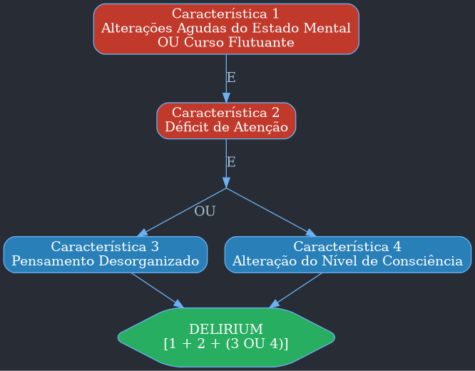

---
{"dg-publish":true,"permalink":"/9-periodo/aulas-segunda-rotacao/psiquiatria-b/"}
---

# Resumo Detalhado de Psiquiatria

## CAP. 1: Psicopatologia, Anamnese Psiquiátrica e Classificações em Psiquiatria

### Psicopatologia

-   **Definição:** A psicopatologia é o conjunto de conhecimentos sobre o adoecimento mental humano. Ela estuda vivências, estados mentais e comportamentos anormais, descritos como sintomas e divididos em funções psíquicas.

### Funções Psíquicas Elementares e Suas Principais Alterações

-   **CONSCIÊNCIA**
    -   **Definição:** É o estado de estar desperto, com capacidade de perceber a realidade e conhecer os objetos.
    -   **Alterações Quantitativas (Nível de consciência):**
        -   **Obnubilação:** Leve sonolência ou turvação da consciência.
        -   **Torpor:** Estado de sonolência mais profundo, do qual o indivíduo só é despertado por estímulos fortes.
        -   **Coma:** Perda total da consciência.
    -   **Alterações Qualitativas (Campo da consciência):**
        -   **Estado Crepuscular (Estreitamento da consciência):** Redução da amplitude da consciência, pode ocorrer em crises epilépticas, quadros dissociativos e intoxicações.
        -   **Dissociação da Consciência:** Fragmentação do campo da consciência, com estado semelhante ao sonho. Ocorre em quadros dissociativos e de ansiedade intensa.

-   **ATENÇÃO**
    -   **Definição:** Direcionamento da consciência para um objeto. A **vigilância** é o estado de alerta, e a **tenacidade** é a capacidade de concentração.
    -   **Alterações:**
        -   **Hipoprosexia:** Diminuição global da atenção.
        -   **Hiperprosexia:** Estado de atenção exacerbada.
        -   **Distração:** Superconcentração em um objeto com inibição do restante.
        -   **Distraibilidade:** Instabilidade da atenção, que é facilmente desviada. Comum em estados maníacos.

-   **ORIENTAÇÃO**
    -   **Definição:** Capacidade de se situar quanto a si mesmo (**autopsíquica**) e ao ambiente (**alopsíquica** - temporal e espacial).
    -   **Tipos de Desorientação:** Pode ser causada por torpor, déficit de memória, apatia, esquizofrenia, deficiência intelectual (oligofrênica) ou dissociação.

-   **SENSOPERCEPÇÃO**
    -   **Definição:** **Sensação** é o fenômeno gerado por estímulos nos órgãos receptores. **Percepção** é a tomada de consciência desse estímulo.
    -   **Alterações Quantitativas:**
        -   **Hiperestesia:** Aumento da intensidade perceptual (ex: intoxicação por alucinógenos).
        -   **Hipoestesia:** Diminuição da intensidade perceptual (ex: depressão).
    -   **Alterações Qualitativas:**
        -   **Ilusões:** Percepção deformada de um objeto real e presente.
        -   **Alucinações:** Percepção de um objeto que não está presente.
            -   **Tipos:** Auditivas (mais comuns na esquizofrenia), visuais, táteis, olfativas, gustativas, cenestésicas (sensações no corpo, ex: "cérebro encolhendo"), cinestésicas (de movimento, ex: "corpo flutuando").
            -   **Alucinose:** Quadros alucinatórios nos quais o indivíduo mantém a consciência da realidade (ex: alcoolismo).

-   **MEMÓRIA**
    -   **Definição:** Capacidade de registrar, manter e evocar fatos passados.
    -   **Tipos:** Imediata, recente (curto prazo) e remota (longo prazo).
    -   **Alterações Quantitativas:**
        -   **Hipermnésia:** Aceleração da evocação.
        -   **Amnésia:** Perda de memória. Pode ser **anterógrada** (dificuldade de fixar novas informações) ou **retrógrada** (dificuldade de evocar informações passadas).
    -   **Alterações Qualitativas (Paramnésias):**
        -   **Ilusões Mnêmicas:** Acréscimo de elementos falsos a uma memória verdadeira.
        -   **Confabulações:** Preenchimento de lacunas de memória com dados fantasiosos (típico da Síndrome de Korsakoff).
        -   **Criptomnésias:** Memórias que surgem como se fossem ideias novas.

-   **AFETIVIDADE**
    -   **Definição:** Dimensão psíquica que dá "tom" às vivências humanas. Divide-se em **humor** (tônus afetivo basal) e **afeto** (qualidade emocional ligada a uma ideia).
    -   **Alterações da Afetividade:**
        -   **Labilidade Afetiva:** Mudanças súbitas e imotivadas de humor.
        -   **Ambivalência Afetiva:** Coexistência de sentimentos opostos e cindidos.
        -   **Embotamento Afetivo:** Perda profunda de toda vivência afetiva, com ausência de resposta emocional. Comum na esquizofrenia com sintomas negativos.
        -   **Anedonia:** Incapacidade de sentir prazer. Sintoma central da depressão.
    -   **Alterações do Humor:**
        -   **Distimia:** Alteração básica do humor (inibição ou exaltação).
        -   **Disforia:** Humor desagradável, mal-humorado, com irritabilidade.
        -   **Ansiedade:** Humor desconfortável com apreensão negativa sobre o futuro.

-   **PENSAMENTO**
    -   **Avaliação:** Analisado quanto ao **curso**, **forma** e **conteúdo**.
    -   **Alterações do Curso:**
        -   **Taquipsiquismo:** Aceleração.
        -   **Bradipsiquismo:** Lentificação.
        -   **Bloqueio do Pensamento:** Interrupção súbita.
        -   **Roubo do Pensamento:** Sensação de que o pensamento foi roubado da mente.
    -   **Alterações da Forma:**
        -   **Fuga de Ideias:** Uma ideia segue a outra rapidamente, sem lógica, por assonância. Característico de quadros maníacos.
        -   **Afrouxamento das Associações:** Ideias menos articuladas, mas ainda com alguma concatenação.
        -   **Desagregação do Pensamento:** Perda radical dos nexos associativos e da coerência. Típico da esquizofrenia grave.
        -   **Circunstancialidade:** O raciocínio "dá voltas" em torno do tema sem chegar ao ponto essencial.
    -   **Alterações do Conteúdo:**
        -   **Delírio:** Juízo patologicamente falseado, com convicção extraordinária e irremovível.
            -   **Tipos:** Persecutório, de grandeza, de culpa, de ciúme, de influência, etc.

-   **LINGUAGEM**
    -   **Definição:** Atividade fundamental na elaboração e expressão do pensamento.
    -   **Alterações:**
        -   **Logorreia/Taquifasia:** Aumento da produção verbal, com "pressão para falar". Comum em episódios maníacos.
        -   **Mutismo:** Ausência de fala, geralmente como forma de negativismo.
        -   **Ecolalia:** Repetição da última palavra dita pelo entrevistador.
        -   **Neologismos:** Criação de palavras novas sem sentido comum.
        -   **Jargonofasia (Salada de Palavras):** Fala incompreensível e incoerente.

-   **VONTADE**
    -   **Definição:** Capacidade de livre-arbítrio e direcionamento da ação.
    -   **Alterações:**
        -   **Hiperbulia:** Aumento da vontade, com sensação de poder. Típico de quadros maníacos.
        -   **Hipobulia:** Diminuição da vontade, com sentimento de impotência. Típico da depressão.
        -   **Negativismo:** Oposição às solicitações do ambiente. Pode ser ativo (faz o oposto) ou passivo (não faz nada).
        -   **Atos Impulsivos:** Ações súbitas e incoercíveis (dromomania - fuga; piromania - fogo; cleptomania - furto).

-   **PSICOMOTRICIDADE**
    -   **Definição:** Relacionada à execução do ato volitivo (movimento).
    -   **Alterações:**
        -   **Agitação Psicomotora:** Aceleração da atividade motora, associada a heteroagressividade.
        -   **Lentificação Psicomotora:** Inibição da atividade psíquica e motora.
        -   **Estupor:** Inibição psicomotora com perda total da atividade espontânea.
        -   **Catatonia:** Alterações psicomotoras como **catalepsia** (hipertonia com redução da mobilidade) e **flexibilidade cérea** (paciente mantém a posição em que é colocado).
        -   **Maneirismos e Estereotipias:** Movimentos bizarros, repetitivos e complexos.

-   **CONSCIÊNCIA DO EU**
    -   **Alterações:**
        -   **Vivências de Influência:** Sensação de que pensamentos ou ações são controlados por uma força externa.
        -   **Despersonalização:** Sentimento de estranheza em relação a si próprio.
        -   **Desrealização:** Perda da familiaridade com o mundo, que parece estranho.

### Roteiro Básico para o Exame Psiquiátrico

-   **Anamnese:** Identificação, queixa principal, história da doença atual, história pregressa, história pessoal e familiar.
-   **Exame Psíquico (Corte Transversal):**
    1.  **Estado de consciência:** Nível, sono.
    2.  **Atenção:** Vigilância, tenacidade.
    3.  **Orientação:** Alopsíquica e autopsíquica.
    4.  **Aspecto geral:** Aparência, higiene, vestimenta, postura.
    5.  **Atitude:** Cooperativo, hostil, desconfiado, etc.
    6.  **Comportamento e psicomotricidade:** Gesticulação, mímica.
    7.  **Linguagem:** Quantidade e qualidade da fala.
    8.  **Afetividade:** Humor, tônus afetivo.
    9.  **Sensopercepção:** Ilusões e alucinações.
    10. **Pensamento:** Curso, forma e conteúdo.
    11. **Memória:** Queixas, avaliação das memórias.
    12. **Vontade e pragmatismo:** Impulsos, iniciativa.
    13. **Inteligência:** Raciocínio e abstração.
    14. **Consciência de morbidade (Insight):** Noção do paciente sobre sua doença.
    15. **Planos para o futuro:** Adequação à realidade.

### Classificações Diagnósticas Atuais em Psiquiatria

#### Manual Diagnóstico e Estatístico de Transtornos Mentais – 5ª edição (DSM-V)

| Categoria Principal                                                                    |
| -------------------------------------------------------------------------------------- |
| Transtornos do neurodesenvolvimento.                                                   |
| Espectro da esquizofrenia e outros transtornos psicóticos.                             |
| Transtorno bipolar e transtornos relacionados.                                         |
| Transtornos depressivos.                                                               |
| Transtornos de ansiedade.                                                              |
| Transtorno obsessivo-compulsivo e transtornos relacionados.                            |
| Transtornos relacionados a trauma e a estressores.                                     |
| Transtornos dissociativos.                                                             |
| Transtorno de sintomas somáticos e transtornos relacionados.                           |
| Transtornos alimentares.                                                               |
| Transtornos da eliminação.                                                             |
| Transtornos do sono-vigília.                                                           |
| Disfunções sexuais.                                                                    |
| Disforia de gênero.                                                                    |
| Transtornos disruptivos, do controle de impulsos e da conduta.                         |
| Transtornos relacionados a substâncias e transtornos aditivos.                         |
| Transtornos neurocognitivos.                                                           |
| Transtornos de personalidade.                                                          |
| Transtornos parafílicos.                                                               |
| Outros transtornos mentais.                                                            |
| Transtornos do movimento induzidos por medicamentos e outros efeitos adversos.         |
| Outras condições que podem ser foco da atenção clínica.                                |

#### Classificação Internacional de Doenças – 10ª Revisão (CID-10) - Capítulo V (F 00-F 99)

| Código  | Categoria                                                                                           |
| :------ | :-------------------------------------------------------------------------------------------------- |
| **F 00-F 09** | **Transtornos mentais orgânicos, inclusive os sintomáticos.**                                       |
| **F 10-F 19** | **Transtornos mentais e comportamentais devidos ao uso de substância psicoativa.**                    |
| **F 20-F 29** | **Esquizofrenia, transtornos esquizotípicos e transtornos delirantes.**                               |
| **F 30-F 39** | **Transtornos do humor [afetivos].**                                                                |
| **F 40-F 48** | **Transtornos neuróticos, relacionados com o estresse e somatoformes.**                               |
| **F 50-F 59** | **Síndromes comportamentais associadas a disfunções fisiológicas e a fatores físicos.**             |
| **F 60-F 69** | **Transtornos da personalidade e do comportamento do adulto.**                                       |
| **F 70-F 79** | **Retardo mental.**                                                                                 |
| **F 80-F 89** | **Transtornos do desenvolvimento psicológico.**                                                     |
| **F 90-F 98** | **Transtornos do comportamento e emocionais que aparecem habitualmente na infância ou adolescência.** |
| **F 99**     | **Transtorno mental não especificado.**                                                             |

---

## CAP. 2: Transtornos Mentais Orgânicos

### Introdução

-   **Definição:** Transtornos agrupados pelo comprometimento da cognição (memória, linguagem, atenção).
-   **Ferramenta de Triagem:** Mini Exame do Estado Mental (MMSE - *Mini-Mental State Examination*).

### DELIRIUM

-   **Definição:** Síndrome caracterizada por alteração global das funções psíquicas, com comprometimento fundamental da **consciência** e da **atenção**.
-   **Características Clínicas:**
    -   **Início:** Súbito (horas a dias).
    -   **Curso:** Breve e **flutuante** (piora à noite - *sundowning*).
    -   **Sintomas:** Alterações cognitivas, do ciclo sono-vigília, da psicomotricidade, do humor e da percepção.
    -   **Prognóstico:** Mau prognóstico se não tratado, com mortalidade de até 50% em um ano.
-   **Etiologia:**
    -   Qualquer alteração da homeostase pode causar delirium.
    -   **Causas Intracranianas:** Epilepsia, TCE, infecções (meningite), transtornos vasculares.
    -   **Causas Extracranianas:** Drogas (intoxicação/abstinência), infecções sistêmicas, desequilíbrio eletrolítico, disfunções de órgãos (fígado, rins).
-   **Diagnóstico:**
    -   Obrigatório ter comprometimento do nível de consciência e atenção.
    -   Alucinações (principalmente visuais) são comuns.
    -   Delírios pouco estruturados e flutuantes.

#### Método Diagnóstico CAM-ICU (Confusion Assessment Method for the Intensive Care Unit)

O CAM-ICU é um método para diagnosticar delirium. Ele se baseia em quatro características:
1.  Alteração aguda do estado mental ou curso flutuante.
2.  Déficit de atenção.
3.  Pensamento desorganizado.
4.  Alteração do nível de consciência.

**O diagnóstico de Delirium requer a presença dos itens 1 E 2, somados a OU 3 OU 4.**

#### Diagnóstico Diferencial: Delirium vs. Demência

| Característica        | Delirium                               | Demência                             |
| --------------------- | -------------------------------------- | ------------------------------------ |
| **História**          | Doença aguda                           | Doença crônica                       |
| **Início**            | Súbito                                 | Insidioso                            |
| **Duração**           | Dias a semanas                         | Meses a anos                         |
| **Curso**             | Flutuante                              | Cronicamente progressivo             |
| **Nível de Consciência** | Flutuante                              | Preservado                           |
| **Orientação**        | Prejudicada                            | Intacta inicialmente                 |
| **Atenção**           | Prejudicada de forma saliente          | Menos prejudicada                    |
| **Pensamento**        | Frequentemente desorganizado           | Quantidade diminuída                 |
| **Memória**           | Recente acentuadamente prejudicada     | Recente e remota prejudicadas        |
| **Percepção**         | Alucinações comuns (visuais)           | Alucinações menos comuns             |
| **Sono**              | Perturbação do ciclo sono-vigília      | Menor perturbação                    |
| **Reversibilidade**   | Frequentemente reversível              | Maioria não reversível               |

-   **Tratamento:**
    -   Princípio básico: **identificar e tratar a causa base**.
    -   Medidas de suporte: ambiente tranquilo, reorientação, controle hidroeletrolítico.
    -   **Evitar benzodiazepínicos** (exceto em *delirium tremens* por abstinência de álcool), pois podem piorar o déficit cognitivo.
    -   Antipsicóticos em baixas doses podem ser usados para agitação psicomotora.

### DEMÊNCIA

-   **Definição:** Síndrome com múltiplos comprometimentos nas funções cognitivas (**sem alteração da consciência**), com prejuízo no funcionamento social e ocupacional.
-   **Causas:**
    -   A principal causa é a **Doença de Alzheimer** (50-60%).
    -   **Demência vascular** (15-30%) é a segunda causa mais comum.
    -   Outras causas incluem: Doença de Parkinson, de Huntington, de Pick, infecções (HIV, neurossífilis), deficiências nutricionais (B 12, folato), massas intracranianas, etc.
    -   Cerca de 15% das causas são **reversíveis**.
-   **Diagnóstico Diferencial:**
    -   **Pseudodemência (Depressão):** Ocorre em pacientes deprimidos, que se queixam de esquecimentos. O início é mais identificável, há autorrecriminação e valorização dos sintomas, ao contrário da demência, onde o paciente tende a encobrir os déficits.

| Parâmetro                 | Pseudodemência (Depressão)                    | Demência                                        |
| ------------------------- | --------------------------------------------- | ----------------------------------------------- |
| **Início**                | Mais facilmente identificável                 | Início insidioso                                |
| **Atitude**               | Autorrecriminação, valoriza os sintomas       | Confabulação, encobre os sintomas               |
| **Esforço**               | Não se esforça para realizar tarefas          | Luta para realizar tarefas                      |
| **Preocupação**           | Ansiosos quanto à sua condição                | Despreocupados                                  |
| **Variação Noturna**      | Não há                                        | Piora noturna comum ("efeito do pôr do sol")   |
| **Memória**               | Recente e remota igualmente acometidas        | Memória remota mais preservada que a recente    |

#### Classificação das Demências

| Tipo        | Exemplos                                |
| ----------- | --------------------------------------- |
| **Cortical**  | Alzheimer, Vascular, Pick             |
| **Subcortical** | Binswanger, Parkinson, Huntington, HIV |

-   **Tratamento:**
    -   Se a causa for reversível, iniciar terapêutica o mais rápido possível.
    -   **Doença de Alzheimer:** Anticolinesterásicos (ex: rivastigmina) e inibidores do receptor NMDA (ex: memantina).
    -   **Demência Vascular:** Controle da doença de base (hipertensão, diabetes) para evitar novos infartos.
    -   Sintomático: Antipsicóticos para sintomas psicóticos, com cuidado devido a efeitos colaterais em idosos.

---

## CAP. 3: Transtornos Mentais Relacionados ao Uso de Substâncias Psicoativas

### Introdução

-   **Tolerância:** Necessidade de quantidades crescentes da substância para atingir o mesmo efeito.
-   **Abstinência:** Sintomas que surgem com a interrupção ou redução do uso.
-   **Padrões de Uso:**
    -   **Uso de Baixo Risco:** Consumo que não traz problemas significativos.
    -   **Uso Nocivo (Abuso):** Consumo que já causa problemas (sociais, físicos, psicológicos), mas sem dependência.
    -   **Dependência:** Padrão de uso compulsivo, com tolerância e abstinência, e consumo em detrimento de outras áreas da vida.

### Transtornos Relacionados ao Álcool

-   **Diagnóstico de Dependência:** Utilização de questionários como CAGE e AUDIT.

#### Questionário CAGE

-   Um mnemônico para ajudar a lembrar as 4 perguntas. Duas ou mais respostas afirmativas são indicativas de dependência.
    -   **C** - **Cut down** (Cortar): Você já tentou diminuir ou **c**ortar a bebida?
    -   **A** - **Annoyed** (Incomodado): Você já ficou incomodado ou irritado (**a**borrecido) com outros porque criticaram seu jeito de beber?
    -   **G** - **Guilty** (Culpado): Você já se sentiu **c**ulpado por causa do seu jeito de beber?
    -   **E** - **Eye-opener** (Abrir os olhos): Você já teve que beber pela manhã para aliviar os nervos ou reduzir os efeitos de uma ressaca ("abrir os olhos")?

#### Questionário AUDIT (Alcohol Use Disorders Identification Test)

-   Consiste em 10 perguntas sobre consumo, comportamento de dependência e problemas relacionados ao álcool.
-   **Pontuação e Interpretação:**
    -   **0-7 pontos:** Consumo de baixo risco (Zona I).
    -   **8-15 pontos:** Uso de risco (Zona II) - requer intervenção breve.
    -   **16-19 pontos:** Uso nocivo (Zona III) - requer intervenção breve e monitoramento.
    -   **20 ou mais pontos:** Provável dependência (Zona IV) - requer avaliação diagnóstica e tratamento.

-   **Intoxicação Aguda:**
    -   Níveis crescentes de depressão do SNC: euforia leve -> tontura/ataxia -> confusão -> estupor/coma.
    -   **Intoxicação Patológica:** Alterações graves de comportamento com pequena quantidade de álcool (agressividade, impulsividade).

-   **Síndrome de Abstinência:**
    -   Sintomas leves (24-36 h): tremores, insônia, ansiedade, irritabilidade.
    -   Sintomas graves (3-4 dias):
        -   ***Delirium Tremens***: Estado confusional agudo com obnubilação da consciência, desorientação, alucinações vívidas (tipicamente zoopsias - animais), tremores intensos e hiperatividade autonômica (hipertensão, taquicardia). É uma emergência médica.
        -   **Alucinose Alcoólica:** Alucinações (geralmente auditivas) que ocorrem **sem rebaixamento do nível de consciência**.
    -   **Tratamento:** Benzodiazepínicos e reposição de vitaminas (Tiamina - Vitamina B 1) para prevenir a Síndrome de Wernicke.

-   **Complicações Clínicas Crônicas:**
    -   **Síndrome de Wernicke-Korsakoff:** Causada por deficiência de tiamina.
        -   **Encefalopatia de Wernicke (aguda e reversível):** Tríade de confusão mental, ataxia e alterações da motilidade ocular (nistagmo).
        -   **Síndrome de Korsakoff (crônica):** Evolução da SW não tratada. Caracteriza-se por amnésia anterógrada severa com confabulação.

-   **Tratamento da Dependência:**
    -   **Motivação:** Modelo Transteórico (Pré-contemplação -> Contemplação -> Preparação -> Ação -> Manutenção).
    -   **Medicamentos (para reduzir o desejo e prevenir recaídas):**
        -   **Naltrexona:** Antagonista opioide que diminui o prazer ao beber.
        -   **Acamprosato:** Reduz o desejo compulsivo (fissura).
        -   **Dissulfiram (Antabuse):** Inibe a enzima acetaldeído desidrogenase, causando reações muito desagradáveis (rubor, náusea, taquicardia) se o paciente consumir álcool.

### Transtornos Relacionados à Cocaína

-   **Mecanismo:** Inibe a recaptação de dopamina, noradrenalina e serotonina.
-   **Manifestações Agudas (Intoxicação):** Euforia, aumento de energia, taquicardia, hipertensão, midríase. Pode haver delírios persecutórios.
-   **Abstinência ("Crash" ou "Aterrisagem"):** Disforia, anedonia, fadiga, hipersonolência, ideação suicida.
-   **Complicações:**
    -   **Cardiovasculares:** Angina, infarto do miocárdio, arritmias.
    -   **Neurológicas:** Convulsões, AVC isquêmico.
-   **Tratamento:** Focado em intervenções psicossociais e grupos de apoio (Narcóticos Anônimos), pois não há medicação específica eficaz para a dependência.

### Transtornos Relacionados à Cannabis

-   **Princípio Ativo:** Δ⁹-tetraidrocanabinol (THC).
-   **Intoxicação:** Euforia, risos imotivados, lentificação do tempo, prejuízo na memória de curto prazo, hiperemia conjuntival, boca seca, taquicardia.
-   **Complicações:**
    -   **Agudas:** Pode desencadear reações de pânico e sintomas psicóticos em indivíduos predispostos.
    -   **Crônicas:** **Síndrome Amotivacional** (apatia, falta de energia e relutância em persistir em tarefas). Risco respiratório semelhante ao tabaco.
-   **Tratamento:** Abstinência e apoio psicossocial. Antidepressivos podem ser usados para a síndrome amotivacional.

### Transtornos Relacionados a Opioides (Morfina, Heroína)

-   **Intoxicação Aguda:** Tríade clássica de **coma, pupilas em ponta de alfinete (miose) e depressão respiratória**. É uma emergência médica.
    -   **Tratamento:** **Naloxona** (antagonista opioide).
-   **Síndrome de Abstinência:** Ansiedade, fissura, sudorese, midríase, lacrimejamento, rinorreia, dores musculares, diarreia.
-   **Tratamento da Dependência:** Metadona (opioide de meia-vida longa para desmame) ou buprenorfina.

### Transtornos Relacionados a Alucinógenos (LSD, Psilocibina)

-   **Mecanismo:** Atuam no sistema serotoninérgico.
-   **Intoxicação:** Alterações perceptuais (ilusões, sinestesias), despersonalização, desrealização, midríase, taquicardia.
-   **Complicações:**
    -   ***Bad Trip***: Experiência de pânico e medo intenso durante a intoxicação.
    -   ***Flashbacks***: Revivência das alucinações muito tempo após o uso.
    -   Pode desencadear transtornos psicóticos prolongados em predispostos.
-   **Tratamento:** Tranquilizar o usuário e, se necessário, tratar condições psiquiátricas subjacentes.

### Transtornos Relacionados à Nicotina (Tabagismo)

-   **Diagnóstico de Dependência:** Utilização do Teste de Fagerström.

#### Teste de Fagerström para Dependência de Nicotina

-   Avalia o grau de dependência. Uma pontuação alta indica maior dependência e maior probabilidade de sintomas de abstinência.
-   **Perguntas e Pontuação:**
    1.  **Quanto tempo após acordar você fuma seu primeiro cigarro?**
        -   Nos primeiros 5 min (3 pts)
        -   De 6 a 30 min (2 pts)
        -   De 31 a 60 min (1 pt)
        -   Mais de 60 min (0 pts)
    2.  **Você acha difícil não fumar em lugares proibidos?**
        -   Sim (1 pt)
        -   Não (0 pts)
    3.  **Qual o cigarro do dia que traz mais satisfação?**
        -   O primeiro da manhã (1 pt)
        -   Os outros (0 pts)
    4.  **Quantos cigarros você fuma por dia?**
        -   Menos de 10 (0 pts)
        -   11-20 (1 pt)
        -   21-30 (2 pts)
        -   Mais de 31 (3 pts)
    5.  **Você fuma mais frequentemente pela manhã?**
        -   Sim (1 pt)
        -   Não (0 pts)
    6.  **Você fuma mesmo doente, quando precisa ficar acamado?**
        -   Sim (1 pt)
        -   Não (0 pts)
-   **Interpretação do Escore Total:**
    -   **0-2:** Muito baixa
    -   **3-4:** Baixa
    -   **5:** Média
    -   **6-7:** Elevada
    -   **8-10:** Muito elevada

-   **Tratamento:**
    -   A base é a Terapia Cognitivo-Comportamental (TCC).
    -   **Farmacoterapia (Primeira Linha):**
        -   **Terapia de Reposição de Nicotina (TRN):** Adesivo, goma, pastilha.
        -   **Bupropiona:** Antidepressivo. Contraindicado em histórico de convulsão.
        -   **Vareniclina:** Agonista parcial do receptor nicotínico.

#### Estágios de Mudança (Modelo Transteórico - MTT) para o Tabagismo

| Estágio             | Descrição                                                                                                  |
| ------------------- | ---------------------------------------------------------------------------------------------------------- |
| **Pré-contemplação**  | Não há intenção de parar.                                                                                  |
| **Contemplação**      | Há conscientização de que fumar é um problema, mas existe ambivalência.                                    |
| **Preparação**        | Prepara-se para parar, aceita escolher uma estratégia.                                                     |
| **Ação**              | Para de fumar de fato.                                                                                     |
| **Manutenção**        | Aprende estratégias para prevenir a recaída.                                                               |

---

## CAP. 4: Esquizofrenia e Outros Transtornos Psicóticos

### Esquizofrenia

-   **Definição:** Um transtorno mental grave, heterogêneo e de causa desconhecida, caracterizado por sintomas psicóticos que prejudicam significativamente o funcionamento social. Tem curso crônico e, geralmente, prognóstico sombrio. Os distúrbios principais são do **pensamento**, da **percepção** e do **afeto**.
-   **Epidemiologia:**
    -   Prevalência mundial de aproximadamente 1%.
    -   Acomete igualmente ambos os sexos.
    -   Início mais precoce em homens (10-25 anos) do que em mulheres (25-35 anos).
-   **Etiologia:**
    -   **Modelo Diátese-Estresse:** Um indivíduo com vulnerabilidade biológica específica (diátese) desenvolve os sintomas quando ativado por fatores estressores (genéticos, biológicos, psicossociais).
    -   **Fatores Genéticos:** Forte componente genético. O risco aumenta significativamente em parentes de primeiro grau.
    -   **Fatores Neurobiológicos (Hipótese Dopaminérgica):** A esquizofrenia resultaria de uma atividade dopaminérgica exacerbada, especialmente nos receptores D 2. A maioria dos antipsicóticos atua bloqueando esses receptores.
-   **Manifestações Clínicas:**
    -   **Personalidade Pré-mórbida:** Frequentemente, há histórico de traços esquizoides (frieza emocional, isolamento) ou esquizotípicos (comportamento estranho, crenças excêntricas).
    -   **Sinais e Sintomas:**
        -   **Insight (Consciência de Morbidade):** Geralmente ausente, o que leva à má adesão ao tratamento.
        -   **Afetividade:** Embotamento (superficialidade) ou incongruência (paratimia) do afeto são comuns.
        -   **Sensopercepção:** Alucinações auditivas são as mais comuns e características (vozes que comentam, dialogam ou dão ordens). Alucinações visuais são mais sugestivas de causa orgânica.
        -   **Pensamento:** Delírios são centrais (persecutórios, de grandeza, de influência). O pensamento pode se apresentar desagregado, com afrouxamento dos nexos associativos.
        -   **Linguagem:** Pode haver neologismos (criação de palavras) e ecolalia (repetição).
-   **Diagnóstico:**
    -   É fenomenológico, baseado na observação clínica. Não há exame complementar que confirme o diagnóstico.
    -   **Os 4 "As" de Bleuler (Sintomas Fundamentais):**
        1.  **A**frouxamento das **A**ssociações (alteração do pensamento).
        2.  **A**feto embotado/inapropriado.
        3.  **A**utismo (tendência ao isolamento e mundo interior).
        4.  **A**mbivalência afetiva.
    -   **Sintomas de Kurt Schneider:**

| Sintomas de Primeira Ordem (Mais Sugestivos)                                       | Sintomas de Segunda Ordem (Menos Específicos)           |
| :--------------------------------------------------------------------------------- | :------------------------------------------------------ |
| • Percepção delirante.                                                             | • Outros transtornos da sensopercepção.                 |
| • Vozes que dialogam entre si.                                                     | • Perplexidade.                                         |
| • Vozes que comentam as atividades do paciente.                                    | • Alterações de humor depressivas ou maníacas.          |
| • Vivências de influência corporal.                                                | • Vivências de empobrecimento afetivo.                  |
| • Roubo de pensamento e outras vivências de influência do pensamento.              | • Outros sintomas.                                      |
| • Sonorização e difusão do pensamento.                                             |                                                         |
| • Todas as outras experiências envolvendo volição, afeto e impulsos influenciados. |                                                         |

-   **Sintomas Positivos vs. Negativos:**
	-   **Sintomas Positivos (Produtivos):** Alucinações, delírios, comportamento bizarro, agitação. Geralmente respondem bem aos antipsicóticos.
	-   **Sintomas Negativos (Deficitários):** Embotamento afetivo, retração social, empobrecimento da linguagem (alogia), diminuição da vontade (avolição), autonegligência. Têm pior prognóstico e menor resposta ao tratamento.
-   **Critérios Diagnósticos (DSM-V vs. CID-10):**

| Critérios Diagnósticos para Esquizofrenia – DSM-V                                                                                                                                                                                                                                            |
| :----------------------------------------------------------------------------------------------------------------------------------------------------------------------------------------------------------------------------------------------------------------------------------------- |
| **A.** Dois ou mais dos seguintes sintomas, presentes por período significativo durante um mês (pelo menos um deve ser 1, 2 ou 3): 1. Delírios; 2. Alucinações; 3. Discurso desorganizado; 4. Comportamento amplamente desorganizado ou catatônico; 5. Sintomas negativos. |
| **B.** Disfunção sócio-ocupacional.                                                                                                                                                                                                                                                        |
| **C.** Duração de pelo menos **seis meses** (incluindo pródromos ou residuais).                                                                                                                                                                                                             |
| **D.** Exclusão de transtorno esquizoafetivo e transtorno do humor.                                                                                                                                                                                                                         |
| **E.** Exclusão de uso de substâncias ou condição médica geral.                                                                                                                                                                                                                            |

| Critérios Diagnósticos para Esquizofrenia – CID-10                                                                                                                                                             |
| :------------------------------------------------------------------------------------------------------------------------------------------------------------------------------------------------------------- |
| Presença de, no mínimo, **um** dos sintomas do grupo de (A) a (D), **OU** **dois** sintomas do grupo de (E) a (H), durante pelo menos **um mês**.  **A.** Eco, inserção, irradiação ou roubo do pensamento. |
| **B.** Delírios de controle, influência ou passividade.                                                                                                                                                        |
| **C.** Vozes que comentam ou discutem entre si.                                                                                                                                                                |
| **D.** Delírios persistentes de outros tipos (bizarros).                                                                                                                                                       |
| **E.** Alucinações persistentes de qualquer modalidade.                                                                                                                                                        |
| **F.** Interceptações ou bloqueio do pensamento.                                                                                                                                                               |
| **G.** Comportamento catatônico.                                                                                                                                                                               |
| **H.** Sintomas negativos (apatia, pobreza do discurso, embotamento).                                                                                                                                          |
| Exclusão de transtorno mental orgânico ou intoxicação/abstinência de drogas.                                                                                                                                   |

-   **Subtipos de Esquizofrenia (CID-10):**
    -   **Paranoide:** Predominam delírios (geralmente persecutórios) e alucinações auditivas. O afeto e o pensamento formal estão mais preservados. Início mais tardio.
    -   **Hebefrênica (Desorganizada):** Predomina a desorganização do pensamento e do afeto (incongruente, pueril). Início precoce (antes dos 25 anos) e prognóstico desfavorável.
    -   **Catatônica:** Predominam distúrbios da psicomotricidade (estupor, posturas bizarras, negativismo, flexibilidade cérea, obediência automática).
    -   **Indiferenciada:** Preenche critérios para esquizofrenia, mas não se encaixa em nenhum dos subtipos acima.
    -   **Residual:** Estágio crônico com predominância de sintomas negativos persistentes.
-   **Tratamento:**
    -   A base do tratamento é o uso de **antipsicóticos (neurolépticos)**, associado a estratégias psicossociais.
    -   **Antipsicóticos Típicos (1ª Geração):** Bloqueiam preferencialmente os receptores D 2. São eficazes para sintomas positivos, mas têm alto risco de efeitos extrapiramidais. Ex: Haloperidol, Clorpromazina.
    -   **Antipsicóticos Atípicos (2ª Geração):** Atuam em receptores D 2 e em outros (ex: serotonina). São eficazes para sintomas positivos e negativos, com menor risco de efeitos extrapiramidais, mas maior risco de efeitos metabólicos (ganho de peso, diabetes). Ex: Risperidona, Olanzapina, Quetiapina, Clozapina (reservada para casos refratários devido ao risco de agranulocitose).

| Antipsicóticos Mais Comuns e Doses Usuais |                                |                          |
| :---------------------------------------- | :----------------------------- | :----------------------- |
| **Típicos - Alta potência**               | **Típicos - Baixa potência**   | **Atípicos**             |
| • Haloperidol, 5-15 mg/dia.               | • Clorpromazina, 300-800 mg/dia. | • Risperidona, 2-8 mg/dia. |
| • Flufenazina, 5-15 mg/dia.               | • Levomepromazina, 100-300 mg/dia. | • Olanzapina, 5-20 mg/dia. |
|                                           |                                | • Quetiapina, 300-400 mg/dia. |
|                                           |                                | • Clozapina, 200-500 mg/dia. |

### Transtornos dos Movimentos Induzidos por Antipsicóticos (Efeitos Extrapiramidais)

-   **Acatisia Aguda:** Inquietação motora subjetiva e objetiva, sensação de não conseguir ficar parado. Tratamento: Redução da dose, troca do antipsicótico, propranolol ou biperideno.
-   **Distonia Aguda:** Contrações musculares involuntárias e sustentadas (ex: torcicolo, crise oculogírica). É uma emergência. Tratamento: Biperideno intramuscular.
-   **Parkinsonismo:** Tríade de tremor de repouso, rigidez e bradicinesia (lentidão dos movimentos). Tratamento: Biperideno oral.
-   **Discinesia Tardia:** Movimentos involuntários, coreoatetoides, que surgem após uso crônico de antipsicóticos, principalmente na região orofacial. De difícil tratamento; a prevenção é crucial.
-   **Síndrome Neuroléptica Maligna (SNM):** Reação rara, mas potencialmente fatal. Caracterizada por rigidez muscular extrema, febre alta, instabilidade autonômica e alteração do nível de consciência. Exames mostram aumento de CPK. **É uma emergência médica.** Tratamento: **Suspender o antipsicótico imediatamente**, suporte intensivo, bromocriptina e dantrolene.

### Outros Transtornos Psicóticos

-   **Transtorno Delirante Persistente:** Presença de um delírio fixo e não bizarro (ex: persecutório, ciúmes, grandioso) por pelo menos um mês, **sem** os outros sintomas da esquizofrenia (alucinações proeminentes, desorganização). O funcionamento geral do indivíduo fora do delírio é preservado.
-   **Transtorno Esquizofreniforme:** Sintomas idênticos à esquizofrenia, mas com duração **entre 1 e 6 meses**. Se persistir, o diagnóstico muda para esquizofrenia.
-   **Transtorno Esquizoafetivo:** Presença simultânea de sintomas de um episódio de humor (depressivo maior ou maníaco) E sintomas da fase ativa da esquizofrenia. Crucial para o diagnóstico: deve haver um período de **pelo menos duas semanas com delírios ou alucinações na ausência de sintomas de humor**.
-   **Transtorno Psicótico Breve:** Sintomas psicóticos com duração **de 1 dia a 1 mês**, com retorno completo ao funcionamento prévio. Geralmente desencadeado por estresse.

---

## CAP. 5: Transtornos do Humor

### Introdução

-   **Definição:** Grupo de condições clínicas cuja perturbação fundamental é uma alteração do humor (tônus afetivo basal), seja para depressão ou para exaltação (mania).
-   **Epidemiologia:**
    -   **Transtorno Depressivo:** Mais comum, prevalência de 15% em mulheres (duas vezes maior que em homens).
    -   **Transtorno Bipolar:** Menos comum, prevalência de 1% (similar à esquizofrenia).
-   **Manifestações Clínicas:**
    -   **Síndromes Depressivas:**
        -   **Sintomas Afetivos:** Tristeza, anedonia (incapacidade de sentir prazer), apatia, irritabilidade.
        -   **Sintomas Físicos:** Fadiga, alterações de sono (insônia terminal é clássica) e apetite, dores.
        -   **Distúrbios do Pensamento:** Ideação negativa, culpa, pessimismo, ideias de morte/suicídio.
        -   **Sintomas Psicóticos:** Podem ocorrer delírios ou alucinações congruentes com o humor (ex: delírios de ruína, culpa).
    -   **Síndromes Maníacas:**
        -   **Humor:** Eufórico, expansivo ou irritável.
        -   **Psicomotricidade e Energia:** Aumento da energia, agitação psicomotora, diminuição da necessidade de sono.
        -   **Pensamento e Fala:** Pensamento acelerado (taquipsiquismo), fuga de ideias, fala rápida e sob pressão (logorreia).
        -   **Autoestima:** Grandiosidade, aumento da autoestima.
        -   **Comportamento:** Desinibição social e sexual, gastos excessivos, impulsividade.
        -   **Hipomania:** Forma atenuada da mania, sem prejuízo funcional grave ou sintomas psicóticos.
-   **Diagnóstico:**

#### Critérios para Episódio Depressivo Maior (DSM-V)

-   **A.** **Cinco ou mais** dos seguintes sintomas por **pelo menos 2 semanas** (sendo obrigatório o sintoma 1 ou 2):
    1.  **Humor deprimido** na maior parte do dia.
    2.  **Anedonia:** Interesse ou prazer acentuadamente diminuídos.
    3.  Perda ou ganho de peso significativo (>5% em um mês).
    4.  Insônia ou hipersonia.
    5.  Agitação ou retardo psicomotor.
    6.  Fadiga ou perda de energia.
    7.  Sentimentos de inutilidade ou culpa excessiva.
    8.  Capacidade diminuída de pensar ou se concentrar.
    9.  Pensamentos recorrentes de morte ou ideação suicida.
-   **B.** Os sintomas causam sofrimento clinicamente significativo ou prejuízo funcional.
-   **C.** Não são devidos a substâncias ou outra condição médica.

#### Estágios do Luto (Elisabeth Kübler-Ross)

| Estágio    | Descrição                                                                                                  |
| :--------- | :--------------------------------------------------------------------------------------------------------- |
| **Negação**  | Mecanismo de defesa inicial contra a dor psíquica. "Não pode ser verdade."                                 |
| **Raiva**    | Revolta e ressentimento quando a negação não pode mais ser mantida. "Por que eu?"                           |
| **Barganha** | Tentativa de adiar o inevitável, geralmente fazendo promessas a Deus.                                     |
| **Depressão**| Tomada de consciência da perda, com sentimentos de tristeza e desinteresse.                                |
| **Aceitação**| O paciente não nega mais a realidade nem sente desespero, atingindo um momento de paz e repouso.             |

#### Critérios para Episódio Maníaco (DSM-V)

-   **A.** Um período distinto de humor anormal e persistentemente elevado, expansivo ou irritável, durando **pelo menos 1 semana**.
-   **B.** Durante esse período, **três ou mais** dos seguintes sintomas (quatro se o humor for apenas irritável):
    1.  Autoestima inflada ou grandiosidade.
    2.  Necessidade de sono diminuída.
    3.  Mais falante que o habitual ou pressão por falar.
    4.  Fuga de ideias ou sensação de que os pensamentos estão correndo.
    5.  Distraibilidade.
    6.  Aumento da atividade dirigida a objetivos ou agitação psicomotora.
    7.  Envolvimento excessivo em atividades com alto potencial para consequências dolorosas (compras, indiscrições sexuais, etc.).
-   **C.** A perturbação do humor é suficientemente severa para causar prejuízo acentuado no funcionamento.
-   **D.** Não é devido a substâncias ou outra condição médica.
-   **Classificação:**
    -   **Transtornos Depressivos:**
        -   **Transtorno Depressivo Maior (Recorrente):** Vários episódios depressivos ao longo da vida.
        -   **Transtorno Depressivo Persistente (Distimia):** Humor cronicamente deprimido por pelo menos 2 anos, com sintomas menos intensos que um episódio depressivo maior.
        -   **Depressão Dupla:** Paciente com distimia que desenvolve um episódio depressivo maior sobreposto.
    -   **Transtorno Bipolar:**
        -   **Transtorno Bipolar Tipo I:** Requer a ocorrência de **pelo menos um episódio maníaco**. Episódios depressivos e hipomaníacos podem ocorrer, mas não são necessários para o diagnóstico.
        -   **Transtorno Bipolar Tipo II:** Requer **pelo menos um episódio hipomaníaco E pelo menos um episódio depressivo maior**. **Nunca** houve um episódio maníaco completo.
        -   **Transtorno Ciclotímico:** Por pelo menos 2 anos, numerosos períodos com sintomas hipomaníacos e períodos com sintomas depressivos que não preenchem critérios para um episódio completo.
-   **Tratamento:**
    -   **Transtorno Depressivo:**
        -   Psicoterapia e antidepressivos.
        -   **Primeira linha:** Inibidores Seletivos da Recaptação de Serotonina (ISRS) - Fluoxetina, Sertralina, etc.
        -   **Outras opções:** ISRSN (Venlafaxina, Duloxetina), tricíclicos (Amitriptilina - mais efeitos colaterais), etc.
        -   A resposta leva de 2 a 4 semanas. O tratamento deve ser mantido por pelo menos 6 meses após a remissão.
    -   **Transtorno Bipolar:**
        -   A base do tratamento são os **estabilizadores de humor**.
        -   **Lítio:** Padrão-ouro, mas com faixa terapêutica estreita e risco de toxicidade. Requer monitoramento dos níveis séricos.
        -   **Outros Estabilizadores:** Ácido valproico, Lamotrigina (eficaz na depressão bipolar), Carbamazepina.
        -   **Antipsicóticos atípicos** (Olanzapina, Quetiapina) também são usados como estabilizadores.
        -   **Mania Aguda:** Estabilizador + Antipsicótico.
        -   **Depressão Bipolar:** Estabilizador (Lítio, Lamotrigina) ou antipsicótico atípico. **Uso de antidepressivos é controverso** devido ao risco de "virada maníaca".

| Classes de Antidepressivos                                 | Exemplos                                                              |
| :--------------------------------------------------------- | :-------------------------------------------------------------------- |
| **Tricíclicos**                                            | Amitriptilina, Imipramina, Clomipramina                               |
| **Inibidores da MAO (IMAO)**                               | Tranilcipromina (requer dieta restritiva de tiramina)                 |
| **Inibidores Seletivos da Recaptação de Serotonina (ISRS)**  | Fluoxetina, Paroxetina, Sertralina, Citalopram, Escitalopram            |
| **Inibidores da Recaptação de Serotonina-Noradrenalina (DUAL/ISRSN)** | Desvenlafaxina, Duloxetina, Venlafaxina                             |
| **Atípicos**                                               | Bupropiona, Mirtazapina                                               |

---Perfeitamente. Aqui está a continuação e finalização da sua aula detalhada para o Obsidian.

---

## CAP. 6: Transtornos de Ansiedade, Obsessivo-Compulsivo, Relacionados a Trauma e a Estressores, Dissociativos e Somatoformes

### Transtornos de Ansiedade

-   **Definição:** A ansiedade é um estado de humor desconfortável, um sentimento de defesa e apreensão sobre um perigo ou ameaça futura ou desconhecida. Difere do **medo**, que é uma resposta a uma ameaça conhecida e presente.
-   **Sintomas:** Podem ser divididos em físicos e psíquicos.

| Sinais e Sintomas de Ansiedade |                                                                                                                                                                                                                |
| :----------------------------- | :------------------------------------------------------------------------------------------------------------------------------------------------------------------------------------------------------------- |
| **Físicos**                      |                                                                                                                                                                                                                |
| *Autonômicos:*                   | Taquicardia, vasoconstrição, sudorese, aumento do peristaltismo, náusea, midríase, piloereção, vertigem.                                                                                                         |
| *Musculares:*                    | Dores, contraturas, tremor, tensão.                                                                                                                                                                            |
| *Cinestésicos:*                  | Parestesias (formigamentos), calafrios, ondas de calor.                                                                                                                                                          |
| *Respiratórios:*                 | Sensação de sufocamento e asfixia.                                                                                                                                                                             |
| **Psíquicos**                    | Nervosismo, apreensão, insegurança, dificuldade de concentração, sensação de estranheza, **despersonalização** (estranheza referida a si mesmo) e **desrealização** (sensação de irrealidade referida ao ambiente). |

-   **Diagnóstico Diferencial:** É crucial excluir condições orgânicas que podem mimetizar a ansiedade.

| Algumas Condições Clínicas que Podem Cursar com Ansiedade |                                                                                               |
| :-------------------------------------------------------- | :-------------------------------------------------------------------------------------------- |
| **Doenças neurológicas:**                                 | Tumores cerebrais, epilepsia, enxaqueca, doença cerebrovascular.                                |
| **Doenças endócrinas:**                                   | Disfunção tireoidiana (hiper e hipo), feocromocitoma, síndrome de Cushing.                     |
| **Doenças pulmonares:**                                   | Asma, hiperventilação, embolia pulmonar, hipóxia, DPOC.                                         |
| **Doenças cardiovasculares:**                             | Angina, HAS, ICC, arritmias, IAM.                                                               |
| **Intoxicação por substâncias:**                          | Cafeína, cocaína, anfetaminas, anticolinérgicos.                                                |
| **Abstinência a drogas:**                                 | Álcool, anti-hipertensivos, opioides, benzodiazepínicos.                                        |
| **Outras condições:**                                     | Infecções sistêmicas, uremia, distúrbios hidroeletrolíticos, hipoglicemia.                      |

### Transtorno de Pânico e Agorafobia

-   **Transtorno de Pânico:** Caracteriza-se por ataques de pânico recorrentes e inesperados.
    -   **Ataque de Pânico:** Um surto abrupto de medo ou desconforto intenso que atinge um pico em minutos, acompanhado por sintomas físicos e cognitivos (palpitações, sudorese, tremores, falta de ar, medo de morrer, enlouquecer ou perder o controle).
    -   O transtorno se desenvolve quando há preocupação persistente em ter novos ataques (ansiedade antecipatória).
-   **Agorafobia:** Medo ou ansiedade acentuados sobre situações onde escapar pode ser difícil ou o auxílio pode não estar disponível caso sintomas de pânico ocorram (ex: transporte público, lugares abertos, lugares fechados, filas).
-   **Tratamento:** Antidepressivos (ISRS são primeira linha), benzodiazepínicos (uso em curto prazo para controle agudo) e psicoterapia.

### Transtorno de Ansiedade Generalizada (TAG)

-   **Definição:** Ansiedade e preocupação excessivas e persistentes sobre diversos eventos ou atividades (caráter "flutuante"). A preocupação é difícil de controlar.
-   **Características Clínicas:** A ansiedade está associada a três ou mais dos seguintes:
    -   **Tensão Motora:** Inquietação, fadiga fácil, tensão muscular.
    -   **Hiperatividade Autonômica:** Palpitações, sudorese, boca seca.
    -   **Vigilância:** Dificuldade de concentração, irritabilidade, perturbação do sono.
-   **Diagnóstico:** Os sintomas devem estar presentes na maioria dos dias por pelo menos 6 meses.
-   **Tratamento:** Antidepressivos (ISRS e Venlafaxina) e psicoterapia.

### Fobia Social e Específica

-   **Fobia:** Medo irracional, excessivo e persistente de um objeto, atividade ou situação específica.
-   **Fobia Social (Transtorno de Ansiedade Social):** Medo de situações sociais ou de desempenho por temor de humilhação, embaraço ou avaliação negativa.
-   **Fobia Específica:** Medo acentuado e persistente de objetos ou situações claramente discerníveis (ex: animais, altura, sangue-injeção-ferimentos, avião).
-   **Tratamento:** Psicoterapia (Terapia de Exposição é a mais eficaz). Na fobia social, antidepressivos (ISRS) podem ser indicados.

### Transtorno Obsessivo-Compulsivo (TOC)

-   **Definição:** Caracterizado pela presença de obsessões e/ou compulsões.
    -   **Obsessões:** Pensamentos, imagens ou impulsos recorrentes e intrusivos que causam acentuada ansiedade. O indivíduo tenta ignorá-los ou neutralizá-los.
    -   **Compulsões:** Comportamentos repetitivos (lavar as mãos, verificar) ou atos mentais (rezar, contar) que o indivíduo se sente compelido a executar em resposta a uma obsessão, para reduzir a ansiedade.
-   **Características:** Geralmente o paciente reconhece que seus pensamentos e atos são excessivos e irracionais (tem *insight*).
-   **Tratamento:** Antidepressivos em doses elevadas (Clomipramina e ISRS) e Terapia Cognitivo-Comportamental (especialmente a técnica de Exposição e Prevenção de Resposta - EPR).

### Transtornos Relacionados a Trauma e a Estressores

-   **Transtorno de Estresse Pós-Traumático (TEPT):**
    -   **Causa:** Exposição a um evento traumático real ou ameaçador (guerra, acidente grave, estupro).
    -   **Sintomas:** Revivência do trauma (flashbacks, pesadelos), evitação de estímulos associados, alterações negativas na cognição e no humor, e hiperexcitabilidade (irritabilidade, sobressaltos).
    -   **Duração:** Os sintomas devem durar **mais de um mês**.
-   **Transtorno de Estresse Agudo:**
    -   Sintomas semelhantes ao TEPT, mas com duração de **3 dias a 1 mês** após o trauma.
-   **Transtorno de Adaptação:**
    -   Sintomas emocionais ou comportamentais em resposta a um estressor identificável, causando prejuízo significativo. A reação é desproporcional ao estressor.

### Transtornos Dissociativos

-   **Definição:** Perda parcial ou completa da integração normal entre memórias, consciência de identidade e controle dos movimentos corporais.
-   **Tipos:**
    -   **Amnésia Dissociativa:** Incapacidade de recordar informações pessoais importantes, geralmente de natureza traumática.
    -   **Fuga Dissociativa:** Viagem súbita e inesperada para longe de casa, com incapacidade de recordar o passado e confusão sobre a identidade pessoal, podendo assumir uma nova.
    -   **Transtorno Dissociativo de Identidade (Personalidade Múltipla):** Presença de duas ou mais identidades ou estados de personalidade distintos que assumem o controle do comportamento.

### Transtornos Somatoformes e Factícios

-   **Transtornos Somatoformes:** Envolvem sintomas físicos que sugerem uma condição médica, mas não são explicados por ela.
    -   **Transtorno de Somatização:** Múltiplas queixas somáticas, crônicas e variadas.
    -   **Transtorno Conversivo:** Um ou mais sintomas de alteração da função motora ou sensorial voluntária (ex: paralisia, cegueira, mutismo) sem causa neurológica.
    -   **Transtorno Hipocondríaco:** Preocupação e medo de ter uma doença grave, baseada na interpretação errônea de sintomas corporais.
-   **Transtornos Factícios (Síndrome de Munchausen):** Produção intencional de sinais ou sintomas físicos ou psicológicos. A motivação é assumir o "papel de doente", sem um incentivo externo óbvio (como ganho financeiro).

---

## CAP. 7: Transtornos Alimentares

### Anorexia Nervosa

-   **Definição:** Profunda perturbação da imagem corporal e busca incessante por magreza, levando à restrição alimentar e a um peso corporal significativamente baixo.
-   **Critérios Diagnósticos:**
    -   **A.** Restrição da ingestão calórica que leva a um peso abaixo do mínimo normal.
    -   **B.** Medo intenso de ganhar peso ou de se tornar gordo.
    -   **C.** Perturbação na maneira como o próprio peso ou forma corporal é vivenciado.
-   **Tipos:**
    -   **Restritivo:** A perda de peso é conseguida primariamente por dieta, jejum e/ou exercício excessivo.
    -   **Compulsão Periódica/Purgativo:** Presença de episódios de compulsão alimentar e/ou comportamentos purgativos (vômito, uso de laxantes).
-   **Critérios de Internação:** A hospitalização é indicada em casos de instabilidade clínica.

| Critérios de Internação na Anorexia Nervosa |
| :------------------------------------------ |
| • Bradicardia (< 40 bpm).                    |
| • Hipotensão (< 80 x 60 mmHg).              |
| • Hipotensão ortostática.                   |
| • Arritmia cardíaca.                        |
| • IMC < 15 kg/m² ou peso < 70% do ideal.    |
| • Desidratação grave.                       |
| • Síndrome de realimentação.                |
| • Complicações graves (crise epiléptica, pancreatite, hipoglicemia). |

-   **Tratamento:** Abordagem multidisciplinar (médico, nutricionista, psicólogo). O foco inicial é a restauração do peso e a reabilitação nutricional. A psicoterapia é fundamental.

### Bulimia Nervosa

-   **Definição:** Episódios recorrentes de compulsão alimentar seguidos por comportamentos compensatórios inadequados para prevenir o ganho de peso.
    -   **Compulsão Alimentar:** Ingestão, em um período de tempo limitado, de uma quantidade de comida definitivamente maior do que a maioria das pessoas comeria, com um sentimento de falta de controle.
    -   **Comportamentos Compensatórios:** Vômitos autoinduzidos, uso indevido de laxantes ou diuréticos, jejuns ou exercícios excessivos.
-   **Características:** Os pacientes geralmente mantêm um peso corporal normal ou sobrepeso, e sentem vergonha e culpa de seus comportamentos.
-   **Tratamento:** Terapia Cognitivo-Comportamental é a primeira linha. Antidepressivos (Fluoxetina em dose alta é aprovada pelo FDA) são eficazes. **Atenção: Bupropiona é contraindicada pelo risco de convulsões.**

### Transtorno de Compulsão Alimentar Periódico (Binge)

-   **Definição:** Episódios recorrentes de compulsão alimentar, como na bulimia, mas **sem** o uso regular de comportamentos compensatórios inadequados.
-   **Características:** Está associado a comer muito mais rapidamente que o normal, comer até se sentir desconfortavelmente cheio, comer grandes quantidades sem fome, comer sozinho por vergonha, e sentir repulsa, depressão ou culpa após o episódio.

---

## APÊNDICE - Transtornos da Personalidade

-   **Definição:** Um padrão persistente e inflexível de experiência interna e comportamento que se desvia acentuadamente das expectativas da cultura do indivíduo, é difuso e estável ao longo do tempo, e leva a sofrimento ou prejuízo.
-   O DSM-V organiza os transtornos de personalidade em três grupos (clusters).

| GRUPOS (CLUSTERS) DE TRANSTORNOS DE PERSONALIDADE |
| :------------------------------------------------ |
| **Grupo A: Estranho ou Excêntrico**               |
| • Transtorno de Personalidade Paranoide           |
| • Transtorno de Personalidade Esquizoide          |
| • Transtorno de Personalidade Esquizotípica       |
| **Grupo B: Dramático, Emocional ou Errático**     |
| • Transtorno de Personalidade Antissocial         |
| • Transtorno de Personalidade Borderline          |
| • Transtorno de Personalidade Histriônica         |
| • Transtorno de Personalidade Narcisista          |
| **Grupo C: Ansioso ou Temeroso**                  |
| • Transtorno de Personalidade Evitativa (Esquiva) |
| • Transtorno de Personalidade Dependente          |
| • Transtorno de Personalidade Obsessivo-Compulsiva|

### Descrição dos Transtornos

-   **GRUPO A**
    -   **Paranoide:** Desconfiança e suspeita invasivas em relação aos outros, interpretando suas intenções como maliciosas.
    -   **Esquizoide:** Distanciamento social e uma faixa restrita de expressão emocional. Preferem atividades solitárias e parecem indiferentes a elogios ou críticas.
    -   **Esquizotípica:** Desconforto agudo em relações íntimas, distorções cognitivas ou perceptivas e comportamento excêntrico. "Esquisitos", com crenças bizarras e pensamentos mágicos.
-   **GRUPO B**
    -   **Antissocial:** Desrespeito e violação dos direitos dos outros, falta de remorso, impulsividade e irresponsabilidade consistentes.
    -   **Borderline:** Padrão de instabilidade nos relacionamentos interpessoais, na autoimagem e nos afetos, com acentuada impulsividade. Esforços frenéticos para evitar o abandono, sentimentos crônicos de vazio, comportamento suicida ou de automutilação.
    -   **Histriônica:** Emotividade excessiva e busca de atenção. São dramáticos, teatrais e usam a aparência física para chamar a atenção.
    -   **Narcisista:** Padrão de grandiosidade, necessidade de admiração e falta de empatia. Sentem-se "especiais" e exploram os outros.
-   **GRUPO C**
    -   **Evitativa (Esquiva):** Inibição social, sentimentos de inadequação e hipersensibilidade à avaliação negativa. Evitam situações sociais por medo de críticas ou rejeição.
    -   **Dependente:** Necessidade excessiva de ser cuidado, levando a um comportamento submisso e "pegajoso", com medo de separação. Dificuldade em tomar decisões sozinhos.
    -   **Obsessivo-Compulsiva:** Preocupação com organização, perfeccionismo e controle mental e interpessoal, à custa da flexibilidade e eficiência. São rígidos, teimosos e excessivamente conscienciosos. **Diferente do TOC**, os traços aqui são **ego-sintônicos** (vistos como parte de si).
-   **Tratamento:** A **psicoterapia** é o tratamento de escolha para todos os transtornos de personalidade. A farmacoterapia é utilizada para tratar sintomas específicos ou comorbidades (ansiedade, depressão, impulsividade).