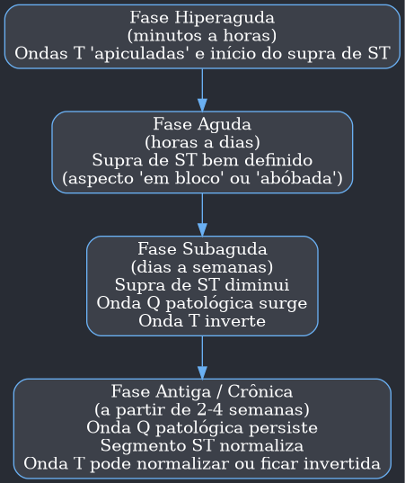
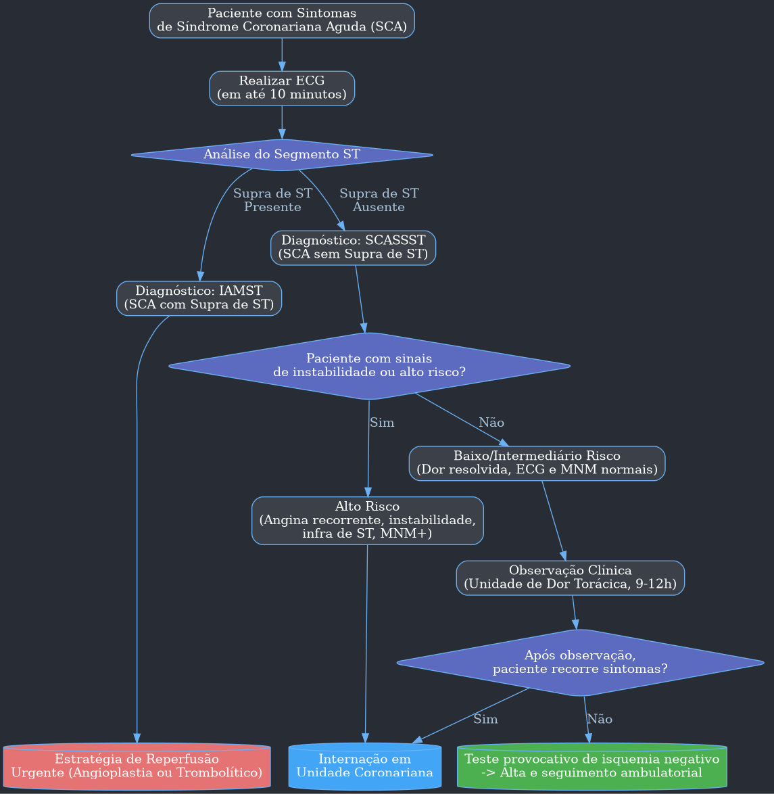

---
{"dg-publish":true,"permalink":"/9-periodo/aulas-segunda-rotacao/sca/","dgPassFrontmatter":true}
---

---

# 💔 Síndromes Coronarianas: Uma Visão Detalhada

##  Anatomia da Circulação Cardíaca

### Circulação Coronariana

- **Irrigação Própria:** O coração tem seu próprio sistema de vasos sanguíneos, composto por artérias e veias cardíacas, que são responsáveis por nutrir o miocárdio (músculo cardíaco) e o epicárdio (camada externa). As artérias coronárias são os primeiros ramos que saem da artéria aorta.
- **Principais Artérias Coronárias:**
    - **Coronária Direita (CD):** Geralmente menor, irriga uma porção menor do coração.
        - **Origem:** Raiz da aorta.
        - **Território:** Irriga o nó sinoatrial (marcapasso natural do coração), o nó atrioventricular, o átrio direito (AD), o ventrículo direito (VD), a parte diafragmática do ventrículo esquerdo (VE) e parte do septo interventricular.
    - **Tronco de Coronária Esquerda (TCE):**
        - **Origem:** Seio da aorta esquerdo.
        - **Divisão:** Origina duas artérias principais:
            1.  **Descendente Anterior (DA):** É a principal, perfundindo a maior parte da zona anterior do coração, a parede anterior e a região apical do VE, além da maior parte do septo interventricular.
            2.  **Circunflexa (Cx):** Estende-se pela face posterior do coração. A artéria marginal esquerda também é um ramo da coronária esquerda.
- **Artérias Epicárdicas vs. Intramurais:**
    - As três artérias principais (CD, DA e Cx) são **epicárdicas**, ou seja, correm na superfície do coração sem penetrar no músculo.
    - Elas emitem ramos menores, as **artérias intramurais**, que vascularizam o miocárdio.
- **Aterosclerose:** É o acúmulo de placas de gordura (ateromas) e tende a ocorrer preferencialmente nos pontos de bifurcação das artérias, onde o fluxo sanguíneo turbulento causa maior estresse mecânico no endotélio (revestimento interno dos vasos).
- **Dominância Cardíaca:**
    - O conceito de dominância é usado para determinar qual artéria coronária irriga a porção basal do septo interventricular e as paredes posterior e inferior do VE, originando a artéria do nódulo AV e a descendente posterior.
    - **Dominância Direita (70% dos indivíduos):** Ocorre quando esses ramos se originam da **Coronária Direita (CD)**.
    - **Dominância Esquerda (30% dos indivíduos):** Ocorre quando esses ramos se originam da **Artéria Circunflexa (Cx)**.
- **Veias Coronárias:**
    - Realizam o retorno do sangue que nutriu o coração.
    - **Grande Veia Coronária:** É a principal veia que drena o lado esquerdo do coração.
    - **Pequena Veia Coronária:** Drena a borda direita do coração.
    - Ambas convergem para o **Seio Coronário**, uma veia de maior calibre na parte posterior, que por sua vez drena o sangue para o **átrio direito**.

---

## Funcionamento da Irrigação

- **Fluxo Sanguíneo Não Contínuo:**
    - **Sístole (Contração):** Durante a contração do miocárdio, os vasos sanguíneos da parede cardíaca são comprimidos, e o fluxo de sangue através deles é interrompido.
    - **Diástole (Relaxamento):** Quando o músculo cardíaco relaxa, os vasos se reabrem e a circulação coronariana é restabelecida. É predominantemente na diástole que o coração é perfundido.
- **Controle do Fluxo (Autorregulação):**
    - O principal controlador do fluxo sanguíneo coronariano é a **necessidade de oxigênio** do próprio músculo cardíaco.
    - Quando há diminuição de oxigênio, as células musculares liberam substâncias vasodilatadoras, como a **adenosina**, que dilatam as arteríolas e aumentam o fluxo sanguíneo.
- **Papel do Sistema Nervoso Autônomo (SNA):**
    - **Estimulação Simpática (Norepinefrina e Epinefrina):**
        - Aumenta a frequência cardíaca (FC) e a força de contração.
        - Isso eleva o metabolismo do coração, que passa a demandar mais oxigênio.
        - Como resultado, ocorre uma dilatação reflexa das coronárias para aumentar o fluxo sanguíneo e suprir essa nova demanda.
    - **Estimulação Parassimpática (Acetilcolina):**
        - Diminui a FC e a força de contração.
        - Reduz o metabolismo cardíaco.
        - Leva à vasoconstrição das coronárias, pois a demanda por oxigênio é menor.
- **Infarto Agudo do Miocárdio (IAM):** Ocorre quando há uma interrupção prolongada do fluxo sanguíneo em uma área do coração, levando à falta de oxigênio (isquemia) e, consequentemente, à morte (necrose) das células cardíacas.

---

## Doença Isquêmica do Miocárdio

- **Definição de Isquemia:** É o desequilíbrio entre a **oferta** e o **consumo** de oxigênio em um tecido. No coração, isso ocorre por diminuição da oferta (obstrução de uma coronária) ou por aumento excessivo do consumo.
    - **Resultado:** Queda na produção de energia (ATP), perda de função celular e, se for grave e persistente, necrose (morte) da célula.
- **Apresentações Clínicas:**
    1.  **Isquemia Silenciosa (Assintomática):** O paciente possui fatores de risco e placas de aterosclerose, mas não apresenta sintomas. A isquemia só é detectada por exames complementares. É perigosa por aumentar o risco de morte súbita.
    2.  **Angina Estável (Crônica):** A placa de ateroma é estável e causa uma obstrução fixa. Os sintomas (dor no peito) aparecem apenas durante esforços físicos (quando a demanda por O₂ aumenta) e melhoram com o repouso.
    3.  **Síndrome Coronariana Aguda (SCA):** Evolui rapidamente e se manifesta mesmo em repouso. É causada pela **instabilidade** de uma placa de ateroma que se rompe, formando um trombo (coágulo) que obstrui a artéria.
        - **Classificação:** Angina Instável (AI), Infarto Agudo do Miocárdio sem supradesnível do segmento ST (IAMSST) e Infarto Agudo do Miocárdio com supradesnível do segmento ST (IAMST).
- **Aterosclerose vs. Arteriosclerose:**
    - **Aterosclerose:** Formação de **placas de ateroma** (gordura, inflamação) que causam estreitamento do lúmen da artéria. É uma doença **oclusiva**.
    - **Arteriosclerose:** É o enrijecimento e perda de elasticidade das grandes artérias (uma espécie de "endurecimento"). É uma doença **não oclusiva**, caracterizada por dilatação e hipertrofia, que leva à diminuição da perfusão coronária.

---

## Síndromes Coronarianas Agudas (SCA)

### Epidemiologia

- **Principal Causa de Óbito:** Tanto no Brasil quanto em diversos países, as SCAs são a principal causa de morte, associadas ao estilo de vida moderno (dieta inadequada, sedentarismo, tabagismo) e ao envelhecimento populacional.
- **Prevalência da Angina Estável:**
    - **Homens (65-84 anos):** 12-14%
    - **Mulheres (65-84 anos):** 10-12%

### Fisiopatologia da Isquemia Miocárdica

- **Alta Taxa de Extração de O₂:**
    - O miocárdio é o tecido que mais extrai oxigênio do sangue no corpo (cerca de 75%).
    - Diferente de outros tecidos, ele não consegue simplesmente extrair mais oxigênio quando precisa de mais energia. A única forma de aumentar a oferta de O₂ é **aumentando o fluxo sanguíneo**.
- **Reserva Coronariana:**
    - É a capacidade das arteríolas pré-capilares de se dilatarem para aumentar o fluxo sanguíneo quando necessário.
    - Essa vasodilatação é estimulada por subprodutos do metabolismo celular (como ADP e creatina) e pela produção de óxido nítrico.
- **Impacto da Obstrução:**
    - **Obstrução Gradual (50-80%):** A reserva coronariana é parcialmente utilizada mesmo em repouso. Durante um esforço físico, a capacidade de vasodilatação residual não é suficiente para suprir a demanda, causando isquemia induzida por esforço (**angina estável**).
    - **Obstrução Aguda e Grave (>80%):** Mesmo com a dilatação máxima das arteríolas, o fluxo é insuficiente para as necessidades basais do coração. Isso gera isquemia em repouso e, posteriormente, infarto. É o que ocorre nas **síndromes coronarianas agudas**.
- **Determinantes da Demanda e Aporte de O₂:**

| Determinantes da Demanda de O₂ | Determinantes do Aporte (Oferta) de O₂ |
| :--- | :--- |
| Frequência Cardíaca (FC) | Conteúdo arterial de O₂ |
| Contratilidade miocárdica | Fluxo coronariano |
| Tensão na parede ventricular | |

- **Fatores de Risco:** Condições que aumentam a demanda (hipertensão, hipertrofia) ou diminuem a oferta (doença pulmonar, anemia), quando somadas a uma doença coronariana, diminuem o limiar para o surgimento de isquemia.

### Aterotrombose

- É o evento central na maioria das SCAs.
- Uma placa de ateroma instável se rompe, expondo seu conteúdo inflamatório e trombogênico ao sangue.
- Isso ativa a cascata de coagulação, formando um **trombo (coágulo)** sobre a placa.
- **Oclusão Parcial (Trombo Branco):** Rico em plaquetas. Geralmente causa Angina Instável ou IAMSST.
- **Oclusão Total (Trombo Vermelho):** Rico em fibrina. Geralmente causa IAMST.

### Consequências da Isquemia

1.  **Disfunção Diastólica:** A primeira consequência é a perda da capacidade de relaxamento do músculo.
2.  **Disfunção Sistólica:** Se a isquemia persiste, o músculo perde a capacidade de contrair.
    - **Hipocinesia:** Contração mais fraca que o normal.
    - **Acinesia:** O segmento fica imóvel.
    - **Discinesia:** O segmento se move de forma paradoxal (abana para fora durante a contração).
3.  **Infarto do Miocárdio:** Isquemias graves e persistentes (>20 min em oclusões totais) levam à morte celular.
4.  **Instabilidade Elétrica:** A região isquêmica se torna eletricamente instável, o que pode gerar arritmias graves (fenômeno de reentrada), como fibrilação ventricular, levando à morte súbita.
5.  **Miocárdio Hibernante:**
    - Não confundir com isquemia. É uma disfunção contrátil crônica em uma área irrigada por uma artéria doente.
    - O músculo "desliga" voluntariamente sua função para economizar energia e se manter vivo em um ambiente de baixo fluxo.
    - **É REVERSÍVEL:** A função pode ser recuperada com a revascularização (restabelecimento do fluxo).

---

## Síndromes Coronarianas Agudas COM Supradesnível de ST (SCACSST)

### Angina de Prinzmetal

- **O que é:** Uma angina instável causada por um **vasoespasmo** súbito e oclusivo de uma artéria coronária. Não é causada por um trombo.
- **Apresentação:** Dor anginosa intensa, em repouso, acompanhada de **supradesnível de ST** no ECG, que são **transitórios**.
- **Perfil do Paciente:** Homens, 45-55 anos, geralmente sem os fatores de risco clássicos para aterosclerose, exceto pelo **tabagismo**. O uso de cocaína é um fator de risco importante. A dor costuma ocorrer de madrugada ou no início da manhã.
- **Diagnóstico:** A **coronariografia (cateterismo)** é o exame de escolha. Para confirmar, podem ser usados testes provocativos com drogas como a acetilcolina, que induzem o vasoespasmo.
- **Tratamento:**
    - Uso intensivo de **nitratos** e **antagonistas dos canais de cálcio** (diltiazem/verapamil) para promover a máxima vasodilatação.
    - **Betabloqueadores são contraindicados**, pois podem piorar o espasmo.
    - O **tabagismo deve ser abandonado imediatamente**.

### Infarto Agudo do Miocárdio com Supradesnível de ST (IAMST)

- **Definição:** Necrose (morte) de uma porção do músculo cardíaco associada à **oclusão total** de uma artéria coronária por um trombo rico em fibrina ("trombo vermelho").
- **Diagnóstico Rápido é Crucial:**
    - Um **eletrocardiograma (ECG)** deve ser realizado em até 2 minutos da chegada do paciente e interpretado em até 10 minutos para identificar o supradesnivelamento de ST.
- **Onda Q Patológica:** O surgimento de uma onda Q no ECG reflete a inatividade elétrica da área necrosada (transmural). No entanto, nem todo IAMST evolui com onda Q, e nem toda onda Q significa necrose irreversível. Por isso, a nomenclatura antiga "IAM com Q" ou "sem Q" não é mais valorizada.
- **Etiologia:** A causa mais comum é a **aterotrombose**. A gravidade da lesão na placa (fissura superficial vs. Ruptura profunda) determina se o trombo será parcialmente ou totalmente oclusivo.

#### Fisiopatologia do IAMST

1.  **Cascata Isquêmica:** Após a oclusão total, a primeira consequência é o **déficit contrátil** (acinesia/discinesia) no segmento afetado.
    - **Isquemia > 20-25% do VE:** Causa insuficiência ventricular esquerda (IVE), com aumento da pressão nos pulmões.
    - **Isquemia > 40% do VE:** Alto risco de **choque cardiogênico** (o coração não consegue bombear sangue suficiente para o corpo).
2.  **Miocárdio Atordoado:** Mesmo após a reperfusão (desobstrução da artéria), o déficit contrátil pode levar horas ou dias para se normalizar.
3.  **Necrose Miocárdica:** A morte celular começa no subendocárdio (camada mais interna) e se estende em direção ao epicárdio (camada externa). O processo completo leva de 6 a 12 horas.
4.  **Remodelamento Cardíaco Pós-IAM:**
    - O estresse mecânico na parede do ventrículo leva a alterações geométricas. A área infartada pode se "remodelar", ficando maior e mais fina.
    - As áreas não infartadas sofrem hipertrofia como mecanismo compensatório.
    - **Inibidores da ECA (IECA):** Medicamentos como captopril e enalapril são fundamentais, pois inibem a angiotensina II, reduzindo o remodelamento e a pós-carga ventricular, o que melhora o prognóstico.

#### Quadro Clínico do IAMST

- **Dor Torácica:**
    - Típica: precordialgia **constritiva** ("aperto", "peso").
    - Forte intensidade, longa duração (> 20 min).
    - **Não melhora** completamente com repouso ou nitrato sublingual.
- **Sintomas Associados:** Dispneia (falta de ar), náuseas, vômitos, palidez, sudorese fria, ansiedade e sensação de morte iminente.
- **Irradiação da Dor:** Epigástrio ("indigestão"), dorso, membros superiores (principalmente o esquerdo) e pescoço/mandíbula ("sufocamento").
- **Atenção:** Todo paciente com mais de 40-45 anos com dor aguda entre a mandíbula e a região epigástrica pode estar infartando e merece investigação imediata.

#### Classificação de Killip

- Classificação prognóstica baseada nos sinais e sintomas clínicos de insuficiência ventricular esquerda (IVE). Quanto maior a classe, pior o prognóstico.

| Classe Killip | Achados Clínicos |
| :--- | :--- |
| **Killip I** | Sem dispneia, estertores pulmonares ou B 3 (sem evidências de IVE). |
| **Killip II** | Dispneia, estertores pulmonares discretos, presença de B 3 ou TJP. |
| **Killip III** | Franco edema agudo de pulmão (EAP). |
| **Killip IV** | Choque cardiogênico. |

---

## Alterações Laboratoriais e Diagnóstico

### Marcadores de Necrose Cardíaca (Enzimas Cardíacas)

- A detecção dessas moléculas no sangue indica que houve morte de células cardíacas.

| Marcador | Nível de Evidência | Características |
| :--- | :--- | :--- |
| **Izoenzima MB da Creatinoquinase (CK-MB)** | B | - Enzima do metabolismo energético do miocárdio. - Mais específica que a CK total. - Relação **CK-MB/CK total ≥ 3%** é sugestiva de isquemia. - Eleva-se em **3-4 horas**, com pico em 24 h e normalização em 48-72 h. - Útil para diagnóstico de **reinfarto** (novo IAM em até 28 dias). |
| **Troponinas (T e I)** | A | - **Padrão-ouro** para diagnóstico de IAM. - Proteínas estruturais da fibra cardíaca. - Mais sensíveis e específicas. - Começam a se elevar entre **3 e 4 horas** após o IAM. - Permanecem elevadas por 7-14 dias. |
| **Mioglobina** | - | - Marcador **muito precoce**, eleva-se em 2 a 5 horas. - **Não é cardioespecífica** (presente em outros músculos). - Principal vantagem: alto valor preditivo negativo. Se estiver normal, a chance de IAM nas primeiras horas é baixa. |

### Confirmação Diagnóstica do IAM

O diagnóstico se baseia na combinação de **história clínica**, **ECG** e a **curva dos marcadores de necrose miocárdica (MNM)**.

**Critérios (pelo menos um dos dois):**
1.  **Aumento e/ou queda dos MNM** (preferencialmente troponina) com pelo menos um dos seguintes:
    A) Sintomas de isquemia.
    B) Novas alterações no ECG (infradesnível ou supradesnível de ST, nova onda Q).
    c) Evidência em exame de imagem de perda de miocárdio viável ou nova anormalidade de contração.
2.  **Evidência de IAM em autópsia.**

---

## Eletrocardiograma (ECG) no IAMST

- **Critérios para IAMST:**
    - **Supradesnível do segmento ST ≥ 1 mm** em pelo menos duas derivações contíguas.
    - *Exceção:* No precórdio, o critério pode ser ≥ 2 mm.
    - O "supra de ST" sugere uma **oclusão coronariana aguda TOTAL**.
- **Como Medir o Desnivelamento do ST:**
    - **Referência:** O **ponto PQ** (junção entre o segmento PR e o início do QRS) é usado como linha de base.
    - **Ponto J:** É a junção entre o final do complexo QRS e o início do segmento ST.
    - **Medida do Supra de ST:** Mede-se a altura do **ponto ST 60** (60 ms ou 1,5 "quadradinhos" após o ponto J) em relação à linha de base (ponto PQ).
    - **Medida do Infra de ST:** Mede-se a altura do **ponto ST 80** (80 ms ou 2 "quadradinhos" após o ponto J).

### Fases do IAMST no ECG

---

## Estratificação de Risco no IAMST

### Escore TIMI para IAMST

- Escore utilizado para estimar o risco de mortalidade em pacientes com IAMST submetidos à reperfusão.

| Variáveis | Pontuação |
| :--- | :--- |
| **Idade:** | |
| ≥ 75 anos | 3 |
| 65-74 anos | 2 |
| **Histórico Pessoal:** | |
| Diabetes, Hipertensão ou Angina prévia | 1 |
| **Exame Físico na Admissão:** | |
| PA Sistólica < 100 mmHg | 3 |
| Frequência Cardíaca > 100 bpm | 2 |
| Classe Killip II, III ou IV | 2 |
| Peso < 67 kg | 1 |
| **Apresentação do IAM:** | |
| Supra de ST em parede anterior ou BRE de 3º grau | 1 |
| "Delta-T" (tempo até a reperfusão) > 4 h | 1 |

#### Interpretação do Escore TIMI-IAMST

| Risco | Escore | Mortalidade Estimada |
| :--- | :--- | :--- |
| **Baixo Risco** | < 2 | < 2% |
| **Risco Intermediário**| 5 | ≈ 10% |
| **Alto Risco** | > 8 | > 20% |

- **Fração de Ejeção (FE):** Um dos principais determinantes prognósticos. Pacientes com **FE < 35%** são considerados de alto risco.

---

## Tratamento do IAMST

A fase aguda é uma emergência médica. O tratamento visa:
1.  **Limitar o tamanho do infarto:** através da reperfusão coronariana.
2.  **Prevenir arritmias malignas.**
3.  **Aliviar a dor e a ansiedade.**
4.  **Tratar complicações.**

### Medidas Iniciais e Terapêuticas

| Medida | Descrição |
| :--- | :--- |
| **Oxigênio** | Apenas se saturação de O₂ < 90%. |
| **Analgesia** | **Morfina** intravenosa é o analgésico de escolha para aliviar a dor e reduzir o tônus adrenérgico. |
| **Nitrato** | **Nitroglicerina** ou **isossorbida** sublingual para vasodilatação, reduzindo pré e pós-carga. Contraindicado em hipotensão e infarto de VD. |
| **Betabloqueador** | **Metoprolol**. Reduz FC, contratilidade e PA, diminuindo o consumo de O₂. Aumenta o fluxo colateral. |
| **Antiplaquetários** | **AAS** (Ácido Acetilsalicílico) para todos, associado a um inibidor do receptor P 2 Y 12, como o **Clopidogrel**. |
| **Anticoagulação** | **Enoxaparina** para garantir a patência da artéria após a reperfusão. |
| **Estatinas** | **Atorvastatina 80 mg/dia** (dose alta) deve ser iniciada precocemente (primeiras 24 h). |
| **Inibidores do SRAA (IECA)** | **Captopril** ou similar. Idealmente para todos os pacientes, para melhora hemodinâmica e redução do remodelamento. |

### Terapia de Reperfusão

- **Objetivo:** Restaurar o fluxo na artéria ocluída o mais rápido possível.
- **Janela Terapêutica:** Idealmente nas primeiras 12 horas do início dos sintomas.
- **Tempos Ideais:**
    - **Tempo "Porta-Agulha" (Trombolítico):** ≤ 30 minutos.
    - **Tempo "Porta-Balão" (Angioplastia):** ≤ 90 minutos (se no mesmo hospital) ou ≤ 120 minutos (se precisar de transferência).

#### Estratégias de Reperfusão

1.  **Trombolíticos (Químicos):**
    - Agentes como **Tenecteplase (TNK)** e **Alteplase (rtPA)** dissolvem o trombo.
    - TNK é a melhor escolha para pacientes < 75 anos.
    - **Contraindicados** em qualquer história de sangramento ativo ou recente.
2.  **Angioplastia Primária com Balão e Stent (Mecânica):**
    - **Método de escolha**, quando disponível.
    - Um cateter com um balão na ponta é inserido até a artéria obstruída, o balão é inflado para esmagar o trombo e a placa, e um **stent** (uma pequena malha metálica) é implantado para manter a artéria aberta.

---

## Síndromes Coronarianas Agudas SEM Supradesnível de ST (SCASSST)

- **Engloba duas condições:**
    1.  **Angina Instável (AI):** Isquemia miocárdica aguda **sem necrose**, ou seja, os marcadores de lesão (troponina) são negativos.
    2.  **Infarto Agudo do Miocárdio sem Supra de ST (IAMSST):** Isquemia aguda com **necrose não transmural** (subendocárdica), ou seja, há elevação dos marcadores de lesão.
- **Fisiopatologia:** A ausência do supra de ST indica que o lúmen da artéria **não foi totalmente ocluído**. Geralmente há uma oclusão subtotal por um "trombo branco" (rico em plaquetas).

### Características da Angina Instável

O paciente refere desconforto precordial com pelo menos uma das seguintes características:
- **Surgimento em repouso** (ou com mínimos esforços).
- **Duração prolongada** (> 10-20 min).
- **Início recente** (últimas 4-6 semanas).
- **Padrão em crescendo** (dor progressivamente mais intensa, frequente e duradoura).

### Fisiopatologia da SCASSST (6 Mecanismos)

1.  **Aterotrombose (mais comum):** Erosão ou fissura de uma placa com formação de trombo suboclusivo.
2.  **Aterosclerose Acelerada:** Aumento rápido do volume da placa.
3.  **Reestenose Pós-Angioplastia:** Formação de trombo no local de um stent prévio.
4.  **Obstrução Dinâmica:** Vasoespasmo.
5.  **Inflamação:** Edema na parede da artéria (vasculite).
6.  **Angina Secundária:** Isquemia por aumento do consumo (taquicardia, febre) ou redução do aporte (anemia, hipóxia).

### Diagnóstico da SCASSST

- Baseia-se na **Anamnese, Exame Físico, ECG e Curva de MNM.**
- **Se houver elevação dos MNM → IAMSST.**
- **Se não houver elevação dos MNM → Angina Instável.**

#### Classificação da Dor Torácica

| Tipo | Descrição |
| :--- | :--- |
| **Definitivamente Anginosa (Tipo A)** | Caráter constritivo, em aperto ou queimação, com melhora ao nitrato e irradiação para membros e/ou mandíbula. |
| **Provavelmente Anginosa (Tipo B)** | Algumas características a favor e outras contra. Ex: dor mal definida, mas de forte intensidade, que melhora com nitrato. |
| **Provavelmente Não Anginosa (Tipo C)** | Dor totalmente atípica, sem definição diagnóstica. |
| **Definitivamente Não Anginosa (Tipo D)** | Dor sugestiva de outras causas (ex: dor pleurítica). |

---

## Estratificação de Risco na SCASSST

- "Tempo é miocárdio". O ECG deve ser feito em até **10 minutos**. O próximo passo é estratificar o risco de eventos graves (infarto e óbito).

### Escore TIMI Risk para SCASSST

- Avalia o risco de eventos cardiovasculares em pacientes com Angina Instável ou IAMSST. Cada critério vale 1 ponto.

| Critério (1 Ponto Cada) |
| :--- |
| **Idade** ≥ 55 anos |
| **Riscos** (≥3 fatores de risco: HF, DM, SM, HAS, dislipidemia, tabagismo, sedentarismo) |
| **Obstrução coronariana** > 50% conhecida |
| **AAS** nos últimos 7 dias |
| **Angina** (≥2 episódios nas últimas 24 horas) |
| **ECG** com desvio do segmento ST > 0,5 mm |
| **Marcadores cardíacos** (CK-MB e/ou troponinas) positivos |

#### Interpretação do TIMI Risk

- **0-2 pontos:** Baixo risco.
- **3-4 pontos:** Risco intermediário.
- **5-7 pontos:** Alto risco.

### Classificação de Risco Tradicional

| Risco | Pelo menos UM dos critérios abaixo |
| :--- | :--- |
| **ALTO RISCO** | - Dor prolongada (> 20 min) em repouso - Sinais de congestão pulmonar (B 3, estertores) - Hipotensão ou taquicardia - Infra de ST > 0,5 mm - **Troponina positiva (> 0,1 ng/ml)** |
| **MÉDIO RISCO** | - Dor prolongada (> 20 min), mas aliviada por nitrato - Idade > 70 anos - Onda T invertida > 2 mm - Onda Q patológica (infarto antigo) - Troponina levemente positiva (> 0,01 ng/ml) |
| **BAIXO RISCO** | - Dor aos mínimos esforços de início recente - Idade < 70 anos - ECG normal ou com alterações antigas - Marcadores de lesão miocárdica normais |

### Classificação de Braunwald

- Classifica a SCASSST com base na intensidade da dor, circunstâncias clínicas e tratamento prévio.

| | Intensidade da Dor |
| :--- | :--- |
| **Classe I** | Angina intensa de início recente (< 2 meses) ou acelerada. **Não há dor em repouso.** |
| **Classe II** | Angina em repouso no último mês, mas não nas últimas 48 h. **Angina de repouso subaguda.** |
| **Classe III**| Angina em repouso nas últimas 48 h. **Angina de repouso aguda.** |
| | **Circunstâncias Clínicas** |
| **A** | **Angina secundária** (causada por condições extracardíacas como anemia, febre). |
| **B** | **Angina primária** (sem condições extracardíacas). |
| **C** | **Angina pós-infarto** (nas primeiras duas semanas após um IAM). |
| | **Intensidade do Tratamento** |
| **1** | Ausência de tratamento para angina. |
| **2** | Tratamento submáximo para angina. |
| **3** | Tratamento máximo para angina. |

---

## Tratamento da SCASSST

### Fluxograma de Abordagem

### Medidas Gerais e Medicamentosas

| Terapia | Medicamentos de Escolha |
| :--- | :--- |
| **1º Medidas Gerais** | Repouso, monitorização, O₂ se SatO₂ < 90%, acesso venoso. |
| **2º Terapia Anti-isquemia** | Nitratos, Betabloqueadores (BB). |
| **3º Terapia Antiplaquetária**| **AAS** + **Clopidogrel** (ou Ticagrelor/Prasugrel). |
| **4º Terapia Anticoagulante** | **Fondaparinux** ou Enoxaparina. |
| **5º Outras Medicações**| IECA, Estatinas. |

### Estratégia Invasiva (Angiografia Coronariana / CATE)

A decisão de quando realizar o cateterismo depende do risco do paciente.

| Estratégia | Quando? | Para Quem? |
| :--- | :--- | :--- |
| **Invasiva Imediata** | < 2 horas | - Angina refratária - Sinais de insuficiência cardíaca grave - Instabilidade hemodinâmica - Arritmias ventriculares |
| **Invasiva Precoce** | < 24 horas | - Escore GRACE > 140 - **Troponina positiva** - Alterações dinâmicas de ST/T |
| **Invasiva Retardada**| < 72 horas | - Pacientes de risco intermediário (DM, FE < 40%, angina pós-infarto, angioplastia prévia). |

- **Pacientes de Baixo Risco:** Não necessitam de CATE imediato. Podem realizar testes não invasivos (teste ergométrico, cintilografia) para detecção de isquemia antes da alta.

---

### Diagnósticos Diferenciais da Dor Torácica

| Causa                              | Características da Dor                                                                                                                                        |
| :--------------------------------- | :------------------------------------------------------------------------------------------------------------------------------------------------------------ |
| **Dor Esofágica**                  | - Queimação retroesternal, sem relação com esforço, mas sim com alimentação e decúbito (DRGE). - Pode mimetizar angina e melhorar com nitrato.             |
| **Dor Musculoesquelética**         | - Agravada pela palpação local e por movimentos específicos. - Síndrome de Tietze (inflamação das cartilagens costoesternais).                             |
| **Dor Pericárdica (Pericardite)**  | - Contínua, caráter pleurítico (piora com inspiração profunda). - Melhora ao sentar e inclinar para frente. - Pode irradiar para o músculo trapézio.    |
| **TEP (Tromboembolismo Pulmonar)** | - Dor tipo "anginosa" ou pleurítica, acompanhada de dispneia súbita e pulmões "limpos" na ausculta. - Associada a fatores de risco (câncer, imobilização). |
| **Distúrbios Psiquiátricos**       | - Ansiedade, pânico. O contexto clínico sugere o diagnóstico. - É um diagnóstico de exclusão.                                                              |