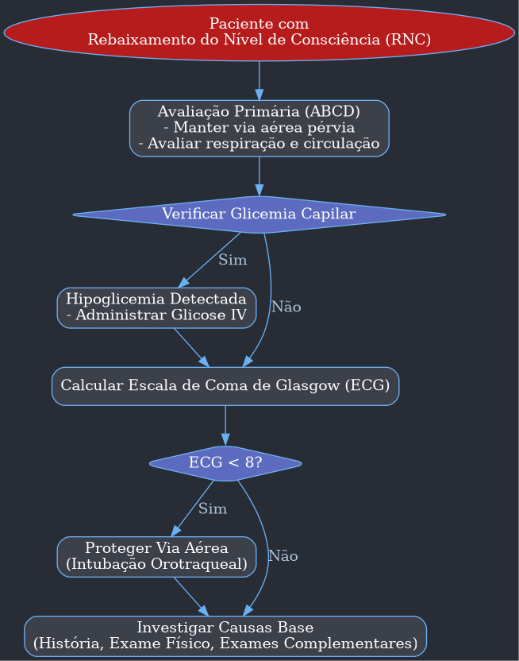
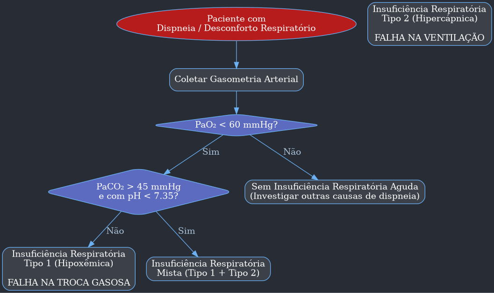
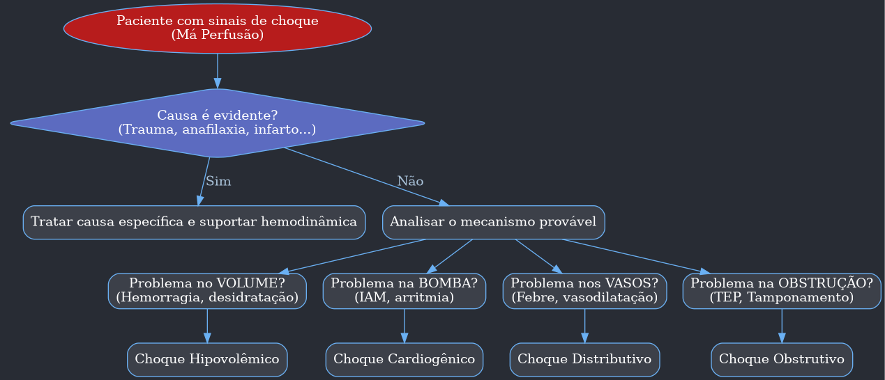

---
{"dg-publish":true,"permalink":"/9-periodo/aulas-segunda-rotacao/sinais-de-gravidade/"}
---

# Resumo da Aula: Abordagem ao Paciente Grave

---

## I. Identificação do Paciente Grave

O objetivo inicial em um ambiente de emergência é rapidamente identificar pacientes que apresentam sinais de gravidade, pois eles necessitam de alocação em setores de maior monitorização (sala vermelha, sala de estabilização, UTI) e intervenção imediata.

- **Sinais de Alerta Iniciais (Os "5 Ds"):**
    - **D**or Torácica
    - **D**ispneia (Desconforto Respiratório)
    - **D**iminuição do Nível de Consciência
    - **D**iminuição da Pressão Arterial (Hipotensão)
    - **D**esconforto Geral / Alteração Súbita do Estado Geral

- **A Importância do Contexto Clínico:**
    - Sinais isolados podem não indicar gravidade e devem ser sempre contextualizados.
    - **Exemplo 1 (Hipotensão):** Uma gestante ou uma mulher jovem e magra pode ter uma pressão arterial basal baixa (ex: 10/6 mmHg) sem que isso represente instabilidade. A hipotensão se torna um sinal de gravidade quando acompanhada de manifestações de resposta adrenérgica compensatória, como **taquicardia** e **sudorese**.
    - **Exemplo 2 (Saturação de O₂):** Uma saturação de 89% em um paciente DPOC tabagista crônico pode ser o seu basal normal. No entanto, o mesmo valor em um paciente jovem e hígido é um sinal alarmante de insuficiência respiratória.
    - **Conclusão:** A avaliação não deve se basear em números isolados, mas na **tendência** dos sinais vitais e no **conjunto de achados clínicos** do paciente.

---

## II. Dor Torácica

A dor torácica é um critério de gravidade que exige uma abordagem sistemática para descartar causas potencialmente fatais.

- **Atualizações de Diretrizes:**
    - Novas diretrizes enfatizam a avaliação de **sinais de instabilidade hemodinâmica** e a inclusão mais precoce do **Ecocardiograma (ECO)** na investigação.
    - O manejo específico de cada causa (dissecção aórtica, TEP, pneumotórax, IAM) continua seguindo os protocolos dedicados a cada uma dessas condições.

- **Classificação da Dor Torácica (Padrões):**
    - É fundamental caracterizar o padrão da dor para guiar o diagnóstico diferencial.

| Tipo | Descrição | Sugestivo de |
| :--- | :--- | :--- |
| **Tipo A (Anginosa)** | Dor retroesternal em aperto, opressão ou queimação, que pode irradiar para mandíbula, ombros ou membros superiores (principalmente o esquerdo). Geralmente piora com esforço. | Síndrome Coronariana Aguda |
| **Tipo B (Pleurítica)** | Dor "em pontada", bem localizada, que piora com a inspiração profunda ou tosse. | TEP, Pneumotórax, Pleurite |
| **Tipo C (Dissecção)** | Dor de início súbito, intensidade máxima desde o início, descrita como "rasgando", que pode irradiar para a região dorsal (interescapular). | Dissecção Aguda de Aorta |
| **Tipo D (Atípica)** | Dores que não se encaixam nos padrões acima, como as de origem musculoesquelética, gastroesofágica, etc. | Causas diversas, geralmente menos graves, mas que exigem exclusão das demais. |

---

## III. Rebaixamento do Nível de Consciência (RNC)

Uma alteração súbita no nível de consciência é um sinal neurológico grave.

- **Avaliação Quantitativa - Escala de Coma de Glasgow (ECG/GCS):**
    - Ferramenta padronizada para avaliar o nível de consciência.
    - **Limitações:** Foi desenvolvida para Trauma Cranioencefálico (TCE) e pode subestimar a gravidade em pacientes com sequelas neurológicas prévias (ex: pós-AVC) ou sob efeito de sedativos. O valor basal do paciente é crucial.
    - **Valores Críticos:**
        - **ECG < 8:** Paciente grave, com indicação de **proteção de via aérea** (intubação orotraqueal).
        - **Queda de 2 ou mais pontos:** Indica deterioração neurológica e exige reavaliação imediata.

- **Causas Comuns de RNC na Emergência:**
    1.  **Trauma Cranioencefálico (TCE):** Causa estrutural primária.
    2.  **Causas Metabólicas:**
        - **Hipoglicemia / Hiperglicemia:** (Cetoacidose diabética, estado hiperosmolar).
        - **Distúrbios Eletrolíticos:** Principalmente **hiponatremia** e **hipernatremia**.
        - **Encefalopatia Urêmica:** Em pacientes com insuficiência renal.
        - **Encefalopatia Hepática:** Em pacientes cirróticos.
        - **Coma Mixedematoso:** Hipotireoidismo grave.
    3.  **Infecções:**
        - **Sepse:** Causa muito comum de rebaixamento, especialmente em idosos, que podem apresentar *delirium* ou sonolência como principal manifestação.
    4.  **Causas Cerebrovasculares:**
        - **AVC (Isquêmico ou Hemorrágico)**
        - **Tumores, Crises Convulsivas.**
    5.  **Intoxicações Exógenas:**
        - **Medicamentos:** Benzodiazepínicos, neurolépticos.
        - **Álcool e outras drogas.**
        - **Tentativas de suicídio.**

### Fluxograma: Avaliação do Rebaixamento do Nível de Consciência

---

## IV. Dispneia e Insuficiência Respiratória (IR)

É a queixa de desconforto para respirar, podendo ou não estar associada ao aumento da frequência respiratória.

- **Diferenciação de Termos:**

| Termo | Definição |
| :--- | :--- |
| **Dispneia** | **Sensação subjetiva** de dificuldade para respirar ou "falta de ar". É um sintoma. |
| **Taquipneia** | **Aumento da frequência respiratória** (FR > 20-22 incursões por minuto). É um sinal. |
| **Bradipneia** | **Diminuição da frequência respiratória** (FR < 12 ipm). Sinal de fadiga muscular ou depressão do SNC. |
| **Taquidispneia** | Associação de dispneia (sintoma) com taquipneia (sinal). |

- **Sinais de Desconforto Respiratório:**
    - Uso de musculatura acessória (esternocleidomastoideo, intercostais).
    - Batimento de asa de nariz.
    - Retração de fúrcula.
    - Cianose (central ou periférica).

- **Tipos de Insuficiência Respiratória:**

| Tipo | Mecanismo | Característica Principal | Exemplo de Causas |
| :--- | :--- | :--- | :--- |
| **IR Tipo 1 (Hipoxêmica)** | Falha na **troca gasosa** (hematose). O oxigênio não consegue passar do alvéolo para o sangue. | **PaO₂ < 60 mmHg** com PaCO₂ normal ou baixo. | Pneumonia, SARA, edema agudo de pulmão, secreções, TEP. |
| **IR Tipo 2 (Hipercápnica)** | Falha na **ventilação**. O pulmão não consegue "lavar" o CO₂ produzido. | **PaCO₂ > 45-50 mmHg** com pH < 7.35 (acidose respiratória). | DPOC exacerbado, crise de asma grave, rebaixamento do nível de consciência, doenças neuromusculares, acidose metabólica (como compensação). |

### Fluxograma: Diferenciação da Insuficiência Respiratória

---

## V. Má Perfusão e Choque

O choque é definido como um estado de **hipoperfusão tecidual generalizada**, que leva à disfunção celular e, se não revertido, à falência de múltiplos órgãos.

- **Sinais Clínicos de Má Perfusão:**
    - **Pele:** Fria, úmida, pegajosa (aumento do tônus simpático).
    - **Tempo de Enchimento Capilar (TEC):** Lentificado (> 3 segundos).
    - **Pulsos:** Filiformes, rápidos e fracos.
    - **Débito Urinário:** Oligúria (diminuição da perfusão renal).
    - **Nível de Consciência:** Sonolência, confusão, agitação (hipoperfusão cerebral).
    - **Pressão Arterial:** Hipotensão (geralmente um sinal tardio).

- **Tipos de Choque:**
    - A identificação do tipo de choque é essencial para direcionar a terapia. O problema pode estar no **volume** (hipovolêmico), na **bomba** (cardiogênico), nos **vasos/condutos** (distributivo) ou em uma **obstrução** ao fluxo.

| Tipo de Choque | Mecanismo Primário | Causas Comuns |
| :--- | :--- | :--- |
| **Hipovolêmico** | Perda de volume intravascular (pré-carga inadequada). | **Hemorrágico:** Trauma, sangramento gastrointestinal.   **Não-hemorrágico:** Diarreia, vômitos, grandes queimados. |
| **Cardiogênico** | Falha da bomba cardíaca (coração não consegue ejetar sangue suficiente). | Infarto agudo do miocárdio, insuficiência cardíaca descompensada, arritmias graves, rotura de valva. |
| **Distributivo** | Vasodilatação periférica maciça, com "sequestro" de volume para o terceiro espaço. | **Séptico:** Infecção grave.   **Anafilático:** Reação alérgica grave.   **Neurogênico:** Trauma raquimedular (lesão do tônus simpático). |
| **Obstrutivo** | Obstrução mecânica que impede o enchimento ou esvaziamento do coração. | **TEP maciço:** Obstrui a saída do ventrículo direito.   **Tamponamento Cardíaco:** Acúmulo de líquido no pericárdio comprime o coração.   **Pneumotórax Hipertensivo:** Ar na pleura desvia o mediastino e comprime os grandes vasos. |

### Fluxograma: Classificação do Choque

---

## VI. Interpretação da Gasometria e Distúrbios Ácido-Base

A gasometria arterial é um exame fundamental na avaliação do paciente grave, fornecendo informações sobre oxigenação, ventilação e estado metabólico.

- **Identificando o Distúrbio Primário:**
    1.  **Olhe o pH:**
        - **< 7.35:** Acidemia.
        - **> 7.45:** Alcalemia.
    2.  **Olhe o PaCO₂ e o Bicarbonato (HCO₃⁻):**
        - Se **acidemia**, o culpado é um **PaCO₂ alto** (acidose respiratória) ou um **HCO₃⁻ baixo** (acidose metabólica).
        - Se **alcalemia**, o culpado é um **PaCO₂ baixo** (alcalose respiratória) ou um **HCO₃⁻ alto** (alcalose metabólica).

- **Avaliando a Compensação:**
    - O corpo tenta compensar o distúrbio primário. Em uma acidose metabólica, a resposta esperada é a **hiperventilação** para "lavar" CO₂.
    - **Fórmula da PaCO₂ Esperada (Fórmula de Winter):**
        - `PaCO₂ esperada = (1.5 * Bicarbonato atual) + 8 ± 2`
        - **Interpretação:**
            - Se a PaCO₂ medida estiver **dentro da faixa esperada**, a compensação respiratória é adequada (distúrbio simples).
            - Se a PaCO₂ medida estiver **acima da faixa esperada**, há uma **acidose respiratória associada** (distúrbio misto).
            - Se a PaCO₂ medida estiver **abaixo da faixa esperada**, há uma **alcalose respiratória associada** (distúrbio misto).

- **Acidose Metabólica - O Ânion Gap (AG):**
    - Ajuda a diferenciar as causas da acidose metabólica.
    - **Fórmula:** `AG = Sódio – (Cloro + Bicarbonato)`
    - **Valor de Referência:** 8 a 12 mEq/L.

| Tipo de Acidose Metabólica | Ânion Gap | Mecanismo | Mnemônico para Causas |
| :--- | :--- | :--- | :--- |
| **AG Elevado** | > 12 | Ganho de um ácido não mensurável (ex: lactato, cetoácidos). | **GOLDMARK:**  **G**licóis (Etilenoglicol, Propilenoglicol) **O**xoprolina **L**-Lactato **D**-Lactato **M**etanol **A**spirina (Salicilatos) **R**enal Failure (Uremia) **K**etoacidosis (Cetoacidose) |
| **AG Normal (Hiperclorêmica)** | 8-12 | Perda de bicarbonato, com o rim retendo cloro para manter a eletroneutralidade. | **USED CARP:** **U**reteroenterostomia **S**aline Infusion (excesso) **E**ndocrine (Addison) **D**iarreia **C**arbonic Anhydrase Inhibitors (Acetazolamida) **A**rginine, Lysine **R**enal Tubular Acidosis (ATR) **P**ancreatic Fistula |

- **Refinando a Análise com o Delta Gap:**
    - Usado para detectar distúrbios mistos quando o AG já está elevado.
    - **Fórmula:** `Relação Delta/Delta = (ΔAG) / (ΔHCO₃⁻) = (AG medido – 12) / (24 – HCO₃⁻ medido)`
    - **Interpretação da Relação:**
        - **< 1:** Sugere uma acidose metabólica hiperclorêmica concomitante (perda de bicarbonato maior que o ganho de ânions).
        - **1 a 2:** Acidose metabólica com AG elevado pura.
        - **> 2:** Sugere uma alcalose metabólica concomitante.

---

## VII. Causas Reversíveis de Parada Cardiorrespiratória (PCR)

Durante o atendimento de uma PCR, é mandatório pensar e tratar as causas reversíveis.

| 5 H's | 5 T's |
| :--- | :--- |
| **H**ipovolemia | **T**ensão no tórax (Pneumotórax hipertensivo) |
| **H**ipóxia | **T**amponamento cardíaco |
| **H**idrogênio (íon H⁺ - Acidose) | **T**óxicos |
| **H**ipo / **H**ipercalemia | **T**rombose pulmonar (TEP) |
| **H**ipotermia | **T**rombose coronariana (IAM) |
